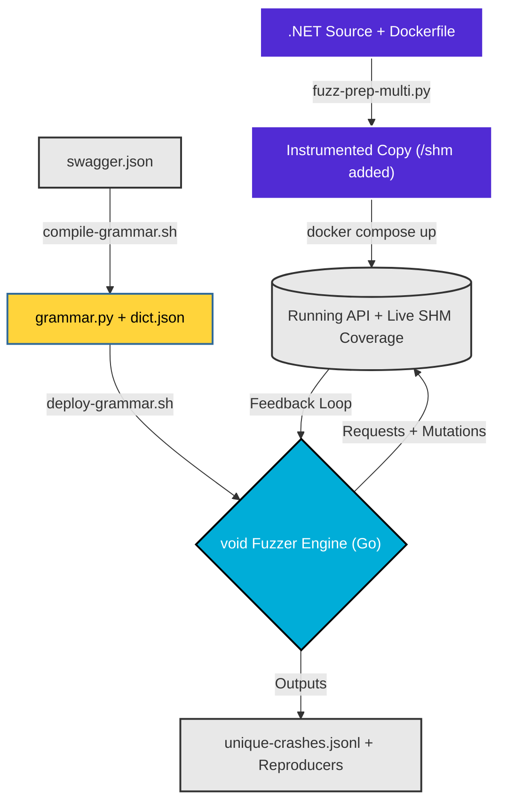

# UpsideFuzz — Coverage-Guided REST API Fuzzer for .NET

> **Automated black-box → grey-box fuzzing for any .NET 8+ web API.**  
> Transforms a standard .NET solution into a coverage-instrumented fuzzing target, then drives it with a Go-based grammar-fed fuzzer with real-time SHM feedback.

---

## How It Works / End-to-End Flow Diagram



### High-level pipeline:

```
.NET Source + Dockerfile
       │
  fuzz-prep-multi.py        ← copies project, injects SharpFuzz probes into all DLLs,
       │                       adds /shm/create + /shm/coverage endpoints, adapts compose
  Instrumented Copy
       │
  docker compose build && docker compose up -d
       │
  Running API with live SHM coverage bitmap
       │
  compile-grammar.sh swagger.json [--dict dict.json] [--src ./src]
       │                             ← sanitizes swagger, runs RESTler compiler,
  grammar.py + dict.json               enhances with OpenAPI enums + C# constraints
       │
  void             ← coverage-guided fuzzing: epoch scheduling, adaptive
       │                        concurrency, MOpt mutations, stateful sequences
  crashes/unique-crashes.jsonl
```

---

## Quickstarts

Check out our step-by-step guides for instrumenting and fuzzing real-world applications from scratch:

- [Bitwarden Quickstart](QUICKSTART_BITWARDEN.md) (Multi-service app, JWT auth, multi-identity and data population)
- [BTCPayServer Quickstart](QUICKSTART_BTCPAYSERVER.md) (Complex multi-service app, Greenfield API, Greenfield Auth)
- [eShopOnWeb Quickstart](QUICKSTART_ESHOP.md) (Standard REST API, basic setup)
- [SimplCommerce Quickstart](QUICKSTART_SIMPLCOMMERCE.md) (Modular Monolith, Anti-forgery + Identity Auth injection)

---

## How it Works


1. **Semantic Source Extraction (SSE)**: The fuzzer parses the target's `.cs` files to extract validation rules (`[StringLength]`, `[Range]`, custom regexes, enum values) and uses them to intelligently enrich the RESTler black-box grammar.
2. **IL Rewriting**: The `fuzz-prep-multi.py` script injects a `SharpFuzz` coverage hook into every basic block of the compiled .NET target.
3. **Direct SHM or HTTP Coverage**: The Go engine reads execution paths in real-time either directly from an mmap'd shared memory bitmap, or via a lightning-fast HTTP endpoint injected into the target's pipeline.
4. **Stateful Sequence Fanout**: When a `POST` creates a resource (e.g., `invoiceId`), the sequence engine tracks it and fans out subsequent `GET` / `PUT` / `DELETE` requests using that exact identifier.

## Features

| Category | What it does |
|----------|-------------|
| **Instrumentation** | Multi-project .NET solution support — instruments all business-logic DLLs, skips tests/migrations/generated code |
| **Coverage** | 256KB SHM bitmap shared across all DLLs via reflection — file-backed mmap, zero HTTP overhead in Docker sidecar mode |
| **Grammar** | OpenAPI → RESTler grammar → enhanced with enums, format constraints, C# `[Range]`/`[StringLength]`/FluentValidation, multipart |
| **Fuzzing** | Go engine: Baseline → Deterministic → Havoc → Splicing epochs, MOpt-style weighted mutation categories (incl. .NET `$type` deserialization gadgets) |
| **Sequences** | Producer→consumer chains (POST→GET→PUT→DELETE), runtime value extraction, configurable fanout |
| **Bug finding** | Crash triage, repro verification, payload minimization, PoC generation, race condition probing, multi-identity auth |
| **Vulnerability oracles** | Beyond HTTP 500s: **BOLA/IDOR + broken-auth** via cross-identity and no-credential replay; **mass-assignment** via privileged-field over-posting; **positive injection** detection (time-based SQLi, evaluated SSTI, reflected XSS) |
| **Root-cause clustering** | Collapses thousands of per-payload crash signatures into a handful of distinct bugs by normalized exception message + top application stack frame (`distinct_root_causes` in the report) |
| **Honest triage** | `likely_vuln` requires a real exploitation signal; unhandled-exception 500s are `confirmed_unhandled_exception`; DI failures are `target_misconfiguration`; malformed-input parse errors are down-ranked |
| **Auth** | Documented auth identity files, JWT/API-key/cookie/header support, weighted multi-identity scheduling, anti-forgery token harvesting |

---

## Repository Structure

```
.
├── fuzz-prep-multi.py          Instrument a .NET project for fuzzing
├── sanitize-swagger-for-restler.sh  Fix deepObject/nested params before RESTler
│
├── void/
│   ├── go/
│   │   ├── main.go             CLI flags and app bootstrap
│   │   ├── fuzzer.go           Main lifecycle hooks and epoch scheduling
│   │   ├── worker.go           Core HTTP fuzzing loop and coverage tracking
│   │   ├── coverage.go         SHM bitmap parsing and HTTP coverage reader
│   │   ├── sequence.go         Stateful producer/consumer chains
│   │   ├── store.go            Knowledge extraction, ID harvesting, and dedup
│   │   ├── template.go         RESTler grammar parsing and payload rendering
│   │   ├── mutation_engine.go  MOpt-style mutation scheduler and weights
│   │   ├── mutations.go        MOpt payload mutation categories
│   │   ├── crash.go            Crash deduplication, signature generation, JSONL logging
│   │   ├── cluster.go          Root-cause clustering (many signatures → one bug)
│   │   ├── oracle.go           BOLA/IDOR + auth-bypass + positive injection oracles
│   │   ├── triage.go           Source-aware priority and crash route scoring
│   │   ├── poc.go              PoC shell script and timeline generation
│   │   ├── report.go           Final JSON crash report and findings summary
│   │   ├── minimize.go         Crash minimization and repro verification
│   │   ├── identity.go         Auth identities, multi-identity scheduling, race probing
│   │   ├── auth.go             JWT/header/cookie auth state and login fallback
│   │   ├── ui.go               Live terminal dashboard
│   │   ├── utils.go            HTTP and string utility functions
│   │   └── types.go            Core data structures
│   ├── export-templates.py     RESTler grammar.py → JSON templates
│   └── Dockerfile.go           Docker image for Go sidecar
│
├── instrumentor/               SharpFuzz instrumentor (C# tool)
│   ├── Program.cs
│   ├── instrument.sh
│   └── instrumentor.csproj
│
├── requirements.txt            Python dependencies
├── INSTRUCTIONS.md             Step-by-step runbook (new system → fuzzing)
└── ARCHITECTURE.md             Platform internals, diagrams, design decisions
```

> **`restler_bin/` and `grammars/` may already exist in this workspace** during active research runs. They are still generated artifacts: `compile-grammar.sh` can refresh `restler_bin/` from Docker and regenerate grammars/templates per target as needed.

---

## Quick Start

### 1. Prerequisites

```bash
# Required
docker --version        # Docker 24+
docker compose version  # Compose v2+
dotnet --version        # .NET 8+
python3 --version       # 3.10+

pip install -r requirements.txt
```

### 2. Instrument your .NET project

```bash
python3 fuzz-prep-multi.py \
  --src ./my-project \
  --out ./my-project-fuzz \
  --main MyProject.Api        # name of the web API project

cd my-project-fuzz
docker compose build && docker compose up -d
sleep 45  # wait for DB migration + startup
```

### 3. Verify instrumentation

```bash
curl -X POST http://localhost:8080/shm/create
curl http://localhost:8080/shm/coverage  # → {"edges":N,"hits":N}
```

### 4. Compile grammar from Swagger

```bash
cd ..
curl -s http://localhost:8080/swagger/v1/swagger.json -o swagger.json

./compile-grammar.sh swagger.json \
  --dict my-domain-dict.json \   # optional: domain-specific values
  --src ./my-project             # optional: C# source for constraint extraction
```

### 5. Run the fuzzer

**Docker sidecar mode** (recommended — direct SHM, fastest coverage):

```bash
export AUTH_TOKEN="<your-jwt-token>"
docker compose --profile fuzz-go run --rm void \
  -grammar restler_output/Compile \
  -direct-shm \
  -time-budget 60
```

For access-control testing with several roles or tenants, prefer an auth identity file:

```bash
docker compose --profile fuzz-go run --rm void \
  -grammar restler_output/Compile \
  -auth-file ./auth.identities.json \
  -identity-mode weighted \
  -direct-shm \
  -skip-endpoint-on-500 \
  -skip-on-crash \
  -time-budget 60
```

**Host mode** (API running natively, coverage via HTTP):

```bash
export TARGET_HOST="http://localhost:8080"
export AUTH_TOKEN="<your-jwt-token>"
./void/go/void -grammar restler_output/Compile -time-budget 60
```

### 6. Monitor crashes

```bash
# Live unique crashes
tail -f void/crashes/unique-crashes-*.jsonl

# Pretty-print
cat void/crashes/unique-crashes-*.jsonl | \
  python3 -c "import sys,json; [print(json.dumps(json.loads(l),indent=2)) for l in sys.stdin]"
```

---

## Fuzzer Key Flags

All bug-finding features are **on by default**. The fastest way to start is a **profile**:

```bash
./void/go/void -profile security -auth-file auth.json   # vuln hunting (oracles + multi-identity)
./void/go/void -profile deep                            # thorough 60-min scan
./void/go/void -profile fast                            # CI smoke (max throughput)
```

A profile only sets knobs you didn't pass yourself — any individual flag below still overrides it.

| Flag | Default | Notes |
|------|---------|-------|
| `-profile` | empty | `fast` \| `deep` \| `security` preset bundle (individual flags win) |
| `-direct-shm` | `false` | Enable in Docker sidecar mode |
| `-time-budget` | `10` min | Set 60–120 for thorough scans |
| `-concurrency` | `10` | Raise to 32–64 for fast APIs |
| `-auth-file` | empty | Recommended JWT/API-key/cookie multi-identity auth config |
| `-sequence-prob` | `0.30` | Raise to 0.5 for stateful APIs |
| `-skip-endpoint-on-500` | `false` | Set `true` if infra returns known 500s |
| `-crash-triage=false` | — | Disable for max throughput in CI |
| `-repro-runs 0` | — | Skip repro verification |
| `-access-probe` | `true` | Master toggle: BOLA + auth-bypass + mass-assignment (most valuable with `-auth-file`) |
| `-probe-bola` | `true` | Cross-identity BOLA/IDOR replay |
| `-probe-auth-bypass` | `true` | No-credential replay — only fires on endpoints already seen returning 401/403 to unauth (no public-endpoint false positives) |
| `-probe-mass-assign` | `true` | Over-post privileged fields on writes |
| `-access-probe-prob` | `0.5` | Probability of firing access-control probes after a successful resource request |
| `-injection-oracle` | `true` | Positive injection detection (time-based SQLi, evaluated SSTI, reflected XSS) |
| `-sqli-time-threshold` | `1.5` s | Latency (also ≥3× baseline) that flags a sleep/benchmark SQLi payload |

Full reference: `./void/go/void --help` or [void/README.md](void/README.md)

---

## Crash Output Format

Each unique crash in `unique-crashes-*.jsonl`:

```json
{
  "signature": "7ecd321e718f5a26",
  "status_code": 500,
  "method": "PUT",
  "path": "/v1/resource/0",
  "mutation": "sqli",
  "triage": {"classification": "confirmed_unhandled_exception", "severity_score": 6},
  "repro": {"stable_reproducible": true, "stability_pct": "100.0"},
  "minimized": {"path": "/v1/resource/0", "payload": ""},
  "poc_file": "./crashes/pocs/poc-7ecd321e.sh"
}
```

**Classification tiers** (see `triage.go` / `oracle.go`):

| Classification | Meaning |
|----------------|---------|
| `likely_vuln_high` / `likely_vuln` | A concrete exploitation signal fired — BOLA/IDOR, broken auth, time-based SQLi, evaluated SSTI, reflected XSS, file read, SSRF |
| `confirmed_unhandled_exception` | Reproducible 500 with a backend stack trace — a robustness/DoS bug, not a proven vulnerability |
| `needs_review` | A 500 that could not be attributed (incl. down-ranked malformed-input parse errors) |
| `target_misconfiguration` | DI/service-resolution failure from how the image was built — excluded from the vuln count |

Access-control findings additionally carry an `access_control: true` field with `origin_identity` → `shadow_identity`; the report's `access_control_findings` and `distinct_root_causes` counters summarize the run.

---

## Documentation

**→ [docs/INDEX.md](docs/INDEX.md)** — Full documentation index with navigation across all guides.

| Document | Description |
|----------|-------------|
| **[INSTRUCTIONS.md](INSTRUCTIONS.md)** | Complete runbook: prerequisites, instrumentation, grammar generation, all run profiles, CLI reference, dictionary format, quality gates, troubleshooting |
| **[ARCHITECTURE.md](ARCHITECTURE.md)** | Platform internals: SHM design, instrumentation pipeline, Go fuzzer components, epoch scheduling, mutation engine |
| **[docs/FUZZER_AUTHENTICATION.md](docs/FUZZER_AUTHENTICATION.md)** | Canonical JWT/API-key/cookie auth file schema and multi-identity access-control fuzzing guidance |
| **[void/README.md](void/README.md)** | Go fuzzer: full CLI reference, startup output guide, build for any platform |
| **[TARGET_CANDIDATES.md](TARGET_CANDIDATES.md)** | Implemented targets and future fuzzing candidates |
| **[MCP_INTEGRATION_GUIDE.md](MCP_INTEGRATION_GUIDE.md)** | Using MCP to enrich the fuzzer dictionary from live database data |
