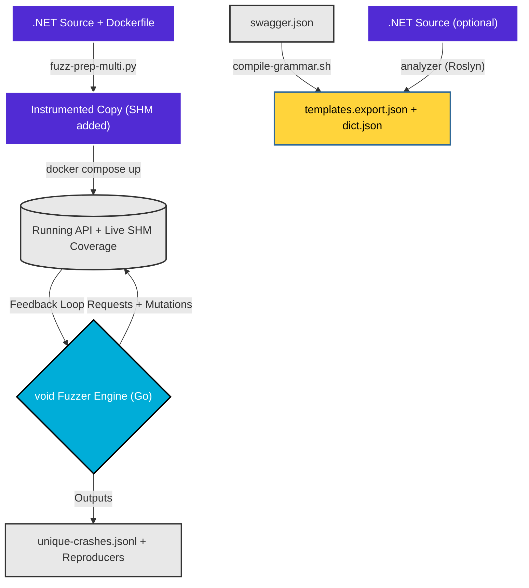
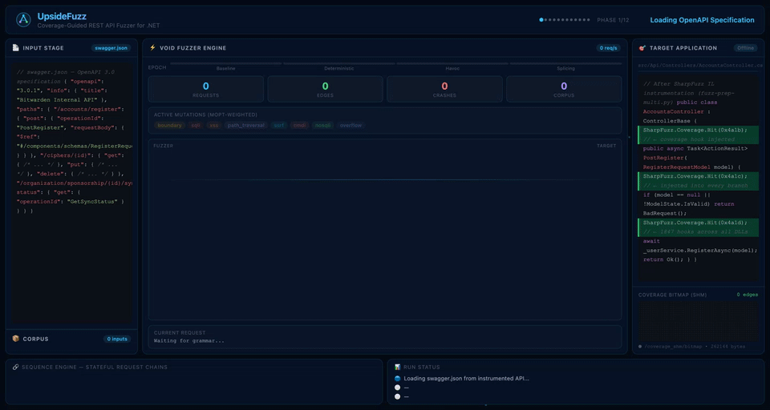

# UpsideFuzz — Coverage-Guided REST API Fuzzer for .NET

[](https://github.com/malchikserega/upside-fuzzer/actions/workflows/e2e.yml)

> **Automated black-box → grey-box fuzzing for any .NET 8+ web API.**  
> Transforms a standard .NET solution into a coverage-instrumented fuzzing target, then drives it with a Go-based grammar-fed fuzzer with real-time SHM feedback.

---

## How It Works / End-to-End Flow Diagram



---

## Quickstarts

New here? [**fixtures/demo-app/**](fixtures/demo-app/README.md) is an in-repo, self-contained .NET REST
API ("TeamFlow") built specifically to demo this whole approach — 57 endpoints, 42
planted vulnerabilities across every oracle class this fuzzer supports (BOLA, mass
assignment, SQLi, SSTI/XSS, SSRF, path traversal, unsafe deserialization, race
conditions, schema drift), including bugs engineered to be findable *only* through
coverage-guided feedback. No external target to clone or license — `cd fixtures/demo-app/ &&
dotnet run` gets you a browsable Swagger UI in seconds, and the README walks through
the full instrument → fuzz pipeline against it end to end.

Check out our step-by-step guides for instrumenting and fuzzing real-world applications from scratch:

- [Bitwarden Quickstart](docs/guides/target-specific/bitwarden-quickstart.md) (Multi-service app, JWT auth, multi-identity and data population)
- [BTCPayServer Quickstart](docs/guides/target-specific/btcpayserver-quickstart.md) (Complex multi-service app, Greenfield API, Greenfield Auth)
- [eShopOnWeb Quickstart](docs/guides/target-specific/eshop-quickstart.md) (Standard REST API, basic setup)
- [SimplCommerce Quickstart](docs/guides/target-specific/simplcommerce-quickstart.md) (Modular Monolith, Anti-forgery + Identity Auth injection)
- [Jellyfin Quickstart](docs/guides/target-specific/jellyfin-quickstart.md) (Large media-server API, no pre-existing Dockerfile, non-standard `MediaBrowser` auth scheme)

---

## How it Works

*New to this project? [**docs/getting-started/how-it-works.md**](docs/getting-started/how-it-works.md) explains the problem UpsideFuzz solves, why grey-box coverage + security oracles beat black-box REST fuzzers, how instrumentation/grammar/sequences/scheduling work in plain language, and what the BOLA/mass-assignment/injection/differential-auth-bypass oracles actually catch. The four bullets below are the short mechanism summary; that page is the "why."*



1. **Semantic Source Extraction (SSE)**: `tools/dotnet/analyzer/` — a real `Microsoft.CodeAnalysis.CSharp` syntax-tree analyzer, not regex — parses the target's `.cs` files to extract validation rules (`[StringLength]`, `[Range]`, FluentValidation chains, enum values, `[Authorize]`/route metadata) scoped by actual type+property, then `tools/grammar/grammarc/` merges them into a first-party OpenAPI-derived grammar (no RESTler).
2. **IL Rewriting**: The `bin/fuzz-prep-multi.py` script injects a `SharpFuzz` coverage hook into every basic block of the compiled .NET target.
3. **Direct SHM or HTTP Coverage**: The Go engine reads execution paths in real-time either directly from an mmap'd shared memory bitmap, or via a lightning-fast HTTP endpoint injected into the target's pipeline.
4. **Stateful Sequence Fanout**: When a `POST` creates a resource (e.g., `invoiceId`), the sequence engine tracks it and fans out subsequent `GET` / `PUT` / `DELETE` requests using that exact identifier.

## Features

| Category | What it does |
|----------|-------------|
| **Instrumentation** | Multi-project .NET solution support — instruments all business-logic DLLs, skips tests/migrations/generated code. **Zero-edit by default** (`--inject-mode hook`): `DOTNET_STARTUP_HOOKS` + an ASP.NET hosting-startup assembly link coverage at load time (incl. lazily-loaded modules) without touching the target's `Program.cs`/`Startup.cs`/`.csproj`. Legacy source-editing available via `--inject-mode source`. **Self-verifying, fail-closed**: the fuzzer sends a real warm-up probe at startup and refuses to run (unless `-allow-degraded-coverage`) if the coverage bitmap doesn't actually move — no more silently fuzzing blind for a whole time budget |
| **Coverage** | SHM bitmap shared across all DLLs via reflection — file-backed mmap, zero HTTP overhead in Docker sidecar mode. **Auto-sized from real instrumented-type count** (~64KB–8MB, not a fixed 256KB) captured at build time. **AFL-style hit-count buckets** (loop-depth aware) with a bucketed virgin map; per-request novelty attributed via a single-scan, first-observer-wins `X-Coverage-Delta` (no concurrency smearing, no double bitmap scan); the periodic bitmap reset now requires both high saturation **and** stagnation, so it never discards progress mid-run |
| **Grammar** | First-party OpenAPI 2/3 → typed grammar compiler (`tools/grammar/grammarc/`, no RESTler, no Docker for this step). Optional `tools/dotnet/analyzer/` Roslyn syntax-tree pass (not regex) extracts type/property-scoped `[Range]`/`[StringLength]`/FluentValidation/`[Authorize]` constraints, merged with precedence over OpenAPI-derived ones. Producer/consumer id inference, boundary-value synthesis, multipart |
| **Fuzzing** | Go engine: Baseline → Deterministic → Havoc → Splicing epochs, MOpt-style weighted mutation categories (incl. .NET `$type` deserialization gadgets). **Constraint-aware boundary mutation**: fields with a declared OpenAPI/Roslyn min/max/length/enum get exact boundary values blended into mutation (verified ~7x more hits on a known bug class in the same time budget). **CMPLOG-lite**: mines ASP.NET's 400-body validation errors for required field names/enum values, feeding them back into the runtime dictionary. **CmpLog/RedQueen via IL comparison instrumentation** (`--cmplog`, hook mode): a second Cecil pass records the literal operands of the target's own `String.Equals`/`StartsWith`/`Contains`/`==` and integer-compare checks straight out of its IL, feeding recovered "magic values" no spec could predict back into mutation. **Constant/string dictionary extraction**: a read-only Cecil pass (unconditional, always on) harvests string/int literals straight out of the target's own compiled IL at instrument time — the .NET analog of AFL's `-x` auto-dictionary |
| **Sequences** | Producer→consumer chains (POST→GET→PUT→DELETE), runtime value extraction, configurable fanout. **State-reward search**: reaching a never-seen workflow shape (not just a new coverage edge) earns extra energy + search budget, and equivalent workflows are deduped in the on-disk report. **Typed resource state graph** (`-resource-graph`, on by default): explicit lifecycle tracking (created/readable/modified/deleted/stale/...) derived from method+status+prior-state, not method alone; generalized entity extraction beyond id-name matching (HAL `_links`, JSON:API relationships, `Location`/`Link` headers, route-template-typed URI segments, and value-shape detection for GUIDs/slugs/opaque tokens under any field name); and coverage-directed consumer scheduling (blends historical edge yield, never-reached bonus, and failure penalty, with bounded epsilon-exploration so nothing is permanently starved) replacing the prior purely-static fanout order. Also models pagination/cursor chaining, multipart upload→process→download, async submit→poll→terminal jobs, and webhook/event lifecycle. See [docs/architecture/stateful-fuzzing.md](docs/architecture/stateful-fuzzing.md) |
| **Bug finding** | Crash triage, repro verification (incl. **whole-chain minimization** — drops non-essential earlier steps of a multi-request crash, not just the final request's own fields), PoC generation, race-burst outcome probing, multi-identity auth, **checkpoint/resume** for long campaigns |
| **Vulnerability oracles** | Beyond HTTP 500s: **BOLA/IDOR + broken-auth** via cross-identity and no-credential replay; **mass-assignment** via privileged-field over-posting (valid-chain-gated); **differential/parser-confusion auth bypass**; **positive injection** detection (SQLi, SSTI, XSS, SSRF, path traversal); **stateful oracles** — stale/deleted-object mutation, ignored ETag/optimistic locking, workflow/approval-state bypass, idempotency/double-processing; **response-schema conformance** drift. Full catalog with explanations in [**Vulnerability Classes Detected**](#vulnerability-classes-detected) below |
| **Reproducibility** | Every report/SARIF output carries a **run manifest** (seed, target, a locally-verified hash of the exact grammar consumed, plus pass-through image-digest/OpenAPI-hash/campaign-config provenance) and, for sequence-originated findings, the **full chain trace + producer→consumer value bindings** — not just the one request that crashed |
| **Root-cause clustering** | Collapses thousands of per-payload crash signatures into a handful of distinct bugs by normalized exception message + top application stack frame (`distinct_root_causes` in the report) |
| **Honest triage** | `likely_vuln` requires a real exploitation signal; unhandled-exception 500s are `confirmed_unhandled_exception`; DI failures are `target_misconfiguration`; malformed-input parse errors are down-ranked |
| **Auth** | Documented auth identity files, JWT/API-key/cookie/header support, weighted multi-identity scheduling, anti-forgery token harvesting |
| **Declarative campaigns** | `campaign.yaml` (`bin/compatibility/campaign.py`) declares target/readiness/state-reset/identities/policy/scenario-list once instead of re-typing CLI flags per run; `security_scenarios.yaml` is the underlying declarative catalog of every scenario family, cross-checked against the real Go implementation so it can't silently drift. See [docs/guides/campaigns.md](docs/guides/campaigns.md) / [docs/guides/security-scenarios.md](docs/guides/security-scenarios.md) |

---

## Vulnerability Classes Detected

Every row below is a distinct finding *type* this fuzzer's oracles produce — not just "the server returned 500." Tags are the literal `reasons`/`oracle` values that appear in `unique-crashes-*.jsonl`, the JSON report, and SARIF output.

| Class | Finding tag(s) | What it means | How it's found |
|-------|-----------------|----------------|-----------------|
| **BOLA / IDOR** | `bola_identical_cross_identity_response`, `bola_suspected_cross_identity_access` | One identity can read or write another identity's (or another tenant's) resource by ID alone — no ownership check | After a successful resource-scoped request, the identical request is replayed under every other configured identity; a byte-identical 2xx response is `likely_vuln_high`, a differing-but-substantial one is `likely_vuln` pending manual confirmation |
| **Broken authentication** | `auth_bypass_unauthenticated_access` | An endpoint that previously rejected unauthenticated access (401/403) accepts a credential-free request anyway | No-credential replay, gated so it only ever fires on endpoints already proven to enforce auth — never flags a genuinely public endpoint |
| **Differential / parser-confusion auth bypass** | `differential_auth_bypass:<technique>` | A verb swap (GET→HEAD), content-type confusion, route-case variant, or path/query param-location trick bypasses authorization the literal unauthenticated request already failed | 4 confusion variants replayed with no credentials, only on endpoints with strong evidence of auth enforcement |
| **Mass assignment** | `mass_assignment_privileged_field_accepted:<field>` | A write accepts and applies a privileged field (`role`, `isAdmin`, `permissions`, ...) the client should never be able to set | Successful writes are re-sent with privileged fields over-posted; the server echoing one back is the signal — valid-chain-gated so it only probes a real, already-confirmed resource, not a guessed path |
| **Stale / deleted-resource mutation** | `stale_object` (`stale_object_stale_read`, `update_after_delete`) | A resource this run already observed as deleted can still be read or, worse, mutated | The typed resource-lifecycle graph tracks DELETE outcomes; a later successful GET/PUT/PATCH against that same resource is flagged directly, no extra probe needed |
| **Ignored ETag / optimistic locking** | `stale_etag_accepted` | A write with a deliberately wrong `If-Match` header succeeds instead of being rejected with 409/412/428 | Replays a write against a resource with a known real ETag, substituting a fabricated stale value |
| **Workflow / approval-state bypass** | `workflow_bypass` | An action endpoint succeeds despite the resource's known state not satisfying the declared predecessor (e.g. `pay()` succeeding on an invoice that was never `sent`) | Cross-checks the resource graph's tracked lifecycle state against the endpoint's declared `x-state-transition` |
| **Idempotency / double-processing** | `idempotency_not_enforced` | Replaying an identical create/payment/refund request verbatim creates a second, different resource instead of returning the original — a double-charge/double-payout class of bug | Verbatim-replays a just-succeeded create-shaped POST (same body, same client idempotency key) and compares the created id |
| **Race conditions** | (see `-race-burst`/`-probe-race-outcome`) | More than one of N concurrent identical requests succeeds where only one should (double-spend, concurrent-approve, over-redeem) | Bursts of concurrent conflicting writes after a successful create/mutate step, with outcome evaluation beyond just "did it crash" |
| **SQL injection** | `sqli_time_based`, `sqli_error_reflected` | Unsanitized input reaches a SQL query | Response latency consistent with a sleep/benchmark payload actually executing, or a raw database engine error reflected in the response body |
| **Server-side template injection (SSTI)** | `ssti_evaluated` | User input is evaluated as a template expression server-side | An injected arithmetic expression (`{{1337*1337}}`) is evaluated and its numeric product appears in the response, not just reflected |
| **Reflected XSS** | `xss_reflected_unescaped` | An injected script payload is reflected back unescaped in an HTML response | Positive-detection payloads checked against the live response, not just presence of the input |
| **SSRF** | `ssrf_metadata_reflected` | The server fetches an attacker-supplied URL server-side | Genuine cloud-metadata-service content appears in the response after a metadata-service-shaped URL is submitted |
| **Path traversal / local file read** | `file_read_success` | User-controlled input reaches a filesystem path with insufficient sanitization | Contents of a well-known system file appear in the response |
| **Unsafe deserialization** | `dotnet_deser` mutation category | `Newtonsoft.Json`-style `$type`-driven polymorphic deserialization gadgets | Dedicated mutation payloads targeting `TypeNameHandling`-style endpoints; surfaces as a triaged crash, not claimed as a full RCE chain |
| **Response-schema drift** | `schema_undeclared_field`, `schema_undeclared_sensitive_field`, `schema_type_mismatch` | A live response carries a field never declared in the OpenAPI schema (flagged higher when the field name looks sensitive — password/secret/token/hash/...), or a declared field's type doesn't match what's actually returned | Every 2xx response body validated against the endpoint's declared OpenAPI response schema |
| **Unhandled exceptions** | `confirmed_unhandled_exception` | A reproducible 500 with a captured backend stack trace | A robustness/DoS-class bug, not by itself proof of a security vulnerability — distinguished honestly from the `likely_vuln*` classes above |
| **Target misconfiguration** | `target_misconfiguration` | A dependency-injection/service-resolution failure caused by how the image was built, not the app's own logic | Excluded from the vulnerability count entirely so it doesn't inflate the report |

See [void/README.md's Vulnerability Oracles / Stateful oracles sections](src/void/cmd/void/README.md#vulnerability-oracles-on-by-default) for the exact flags gating each of these, and [`security_scenarios.yaml`](tools/campaign/security_scenarios.yaml) / [docs/guides/security-scenarios.md](docs/guides/security-scenarios.md) for the same catalog in machine-readable form (`requires`/`valid`/`attack`/`confirm` per scenario).

---

## Repository Structure

```
.
├── upsidefuzz              Zero-install launcher (Docker mode; --no-docker for native)
├── bin/                     fuzz-prep-multi.py, compile-grammar.sh, verify-hook.sh, compatibility/ wrappers
├── src/
│   ├── void/                Go module (go.mod) — the fuzzing engine (cmd/void, internal/{config,engine})
│   └── cli/upsidefuzz/      The upsidefuzz CLI package
├── tools/
│   ├── prep/fuzzprep/       Multi-project .NET instrumentation
│   ├── grammar/grammarc/    OpenAPI → typed grammar compiler (Python, stdlib-only)
│   ├── campaign/            campaign.yaml + security_scenarios.yaml contracts
│   └── dotnet/              Roslyn analyzer + SharpFuzz/Cecil IL instrumentor (+ their .Tests projects)
├── fixtures/demo-app/       In-repo flagship demo target (TeamFlow) — 57 endpoints, 42 planted bugs
├── fixtures/planted-bug-api/  Minimal fixture used by the E2E CI regression gate
├── deployments/docker/      Dockerfile.void (fuzzer image), Dockerfile.cli (zero-install CLI image)
├── scripts/                 e2e-test.sh (CI gate) + test-compile-grammar-cli.sh
├── tests/integration/compatibility/   Smoke tests for every bin/ wrapper + the launcher
├── docs/                    See docs/index.md for the full map, or docs/guides/repo-layout.md for
│                            this tree in detail
└── README.md                this file
```

> **`grammars/` may already exist** in this workspace during active research runs — it's a generated artifact regenerated per target by `bin/compile-grammar.sh`. See [`.work/README.md`](.work/README.md) for the convention covering this and other local working state (target checkouts, run output, secrets).

---

## Quick Start

> **Prefer one command over six manual steps?** `./upsidefuzz run --src ... --out ... --target ... --swagger ...`
> drives the whole pipeline below (instrument → build+up → verify → grammar → fuzz) at once, and needs only
> **Docker** installed locally — no Python/.NET/Go required on your machine. See [docs/getting-started/cli.md](docs/getting-started/cli.md).
> Everything below still works exactly as written; the CLI is an additive convenience, not a replacement.

### 1. Prerequisites

```bash
# Required
docker --version        # Docker 24+
docker compose version  # Compose v2+
dotnet --version        # .NET 8+
python3 --version       # 3.10+

pip install -r requirements.txt
```

### 2. Instrument your .NET project

```bash
# Zero-edit instrumentation (default): no changes to the target's Program.cs/Startup.cs/.csproj
python3 bin/fuzz-prep-multi.py \
  --src ./my-project \
  --out ./my-project-fuzz \
  --main MyProject.Api        # name of the web API project

cd my-project-fuzz
docker compose build && docker compose up -d
sleep 45  # wait for DB migration + startup
```

> **Injection mode.** `--inject-mode hook` (default) uses `DOTNET_STARTUP_HOOKS` and never edits
> your source; `--inject-mode source` falls back to patching `Program.cs`/`Startup.cs` directly.
> Both expose the same `/shm/*` endpoints. Verify the hook is live:
> `curl -s http://localhost:8080/shm/health` → `{"linked_assemblies":N,...}` (N > 0).

### 3. Verify instrumentation

```bash
curl -X POST http://localhost:8080/shm/create
curl http://localhost:8080/shm/coverage  # → {"edges":N,"hits":N}
```

### 4. Compile grammar from Swagger

```bash
cd ..
curl -s http://localhost:8080/swagger/v1/swagger.json -o swagger.json

./bin/compile-grammar.sh swagger.json \
  --dict my-domain-dict.json \   # optional: domain-specific values
  --src ./my-project              # optional: runs the Roslyn analyzer for type-scoped constraints
  # --out grammars/my-project     # optional, defaults to grammars/<swagger-basename>/
```

One command, no Docker, no RESTler — writes `templates.export.json` + `dict.json` directly to
`--out` (default `grammars/<swagger-basename>/`).

**Adding your own fuzzing values?** You don't need `--dict` for that (it's a separate, one-off
mechanism) — the first compile also creates `<out>/dict.custom.json`, a starter file that's
merged into `dict.json` on every future run and never overwritten. Edit that file directly; see
[INSTRUCTIONS.md §10](docs/getting-started/quickstart.md#10-custom-dictionary-format) for the full workflow.

### 5. Run the fuzzer

**Docker sidecar mode** (recommended — direct SHM, fastest coverage):

```bash
export AUTH_TOKEN="<your-jwt-token>"
docker compose --profile fuzz-go run --rm void \
  -grammar grammars/my-project \
  -direct-shm \
  -time-budget 60
```

For access-control testing with several roles or tenants, prefer an auth identity file:

```bash
docker compose --profile fuzz-go run --rm void \
  -grammar grammars/my-project \
  -auth-file ./auth.identities.json \
  -identity-mode weighted \
  -direct-shm \
  -skip-endpoint-on-500 \
  -skip-on-crash \
  -time-budget 60
```

> **Getting `AUTH_TOKEN`/identity tokens is manual** — Void doesn't perform an OAuth2/OIDC login
> flow per identity. Single-identity mode has one fallback (`AUTH_URL`/`AUTH_BODY`/`AUTH_TOKEN_FIELD`,
> see [quickstart.md](docs/getting-started/quickstart.md#authentication-jwt-api-keys-custom-headers-and-cookies)),
> but `-auth-file` identities need a pre-obtained token each and aren't refreshed mid-run — on a
> long scan, re-generate `auth.identities.json` periodically or expect stale-token 401s late on.

**Host mode** (API running natively, coverage via HTTP):

```bash
go -C src/void build -o cmd/void/void ./cmd/void   # one-time (or after a source change)
export TARGET_HOST="http://localhost:8080"
export AUTH_TOKEN="<your-jwt-token>"
./src/void/cmd/void/void -grammar grammars/my-project -time-budget 60
```

### 6. Monitor crashes

```bash
# Live unique crashes (./crashes/ is the default -unique-crash-file directory)
tail -f crashes/unique-crashes-*.jsonl

# Pretty-print
cat crashes/unique-crashes-*.jsonl | \
  python3 -c "import sys,json; [print(json.dumps(json.loads(l),indent=2)) for l in sys.stdin]"
```

---

## Fuzzer Key Flags

All bug-finding features are **on by default**. The fastest way to start is a **profile**:

```bash
./src/void/cmd/void/void -profile security -auth-file auth.json   # vuln hunting (oracles + multi-identity)
./src/void/cmd/void/void -profile deep                            # thorough 60-min scan
./src/void/cmd/void/void -profile fast                            # CI smoke (max throughput)
```

A profile only sets knobs you didn't pass yourself — any individual flag below still overrides it.

| Flag | Default | Notes |
|------|---------|-------|
| `-profile` | empty | `fast` \| `deep` \| `security` preset bundle (individual flags win) |
| `-direct-shm` | `false` | Enable in Docker sidecar mode |
| `-time-budget` | `10` min | Set 60–120 for thorough scans |
| `-concurrency` | `10` | Raise to 32–64 for fast APIs |
| `-auth-file` | empty | Recommended JWT/API-key/cookie multi-identity auth config |
| `-sequence-prob` | `0.30` | Raise to 0.5 for stateful APIs |
| `-skip-endpoint-on-500` | `false` | Set `true` if infra returns known 500s |
| `-crash-triage=false` | — | Disable for max throughput in CI |
| `-repro-runs 0` | — | Skip repro verification |
| `-access-probe` | `true` | Master toggle: BOLA + auth-bypass + mass-assignment (most valuable with `-auth-file`) |
| `-probe-bola` | `true` | Cross-identity BOLA/IDOR replay |
| `-probe-auth-bypass` | `true` | No-credential replay — only fires on endpoints already seen returning 401/403 to unauth (no public-endpoint false positives) |
| `-probe-mass-assign` | `true` | Over-post privileged fields on writes |
| `-probe-differential` | `true` | Verb/content-type/route-case/param-location confusion auth-bypass replay — only fires on endpoints with strong evidence of auth enforcement |
| `-access-probe-prob` | `0.5` | Probability of firing access-control probes after a successful resource request |
| `-injection-oracle` | `true` | Positive injection detection (time-based SQLi, evaluated SSTI, reflected XSS) |
| `-schema-conformance` | `true` | Validate 2xx response bodies against the declared OpenAPI response schema — flags undeclared fields (separately tagged when the field name looks sensitive) and type drift. Silent on endpoints whose grammar declares no response schema; regenerate with an up-to-date `tools/grammar/grammarc/` if your grammar predates this |
| `-sqli-time-threshold` | `1.5` s | Latency (also ≥3× baseline) that flags a sleep/benchmark SQLi payload |
| `-resource-graph` | `true` | Master toggle for the typed resource-lifecycle graph — turns it off reproduces the old id-name-centric extraction (no stateful oracles below need it) |
| `-probe-stale-object` | `true` | Flags a write/read that unexpectedly succeeds against a resource this run already saw deleted |
| `-probe-stale-etag` | `true` | Flags a write accepted despite a deliberately wrong `If-Match` header (optimistic locking not enforced) |
| `-probe-workflow-bypass` | `true` | Flags an `x-state-transition`-declared action succeeding against a resource whose known state skips the declared predecessor (approval bypass) |
| `-probe-idempotency` | `true` | Verbatim-replays a just-succeeded create/payment POST; a second, different created id flags double-processing |
| `-race-mode` / `-probe-race-outcome` | `true` | Concurrent conflicting writes + evaluation of how many of them actually succeeded (double-spend, concurrent-approve) |
| `-minimize-chain` | `true` | For a crash reached through a multi-step chain, also drops non-essential earlier steps (requires `-minimize-crash`) |
| `-checkpoint-path` / `-resume` | empty / `false` | Periodically snapshot the corpus + resource graph; `-resume` loads it back instead of starting cold — useful for long campaigns |
| `-cmplog` | `true` | Poll `/shm/cmplog` for comparison operands harvested from the target's own IL (needs `--cmplog` at instrument time, hook mode only) and blend them into string/int mutation |
| `-cmplog-interval` | `3.0` s | Seconds between `/shm/cmplog` polls |
| `-sarif-file` | empty | Path to also write findings as SARIF 2.1.0 (drops into GitHub code scanning / DefectDojo), including the run manifest and per-finding chain trace. Empty = don't write one. |

Full reference: `./src/void/cmd/void/void --help`, [void/README.md](src/void/cmd/void/README.md), or declare a whole run once as a reusable [`campaign.yaml`](docs/guides/campaigns.md) instead of flags.

---

## Crash Output Format

Each unique crash in `unique-crashes-*.jsonl`:

```json
{
  "signature": "7ecd321e718f5a26",
  "status_code": 500,
  "method": "PUT",
  "path": "/v1/resource/0",
  "mutation": "sqli",
  "triage": {"classification": "confirmed_unhandled_exception", "severity_score": 6},
  "repro": {"stable_reproducible": true, "stability_pct": "100.0"},
  "minimized": {"path": "/v1/resource/0", "payload": ""},
  "poc_file": "./crashes/pocs/poc-7ecd321e.sh"
}
```

**Classification tiers** (see `triage.go` / `oracle.go`):

| Classification | Meaning |
|----------------|---------|
| `likely_vuln_high` / `likely_vuln` | A concrete exploitation signal fired — BOLA/IDOR, broken auth, time-based SQLi, evaluated SSTI, reflected XSS, file read, SSRF |
| `confirmed_unhandled_exception` | Reproducible 500 with a backend stack trace — a robustness/DoS bug, not a proven vulnerability |
| `needs_review` | A 500 that could not be attributed (incl. down-ranked malformed-input parse errors) |
| `target_misconfiguration` | DI/service-resolution failure from how the image was built — excluded from the vuln count |

Access-control findings additionally carry an `access_control: true` field with `origin_identity` → `shadow_identity`; the report's `access_control_findings` and `distinct_root_causes` counters summarize the run.

---

## Documentation

**→ [docs/index.md](docs/index.md)** — Full documentation index with navigation across all guides.

| Document | Description |
|----------|-------------|
| **[docs/getting-started/how-it-works.md](docs/getting-started/how-it-works.md)** | Start here if you're new: the problem this solves, why grey-box + oracles beat black-box fuzzing, plain-language explainers of instrumentation/grammar/sequences/scheduling, and the BOLA/mass-assignment/injection/differential-auth-bypass oracles |
| **[docs/research/whitepaper.md](docs/research/whitepaper.md)** | The full whitepaper: builds fuzzing and coverage-guided fuzzing from zero, then walks the entire architecture and the engineering decisions behind it, diagrams included — the single best document to hand someone who wants to understand the whole project |
| **[INSTRUCTIONS.md](docs/getting-started/quickstart.md)** | Complete runbook: prerequisites, instrumentation, grammar generation, all run profiles, CLI reference, dictionary format, quality gates, troubleshooting |
| **[ARCHITECTURE.md](docs/architecture/overview.md)** | Pipeline internals: source discovery, Docker build, SharpFuzz instrumentation, SHM sync/coverage protocol, grammar compilation |
| **[ARCHITECTURE_ENGINE.md](docs/architecture/engine.md)** | The Void fuzzing runtime itself: component map, CmpLog/constant extraction, schema-conformance oracle, epoch scheduling, mutation engine, triage/clustering/SARIF, vulnerability oracles |
| **[ARCHITECTURE_STATEFUL.md](docs/architecture/stateful-fuzzing.md)** | The stateful-fuzzing architecture specifically: typed resource/lifecycle model, valid-workflow vs. adversarial-branch planning, producer→consumer bindings, reproducibility (run manifest, chain-level minimization/SARIF) — implemented-vs-open status mapped file by file |
| **[ARCHITECTURE_REVIEW.md](docs/development/architecture-review.md)** | Candid engineering self-review: subsystem-by-subsystem strengths/weaknesses, comparison to RESTler/EvoMaster/Schemathesis, and the prioritized roadmap |
| **[CAMPAIGN.md](docs/guides/campaigns.md)** | The `campaign.yaml` contract — declare target/readiness/state reset-seed-cleanup/identities/policy/scenarios once as a reusable file instead of re-typing CLI flags per run |
| **[SECURITY_SCENARIOS.md](docs/guides/security-scenarios.md)** | The `security_scenarios.yaml` declarative catalog — every stateful security-scenario family this fuzzer implements, cross-checked against the real Go code so it can't silently drift |
| **[docs/guides/authentication.md](docs/guides/authentication.md)** | Canonical JWT/API-key/cookie auth file schema and multi-identity access-control fuzzing guidance |
| **[void/README.md](src/void/cmd/void/README.md)** | Go fuzzer: full CLI reference, startup output guide, build for any platform |
| **[docs/guides/target-candidates.md](docs/guides/target-candidates.md)** | Implemented targets and future fuzzing candidates |
| **[docs/guides/mcp-integration.md](docs/guides/mcp-integration.md)** | Using MCP to enrich the fuzzer dictionary from live database data |
| **[docs/development/code-map.md](docs/development/code-map.md)** | Terse, AI-agent-facing operational summary — component map, "do not revert" architectural decisions, file-lookup table. Read this first if you're an AI agent about to modify this repo or fuzz a new target autonomously |
| **[docs/guides/repo-layout.md](docs/guides/repo-layout.md)** | Where everything lives on disk (`src/void/`, `src/cli/upsidefuzz/`, `bin/`+`bin/compatibility/`, `.work/`) and the full old-path → new-path map from the 2026-07-31 repo cleanup |

---

## Contributing

Issues and PRs are welcome — see [CONTRIBUTING.md](CONTRIBUTING.md) for setup,
the test/lint commands (`make test`, `make lint`, `make e2e`), and commit/PR
conventions.

## License

Apache License 2.0 — see [LICENSE](LICENSE). Permissive: use, modify, and
distribute freely (including commercially), provided you keep the copyright
and license notice. Includes an explicit patent grant from contributors to
users, with a patent-retaliation clause.
