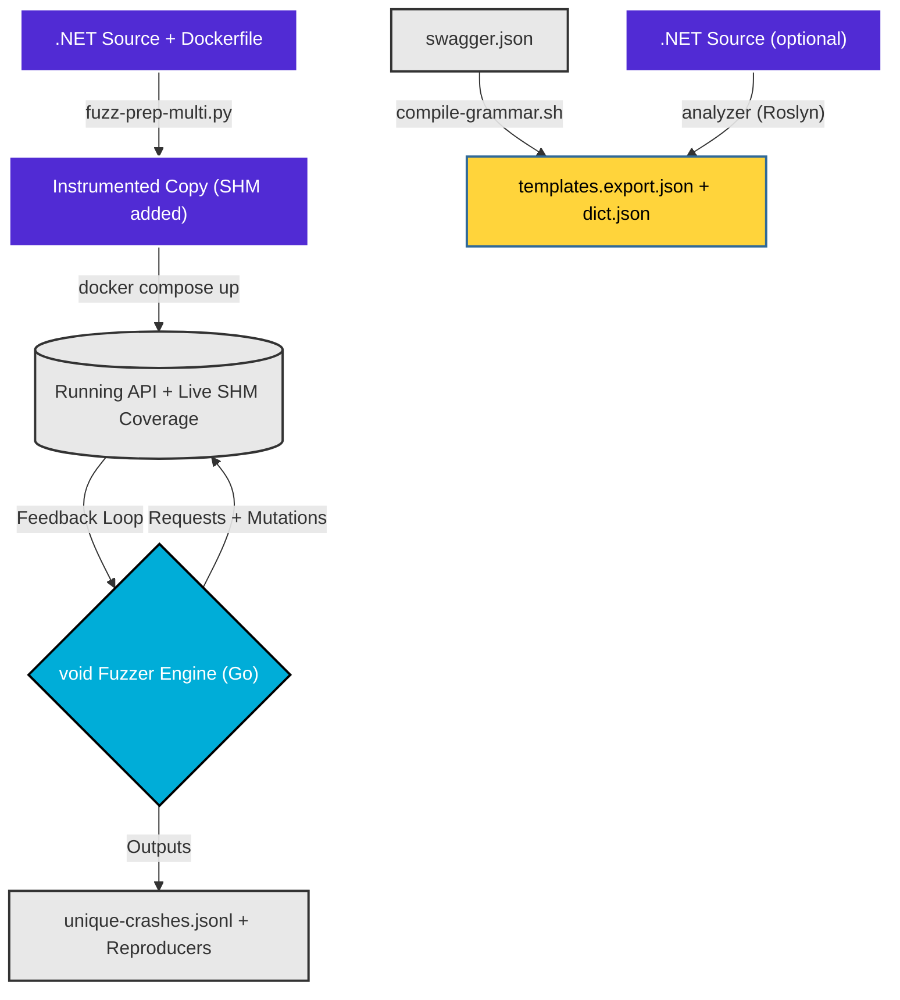

# UpsideFuzz — Coverage-Guided REST API Fuzzer for .NET

[](https://github.com/malchikserega/upside-fuzzer/actions/workflows/e2e.yml)

> **Automated black-box → grey-box fuzzing for any .NET 8+ web API.**  
> Transforms a standard .NET solution into a coverage-instrumented fuzzing target, then drives it with a Go-based grammar-fed fuzzer with real-time SHM feedback.

---

## How It Works / End-to-End Flow Diagram



### High-level pipeline:

```
.NET Source + Dockerfile
       │
  fuzz-prep-multi.py        ← copies project, injects SharpFuzz probes into all DLLs,
       │                       adds /shm/create + /shm/coverage endpoints, adapts compose
  Instrumented Copy
       │
  docker compose build && docker compose up -d
       │
  Running API with live SHM coverage bitmap
       │
  compile-grammar.sh swagger.json [--dict dict.json] [--src ./src]
       │                             ← parses OpenAPI directly (grammarc/), optionally
       │                               runs dotnet/analyzer/ (real Roslyn syntax-tree analysis)
       │                               over --src for type-scoped C# constraints;
       │                               no RESTler, no Docker for this step
  templates.export.json + dict.json
       │
  void             ← coverage-guided fuzzing: epoch scheduling, adaptive
       │                        concurrency, MOpt mutations, stateful sequences
  crashes/unique-crashes.jsonl
```

---

## Quickstarts

New here? [**demo_app/**](demo_app/README.md) is an in-repo, self-contained .NET REST
API ("TeamFlow") built specifically to demo this whole approach — 26 endpoints, 24
planted vulnerabilities across every oracle class this fuzzer supports (BOLA, mass
assignment, SQLi, SSTI/XSS, SSRF, path traversal, unsafe deserialization, race
conditions, schema drift), including bugs engineered to be findable *only* through
coverage-guided feedback. No external target to clone or license — `cd demo_app &&
dotnet run` gets you a browsable Swagger UI in seconds, and the README walks through
the full instrument → fuzz pipeline against it end to end.

Check out our step-by-step guides for instrumenting and fuzzing real-world applications from scratch:

- [Bitwarden Quickstart](docs/QUICKSTART_BITWARDEN.md) (Multi-service app, JWT auth, multi-identity and data population)
- [BTCPayServer Quickstart](docs/QUICKSTART_BTCPAYSERVER.md) (Complex multi-service app, Greenfield API, Greenfield Auth)
- [eShopOnWeb Quickstart](docs/QUICKSTART_ESHOP.md) (Standard REST API, basic setup)
- [SimplCommerce Quickstart](docs/QUICKSTART_SIMPLCOMMERCE.md) (Modular Monolith, Anti-forgery + Identity Auth injection)

---

## How it Works

*New to this project? [**docs/HOW_IT_WORKS.md**](docs/HOW_IT_WORKS.md) explains the problem UpsideFuzz solves, why grey-box coverage + security oracles beat black-box REST fuzzers, how instrumentation/grammar/sequences/scheduling work in plain language, and what the BOLA/mass-assignment/injection/differential-auth-bypass oracles actually catch. The four bullets below are the short mechanism summary; that page is the "why."*


1. **Semantic Source Extraction (SSE)**: `dotnet/analyzer/` — a real `Microsoft.CodeAnalysis.CSharp` syntax-tree analyzer, not regex — parses the target's `.cs` files to extract validation rules (`[StringLength]`, `[Range]`, FluentValidation chains, enum values, `[Authorize]`/route metadata) scoped by actual type+property, then `grammarc/` merges them into a first-party OpenAPI-derived grammar (no RESTler).
2. **IL Rewriting**: The `fuzz-prep-multi.py` script injects a `SharpFuzz` coverage hook into every basic block of the compiled .NET target.
3. **Direct SHM or HTTP Coverage**: The Go engine reads execution paths in real-time either directly from an mmap'd shared memory bitmap, or via a lightning-fast HTTP endpoint injected into the target's pipeline.
4. **Stateful Sequence Fanout**: When a `POST` creates a resource (e.g., `invoiceId`), the sequence engine tracks it and fans out subsequent `GET` / `PUT` / `DELETE` requests using that exact identifier.

## Features

| Category | What it does |
|----------|-------------|
| **Instrumentation** | Multi-project .NET solution support — instruments all business-logic DLLs, skips tests/migrations/generated code. **Zero-edit by default** (`--inject-mode hook`): `DOTNET_STARTUP_HOOKS` + an ASP.NET hosting-startup assembly link coverage at load time (incl. lazily-loaded modules) without touching the target's `Program.cs`/`Startup.cs`/`.csproj`. Legacy source-editing available via `--inject-mode source`. **Self-verifying, fail-closed**: the fuzzer sends a real warm-up probe at startup and refuses to run (unless `-allow-degraded-coverage`) if the coverage bitmap doesn't actually move — no more silently fuzzing blind for a whole time budget |
| **Coverage** | SHM bitmap shared across all DLLs via reflection — file-backed mmap, zero HTTP overhead in Docker sidecar mode. **Auto-sized from real instrumented-type count** (~64KB–8MB, not a fixed 256KB) captured at build time. **AFL-style hit-count buckets** (loop-depth aware) with a bucketed virgin map; per-request novelty attributed via a single-scan, first-observer-wins `X-Coverage-Delta` (no concurrency smearing, no double bitmap scan); the periodic bitmap reset now requires both high saturation **and** stagnation, so it never discards progress mid-run |
| **Grammar** | First-party OpenAPI 2/3 → typed grammar compiler (`grammarc/`, no RESTler, no Docker for this step). Optional `dotnet/analyzer/` Roslyn syntax-tree pass (not regex) extracts type/property-scoped `[Range]`/`[StringLength]`/FluentValidation/`[Authorize]` constraints, merged with precedence over OpenAPI-derived ones. Producer/consumer id inference, boundary-value synthesis, multipart |
| **Fuzzing** | Go engine: Baseline → Deterministic → Havoc → Splicing epochs, MOpt-style weighted mutation categories (incl. .NET `$type` deserialization gadgets). **Constraint-aware boundary mutation**: fields with a declared OpenAPI/Roslyn min/max/length/enum get exact boundary values blended into mutation (verified ~7x more hits on a known bug class in the same time budget). **CMPLOG-lite**: mines ASP.NET's 400-body validation errors for required field names/enum values, feeding them back into the runtime dictionary. **CmpLog/RedQueen via IL comparison instrumentation** (`--cmplog`, hook mode): a second Cecil pass records the literal operands of the target's own `String.Equals`/`StartsWith`/`Contains`/`==` and integer-compare checks straight out of its IL, feeding recovered "magic values" no spec could predict back into mutation. **Constant/string dictionary extraction**: a read-only Cecil pass (unconditional, always on) harvests string/int literals straight out of the target's own compiled IL at instrument time — the .NET analog of AFL's `-x` auto-dictionary |
| **Sequences** | Producer→consumer chains (POST→GET→PUT→DELETE), runtime value extraction, configurable fanout. **State-reward search**: reaching a never-seen workflow shape (not just a new coverage edge) earns extra energy + search budget, and equivalent workflows are deduped in the on-disk report |
| **Bug finding** | Crash triage, repro verification, payload minimization, PoC generation, race condition probing, multi-identity auth |
| **Vulnerability oracles** | Beyond HTTP 500s: **BOLA/IDOR + broken-auth** via cross-identity and no-credential replay; **mass-assignment** via privileged-field over-posting; **differential/parser-confusion auth bypass** via verb/content-type/route-case/param-location variants on endpoints known to enforce auth; **positive injection** detection (time-based SQLi, evaluated SSTI, reflected XSS); **response-schema conformance** — fields present in a live response but undeclared in the OpenAPI schema (flagged distinctly when the field name looks sensitive), plus declared-vs-observed type drift |
| **Root-cause clustering** | Collapses thousands of per-payload crash signatures into a handful of distinct bugs by normalized exception message + top application stack frame (`distinct_root_causes` in the report) |
| **Honest triage** | `likely_vuln` requires a real exploitation signal; unhandled-exception 500s are `confirmed_unhandled_exception`; DI failures are `target_misconfiguration`; malformed-input parse errors are down-ranked |
| **Auth** | Documented auth identity files, JWT/API-key/cookie/header support, weighted multi-identity scheduling, anti-forgery token harvesting |

---

## Repository Structure

```
.
├── fuzz-prep-multi.py          Entry point (thin wrapper -> fuzzprep.cli.main()); instruments
│                               a .NET project for fuzzing
├── fuzzprep/                   The actual implementation, one file per responsibility
│   ├── models.py               Shared dataclasses (ProjectInfo, MultiAnalysisResult)
│   ├── analysis.py             MultiProjectAnalyzer: scans the solution, classifies
│   │                           business-logic files
│   ├── detect.py                Pure regex helpers over Dockerfile/C# source text
│   │                           (build/runtime stage detection, publish dir, etc.)
│   ├── docker_gen.py            Dockerfile + docker-compose generation/adaptation
│   ├── instrumentor_gen.py      Instrumentor source copy + zero-edit coverage-hook assembly
│   ├── coverage_helper_gen.py   Legacy --inject-mode source support
│   └── cli.py                  Argument parsing and orchestration (main())
├── compile-grammar.sh          One-command grammar compile (grammarc/ + dotnet/analyzer/, no Docker)
│
├── grammarc/                   First-party OpenAPI → typed grammar compiler (Python, stdlib-only)
│   ├── oas.py                  OpenAPI 2/3 parser ($ref/allOf/oneOf/anyOf resolution)
│   ├── body_serializer.py      Schema → request-body segment serializer
│   ├── dependencies.py         Producer/consumer id inference (path/name convention)
│   ├── roslyn_merge.py         Merges the analyzer's type-scoped constraints over OpenAPI's
│   ├── boundary.py             Boundary-value synthesis (min-1/max+1, canned formats, etc.)
│   ├── multipart.py            Multipart/form-data template synthesis
│   ├── emit_templates.py       Writes templates.export.json (Go engine contract)
│   ├── emit_dict.py            Writes dict.json (Go engine contract); scaffolds + merges dict.custom.json
│   └── cli.py                  Orchestration entry point (python3 -m grammarc.cli)
│
├── dotnet/                     The two C# build-time tools, each with its own xUnit test project
│   ├── analyzer/                Roslyn syntax-tree analyzer (Microsoft.CodeAnalysis.CSharp)
│   │   ├── Program.cs
│   │   ├── ConstraintWalker.cs   DataAnnotations, type/property-scoped
│   │   ├── FluentValidationWalker.cs
│   │   ├── RouteAuthWalker.cs   [Authorize]/route metadata (controller + minimal-API styles)
│   │   └── analyzer.csproj
│   ├── analyzer.Tests/
│   ├── instrumentor/             SharpFuzz/Cecil IL instrumentor
│   │   ├── Program.cs
│   │   ├── instrument.sh
│   │   └── instrumentor.csproj
│   └── instrumentor.Tests/
│
├── void/
│   ├── go/
│   │   ├── main.go             CLI flags and app bootstrap
│   │   ├── fuzzer.go           Main lifecycle hooks and epoch scheduling
│   │   ├── worker.go           Core HTTP fuzzing loop and coverage tracking
│   │   ├── coverage.go         SHM bitmap parsing and HTTP coverage reader
│   │   ├── sequence.go         Stateful producer/consumer chains
│   │   ├── store.go            Knowledge extraction, ID harvesting, and dedup
│   │   ├── template.go         templates.export.json parsing and payload rendering
│   │   ├── mutation_engine.go  MOpt-style mutation scheduler and weights
│   │   ├── mutations.go        MOpt payload mutation categories
│   │   ├── crash.go            Crash deduplication, signature generation, JSONL logging
│   │   ├── cluster.go          Root-cause clustering (many signatures → one bug)
│   │   ├── oracle.go           BOLA/IDOR + auth-bypass + positive injection oracles
│   │   ├── triage.go           Source-aware priority and crash route scoring
│   │   ├── poc.go              PoC shell script and timeline generation
│   │   ├── report.go           Final JSON crash report and findings summary
│   │   ├── minimize.go         Crash minimization and repro verification
│   │   ├── identity.go         Auth identities, multi-identity scheduling, race probing
│   │   ├── auth.go             JWT/header/cookie auth state and login fallback
│   │   ├── jwt_expiry.go       JWT expiry warnings for -auth-file identities
│   │   ├── ui.go               Live terminal dashboard
│   │   ├── utils.go            HTTP and string utility functions
│   │   └── types.go            Core data structures
│   ├── export-templates.py     Legacy fallback: converts an old grammar.py → JSON templates
│   │                           (only used for pre-migration grammars not yet regenerated
│   │                           with grammarc/ — the primary path writes templates.export.json
│   │                           directly and never touches this script)
│   └── Dockerfile.go           Docker image for Go sidecar
│
├── demo_app/                   In-repo flagship demo target (TeamFlow) -- 26 endpoints,
│                               24 planted vulnerabilities, no external clone required
├── fixtures/planted-bug-api/   Minimal fixture used by the E2E CI regression gate
├── scripts/                    e2e-test.sh (CI gate) + test-compile-grammar-cli.sh
│
├── requirements.txt            Python dependencies
├── test_fuzz_prep_multi.py     Unit tests for fuzzprep/detect.py
├── docs/
│   ├── INSTRUCTIONS.md         Step-by-step runbook (new system → fuzzing)
│   └── ARCHITECTURE.md         Platform internals, diagrams, design decisions
└── README.md                   this file
```

> **`grammars/` may already exist in this workspace** during active research runs — it's a generated artifact; `compile-grammar.sh` regenerates it per target as needed. `restler_bin/`/`restler_input/`/`restler_output/` may also still be present from before the RESTler retirement — they're inert now and can be deleted; nothing in the current pipeline reads or writes them.

---

## Quick Start

> **Prefer one command over six manual steps?** `./upsidefuzz run --src ... --out ... --target ... --swagger ...`
> drives the whole pipeline below (instrument → build+up → verify → grammar → fuzz) at once, and needs only
> **Docker** installed locally — no Python/.NET/Go required on your machine. See [docs/CLI.md](docs/CLI.md).
> Everything below still works exactly as written; the CLI is an additive convenience, not a replacement.

### 1. Prerequisites

```bash
# Required
docker --version        # Docker 24+
docker compose version  # Compose v2+
dotnet --version        # .NET 8+
python3 --version       # 3.10+

pip install -r requirements.txt
```

### 2. Instrument your .NET project

```bash
# Zero-edit instrumentation (default): no changes to the target's Program.cs/Startup.cs/.csproj
python3 fuzz-prep-multi.py \
  --src ./my-project \
  --out ./my-project-fuzz \
  --main MyProject.Api        # name of the web API project

cd my-project-fuzz
docker compose build && docker compose up -d
sleep 45  # wait for DB migration + startup
```

> **Injection mode.** `--inject-mode hook` (default) uses `DOTNET_STARTUP_HOOKS` + an ASP.NET hosting-startup assembly (`UpsideFuzz.Coverage`) and never edits your source. To fall back to the legacy behavior that injects `CoverageExtensions.cs` and patches `Program.cs`/`Startup.cs`, pass `--inject-mode source`. Both modes expose the same `/shm/*` endpoints and `X-Coverage-Delta` header, so all later steps are identical.
>
> Verify the hook is live after startup: `curl -s http://localhost:8080/shm/health` → `{"linked_assemblies":N,...}` (N > 0).

### 3. Verify instrumentation

```bash
curl -X POST http://localhost:8080/shm/create
curl http://localhost:8080/shm/coverage  # → {"edges":N,"hits":N}
```

### 4. Compile grammar from Swagger

```bash
cd ..
curl -s http://localhost:8080/swagger/v1/swagger.json -o swagger.json

./compile-grammar.sh swagger.json \
  --dict my-domain-dict.json \   # optional: domain-specific values
  --src ./my-project              # optional: runs the Roslyn analyzer for type-scoped constraints
  # --out grammars/my-project     # optional, defaults to grammars/<swagger-basename>/
```

One command, no Docker, no RESTler — writes `templates.export.json` + `dict.json` directly to
`--out` (default `grammars/<swagger-basename>/`).

**Adding your own fuzzing values?** You don't need `--dict` for that (it's a separate, one-off
mechanism) — the first compile also creates `<out>/dict.custom.json`, a starter file that's
merged into `dict.json` on every future run and never overwritten. Edit that file directly; see
[INSTRUCTIONS.md §10](docs/INSTRUCTIONS.md#10-custom-dictionary-format) for the full workflow.

### 5. Run the fuzzer

**Docker sidecar mode** (recommended — direct SHM, fastest coverage):

```bash
export AUTH_TOKEN="<your-jwt-token>"
docker compose --profile fuzz-go run --rm void \
  -grammar grammars/my-project \
  -direct-shm \
  -time-budget 60
```

For access-control testing with several roles or tenants, prefer an auth identity file:

```bash
docker compose --profile fuzz-go run --rm void \
  -grammar grammars/my-project \
  -auth-file ./auth.identities.json \
  -identity-mode weighted \
  -direct-shm \
  -skip-endpoint-on-500 \
  -skip-on-crash \
  -time-budget 60
```

> **Getting `AUTH_TOKEN`/identity tokens is manual** — Void doesn't perform an OAuth2/OIDC login
> flow per identity today. Single-identity mode has one fallback (`AUTH_URL`/`AUTH_BODY`/
> `AUTH_TOKEN_FIELD` — Void POSTs your login request itself instead of you exporting a token;
> see [INSTRUCTIONS.md](docs/INSTRUCTIONS.md#authentication-jwt-api-keys-custom-headers-and-cookies)),
> but `-auth-file` identities must each carry a pre-obtained token and are **not** refreshed
> once they expire mid-run. On a long scan, re-generate `auth.identities.json` periodically or
> expect stale-token 401s late in the run.

**Host mode** (API running natively, coverage via HTTP):

```bash
export TARGET_HOST="http://localhost:8080"
export AUTH_TOKEN="<your-jwt-token>"
./void/go/void -grammar grammars/my-project -time-budget 60
```

### 6. Monitor crashes

```bash
# Live unique crashes
tail -f void/crashes/unique-crashes-*.jsonl

# Pretty-print
cat void/crashes/unique-crashes-*.jsonl | \
  python3 -c "import sys,json; [print(json.dumps(json.loads(l),indent=2)) for l in sys.stdin]"
```

---

## Fuzzer Key Flags

All bug-finding features are **on by default**. The fastest way to start is a **profile**:

```bash
./void/go/void -profile security -auth-file auth.json   # vuln hunting (oracles + multi-identity)
./void/go/void -profile deep                            # thorough 60-min scan
./void/go/void -profile fast                            # CI smoke (max throughput)
```

A profile only sets knobs you didn't pass yourself — any individual flag below still overrides it.

| Flag | Default | Notes |
|------|---------|-------|
| `-profile` | empty | `fast` \| `deep` \| `security` preset bundle (individual flags win) |
| `-direct-shm` | `false` | Enable in Docker sidecar mode |
| `-time-budget` | `10` min | Set 60–120 for thorough scans |
| `-concurrency` | `10` | Raise to 32–64 for fast APIs |
| `-auth-file` | empty | Recommended JWT/API-key/cookie multi-identity auth config |
| `-sequence-prob` | `0.30` | Raise to 0.5 for stateful APIs |
| `-skip-endpoint-on-500` | `false` | Set `true` if infra returns known 500s |
| `-crash-triage=false` | — | Disable for max throughput in CI |
| `-repro-runs 0` | — | Skip repro verification |
| `-access-probe` | `true` | Master toggle: BOLA + auth-bypass + mass-assignment (most valuable with `-auth-file`) |
| `-probe-bola` | `true` | Cross-identity BOLA/IDOR replay |
| `-probe-auth-bypass` | `true` | No-credential replay — only fires on endpoints already seen returning 401/403 to unauth (no public-endpoint false positives) |
| `-probe-mass-assign` | `true` | Over-post privileged fields on writes |
| `-probe-differential` | `true` | Verb/content-type/route-case/param-location confusion auth-bypass replay — only fires on endpoints with strong evidence of auth enforcement |
| `-access-probe-prob` | `0.5` | Probability of firing access-control probes after a successful resource request |
| `-injection-oracle` | `true` | Positive injection detection (time-based SQLi, evaluated SSTI, reflected XSS) |
| `-schema-conformance` | `true` | Validate 2xx response bodies against the declared OpenAPI response schema — flags undeclared fields (separately tagged when the field name looks sensitive) and type drift. Silent on endpoints whose grammar declares no response schema; regenerate with an up-to-date `grammarc` if your grammar predates this |
| `-sqli-time-threshold` | `1.5` s | Latency (also ≥3× baseline) that flags a sleep/benchmark SQLi payload |
| `-cmplog` | `true` | Poll `/shm/cmplog` for comparison operands harvested from the target's own IL (needs `--cmplog` at instrument time, hook mode only) and blend them into string/int mutation |
| `-cmplog-interval` | `3.0` s | Seconds between `/shm/cmplog` polls |
| `-sarif-file` | empty | Path to also write findings as SARIF 2.1.0 (drops into GitHub code scanning / DefectDojo). Empty = don't write one. |

Full reference: `./void/go/void --help` or [void/README.md](void/README.md)

---

## Crash Output Format

Each unique crash in `unique-crashes-*.jsonl`:

```json
{
  "signature": "7ecd321e718f5a26",
  "status_code": 500,
  "method": "PUT",
  "path": "/v1/resource/0",
  "mutation": "sqli",
  "triage": {"classification": "confirmed_unhandled_exception", "severity_score": 6},
  "repro": {"stable_reproducible": true, "stability_pct": "100.0"},
  "minimized": {"path": "/v1/resource/0", "payload": ""},
  "poc_file": "./crashes/pocs/poc-7ecd321e.sh"
}
```

**Classification tiers** (see `triage.go` / `oracle.go`):

| Classification | Meaning |
|----------------|---------|
| `likely_vuln_high` / `likely_vuln` | A concrete exploitation signal fired — BOLA/IDOR, broken auth, time-based SQLi, evaluated SSTI, reflected XSS, file read, SSRF |
| `confirmed_unhandled_exception` | Reproducible 500 with a backend stack trace — a robustness/DoS bug, not a proven vulnerability |
| `needs_review` | A 500 that could not be attributed (incl. down-ranked malformed-input parse errors) |
| `target_misconfiguration` | DI/service-resolution failure from how the image was built — excluded from the vuln count |

Access-control findings additionally carry an `access_control: true` field with `origin_identity` → `shadow_identity`; the report's `access_control_findings` and `distinct_root_causes` counters summarize the run.

---

## Documentation

**→ [docs/INDEX.md](docs/INDEX.md)** — Full documentation index with navigation across all guides.

| Document | Description |
|----------|-------------|
| **[docs/HOW_IT_WORKS.md](docs/HOW_IT_WORKS.md)** | Start here if you're new: the problem this solves, why grey-box + oracles beat black-box fuzzing, plain-language explainers of instrumentation/grammar/sequences/scheduling, and the BOLA/mass-assignment/injection/differential-auth-bypass oracles |
| **[INSTRUCTIONS.md](docs/INSTRUCTIONS.md)** | Complete runbook: prerequisites, instrumentation, grammar generation, all run profiles, CLI reference, dictionary format, quality gates, troubleshooting |
| **[ARCHITECTURE.md](docs/ARCHITECTURE.md)** | Platform internals: SHM design, instrumentation pipeline, Go fuzzer components, epoch scheduling, mutation engine |
| **[ARCHITECTURE_REVIEW.md](docs/ARCHITECTURE_REVIEW.md)** | Candid engineering self-review: subsystem-by-subsystem strengths/weaknesses, comparison to RESTler/EvoMaster/Schemathesis, and the prioritized roadmap |
| **[docs/FUZZER_AUTHENTICATION.md](docs/FUZZER_AUTHENTICATION.md)** | Canonical JWT/API-key/cookie auth file schema and multi-identity access-control fuzzing guidance |
| **[void/README.md](void/README.md)** | Go fuzzer: full CLI reference, startup output guide, build for any platform |
| **[docs/TARGET_CANDIDATES.md](docs/TARGET_CANDIDATES.md)** | Implemented targets and future fuzzing candidates |
| **[docs/MCP_INTEGRATION_GUIDE.md](docs/MCP_INTEGRATION_GUIDE.md)** | Using MCP to enrich the fuzzer dictionary from live database data |
