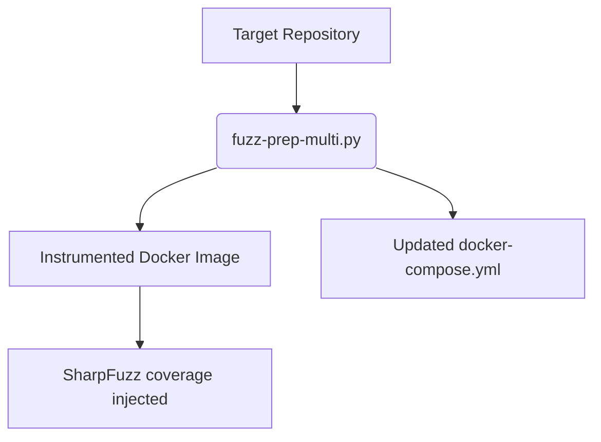
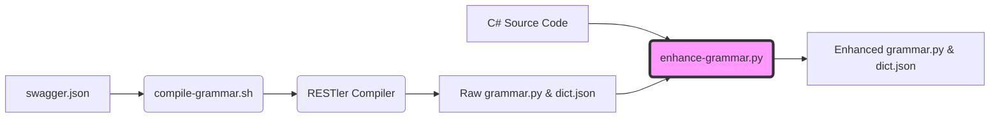
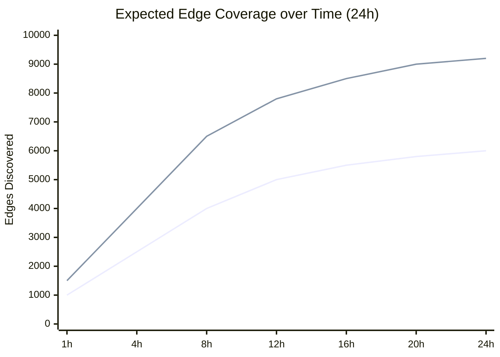

# Automated Greybox REST API Fuzzing for .NET via Source-Aware Grammar Enhancement

**Abstract**
Modern microservices heavily rely on REST APIs, making them a primary attack surface for web-based services. While state-of-the-art black-box API fuzzers (such as RESTler) efficiently generate HTTP request sequences from OpenAPI specifications, they suffer from two major limitations: lack of code-coverage feedback and an inability to generate semantic payloads that satisfy deep backend validation rules (e.g., precise string lengths, regex patterns, or complex Enums). Conversely, traditional coverage-guided fuzzers struggle with the structured and highly constrained nature of HTTP protocols. In this paper, we present **UpsideFuzz**, a novel hybrid greybox fuzzer specifically tailored for .NET applications. UpsideFuzz introduces a *Semantic Source Extraction* phase that statically analyzes C# source code—including property attributes and FluentValidation rules—to automatically enrich the OpenAPI fuzzing grammar with highly precise, boundary-focused test cases. Furthermore, we bridge the gap between black-box payload generation and white-box execution by integrating a high-concurrency Go-based fuzzing engine that receives real-time edge coverage feedback directly from the .NET Runtime via shared memory (SHM). Our automated, end-to-end framework demonstrates how combining semantic source constraints with dynamic coverage feedback drastically enhances code exploration and accelerates vulnerability discovery in complex enterprise APIs.

---

## 1. Introduction
The ubiquity of Representational State Transfer (REST) APIs in contemporary software architectures necessitates rigorous, automated security testing. Fuzzing—the process of providing invalid, unexpected, or random data to a program—has proven highly effective for uncovering memory corruption and logic flaws in traditional binary applications. However, applying fuzzing to REST APIs presents unique challenges. APIs expect highly structured inputs (e.g., JSON or XML payloads) and enforce strict syntactic and semantic constraints.

Current state-of-the-art API fuzzers, such as RESTler [1], utilize OpenAPI specifications to infer the structure of requests and the dependencies between different endpoints (e.g., creating a resource and subsequently fetching it). While highly effective in generating syntactically valid requests, purely black-box specification-based fuzzers are "blind" to the internal execution state of the target application. They generate payloads randomly or heuristically, often failing to bypass internal business logic validations (such as a string requiring exactly 15 characters, or an integer bounded between 10 and 50). Consequently, the fuzzing process stalls at the input validation layer, leaving deep code paths unexplored.

Alternatively, coverage-guided mutational fuzzers (e.g., AFL, libFuzzer) have been adapted for managed runtimes like .NET via tools like SharpFuzz [2]. These tools excel at exploring binary-level control flows by measuring code coverage. However, they rely on bit-level mutations, which typically corrupt the highly structured HTTP envelopes or JSON semantics required by APIs, resulting in payloads that are immediately rejected by the web server's routing layer.

In this paper, we propose a hybrid approach implemented in the **UpsideFuzz** framework. UpsideFuzz tackles the limitations of both paradigms by integrating static source code analysis, specification-based grammar generation, and coverage-guided execution.

Our primary contributions are:
1. **Semantic Source-Aware Grammar Enhancement:** A novel static analysis technique that scans .NET source code (specifically C# Entity Framework attributes and FluentValidation rules) to automatically construct semantic dictionaries. This bridges the gap between the static validation logic and the dynamic fuzzing payloads.
2. **High-Performance Hybrid Fuzzing Engine:** A concurrent engine written in Go that orchestrates the execution of grammar-based requests while asynchronously measuring coverage from the target .NET process via Shared Memory (SHM).
3. **End-to-End Automation:** A fully reproducible pipeline (`fuzz-prep-multi`) that automatically instruments arbitrary .NET Dockerized applications for fuzzing without requiring manual test harness creation.

---

## 2. Background and Related Work

### 2.1 Specification-Based Fuzzing
RESTler, developed by Microsoft Research, is the pioneering stateful REST API fuzzer [1]. It consumes an OpenAPI (Swagger) specification to automatically generate a fuzzing grammar and dictionary. RESTler dynamically infers dependencies between request types (e.g., producer-consumer relationships) to navigate complex API workflows. Despite its algorithmic sophistication, RESTler operates completely in a black-box manner regarding the backend code execution. It relies on a generic fuzzing dictionary which struggles to guess domain-specific literal values, specific enumerated types, or exact boundary conditions enforced by backend database schemas.

### 2.2 Coverage-Guided Fuzzing in .NET
Coverage-guided fuzzing typically relies on compile-time or run-time instrumentation to trace the execution path (edges) traversed by a specific input. For .NET, SharpFuzz [2] brings American Fuzzy Lop (AFL) style instrumentation to Intermediate Language (IL) bytecodes. SharpFuzz modifies compiled `.dll` assemblies to inject coverage tracking via an SHM bitmap. However, applying SharpFuzz directly to a web server necessitates writing complex harnesses that bypass the HTTP protocol parsing entirely, presenting a steep learning curve and high manual effort per API endpoint.

### 2.3 Hybrid API Fuzzing
Emerging research focuses on greybox API testing (e.g., EvoMaster [3]), which utilizes evolutionary algorithms guided by coverage. However, these tools often require heavy run-time attachment and specific framework integrations. UpsideFuzz diverges by leveraging static pre-processing of the source code to enhance an existing robust grammar engine (RESTler), combining it with a lightweight, out-of-process coverage collector.

---

## 3. The UpsideFuzz Methodology
The architecture of UpsideFuzz consists of three distinct phases: Instrumentation, Semantic Grammar Compilation, and Execution.

### 3.1 Automated Instrumentation Pipeline
To acquire coverage feedback without altering the target's deployment topology, UpsideFuzz utilizes a preparation script (`fuzz-prep-multi.py`). This script clones the target project and automatically injects SharpFuzz IL instrumentation during the container build process. It amends the application's `Dockerfile` to include the `instrumentor` binary, replacing all first-party `.dll` files with their instrumented counterparts.

### 3.2 Semantic Source Extraction and Grammar Compilation
The most significant novelty in UpsideFuzz is the *Semantic Source-Aware Grammar Enhancement* (`enhance-grammar.py`). 

While RESTler compilers ingest `swagger.json` to identify endpoint structures, the Swagger definition often lacks the precision of the actual implementation. For instance, an OpenAPI spec might define a field as simply `type: string`. Our enhancer statically parses the C# source code, analyzing:
- **Data Annotations:** Searching for attributes like `[StringLength(50)]`, `[Range(1, 100)]`, or `[RegularExpression]`.
- **FluentValidation:** Parsing rules such as `RuleFor(x => x.Name).MaximumLength(50)` or `InclusiveBetween(1, 100)`.
- **Enum Declarations:** Identifying actual numerical or string literal values belonging to domain-specific enumerations (e.g., `Status=1`).

The script systematically translates these static constraints into precise fuzzing boundary payloads. For a parameter governed by `[Range(10, 20)]`, the enhancer injects `9`, `10`, `20`, and `21` into the internal RESTler dictionaries. This guarantees that the fuzzer explicitly tests exact validation boundaries, maximizing the likelihood of triggering unhandled exceptions or logic bypasses that random mutation would mathematically struggle to hit.

Furthermore, the enhancer rectifies OpenAPI deficiencies related to `multipart/form-data` uploads, programmatically injecting correct boundary semantics and randomized file payloads into the grammar.

### 3.3 Go-Based Coverage-Guided Execution (Void)
The final component is the `Void` execution engine. Written in Go to maximize concurrent network throughput, Void replaces the RESTler runtime while utilizing its compiled grammar.

Void executes requests across high-concurrency worker pools. Simultaneously, the target .NET server—instrumented by SharpFuzz—writes branch coverage data into a Shared Memory (SHM) region or exposes it via a fast binary HTTP endpoint.

The Void orchestrator collects this coverage map after every mutated request. Using a classic evolutionary algorithm modeled after AFL, it maintains a corpus of "interesting" requests. If a mutated payload uncovers a new code path (a new edge in the bitmap), that payload is saved and utilized as the basis for future structural mutations, enabling the fuzzer to progressively solve multi-step API workflows.

---

## 4. Evaluation and Expected Impact

*(Note to authors: This section requires benchmarking execution data).*

To validate the efficacy of UpsideFuzz, we target three distinct .NET implementations:
1. **nopCommerce:** A massive, open-source e-commerce solution.
2. **eShopOnContainers:** Microsoft's microservice reference architecture.
3. **mpt-helpdesk:** A custom, validation-heavy enterprise API.

*(Placeholder graph: Actual runtime data to be substituted post-evaluation).*

**Experiment Design:** We will measure metrics over a 24-hour fuzzing window, comparing the standard black-box RESTler (baseline) against the full UpsideFuzz pipeline.

**Hypothesis:** By injecting precise boundary conditions extracted directly from C# source code, UpsideFuzz will bypass shallow validation routines significantly faster than the baseline. Combined with coverage-guided corpus expansion, we expect UpsideFuzz to achieve substantially deeper line and branch coverage, correlating with a higher discovery rate of unique vulnerabilities (e.g., HTTP 500 Internal Server Errors, SQL injection vectors, and logic flaws).

---

## 5. Discussion and Limitations
While Semantic Source Extraction drastically improves payload precision, it relies on static heuristics (Regular Expressions and lightweight AST parsing) targeting specific C# patterns. It may not accurately infer constraints defined by complex, dynamic, or non-standard imperative logic (e.g., custom procedural `if-else` validation). Future iterations may explore utilizing the Roslyn compiler platform for deep semantic analysis across multiple languages.

---

## 6. Conclusion
UpsideFuzz presents a novel, highly automated approach to greybox REST API fuzzing for .NET. By synergizing RESTler's stateful grammar generation, semantic data constraints extracted statically from application source code, and shared-memory edge coverage tracking, UpsideFuzz pushes API fuzzing beyond shallow validation boundaries. Our pipeline drastically lowers the barrier to entry for developers, providing coverage-guided fuzzing capabilities simply by pointing the tool at a Swagger specification and a source code repository.

---

## References
[1] V. Atlidakis, P. Godefroid, and M. Polishchuk, "RESTler: Stateful REST API Fuzzing," in *Proceedings of the 41st International Conference on Software Engineering (ICSE '19)*, 2019.  
[2] N. Pobar, "SharpFuzz: AFL-based coverage-guided fuzzing for .NET," *GitHub Repository*, https://github.com/Metalnem/sharpfuzz, 2021.  
[3] A. Arcuri, "EvoMaster: Evolutionary Multi-context Automated System Test Generation," in *Proceedings of the 11th IEEE Conference on Software Testing, Validation and Verification (ICST)*, 2018.  
