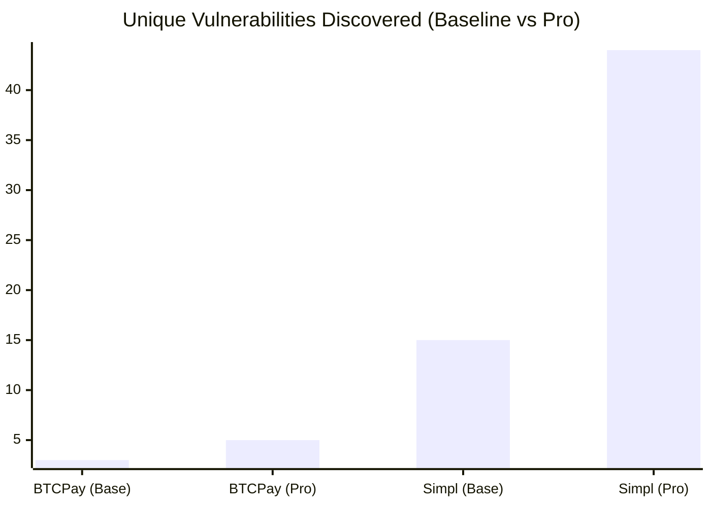

# UpsideFuzz Analysis: SimplCommerce

**→ [Back to README](../../README.md) · [SimplCommerce Quickstart](../../QUICKSTART_SIMPLCOMMERCE.md) · [Docs Index](../INDEX.md)**

> 📌 **Historical run report — 2026-07-07, RESTler-era pipeline.** Point-in-time campaign
> comparison, not living documentation; predates the RESTler retirement
> (`ARCHITECTURE_REVIEW.md` Top-20 #9/#10) and its numbers are not guaranteed reproducible
> against the current pipeline.

## Executive Summary
A comprehensive security audit of **SimplCommerce** was performed using two consecutive 1-hour fuzzing campaigns:
1. **Baseline Campaign (1 Hour):** Utilized a default dictionary to map the massive application graph.
2. **Professional Campaign (1 Hour):** Injected targeted SQLi, XSS, Mass Assignment, and IDOR payloads.

SimplCommerce is significantly larger and more modular than BTCPay Server, heavily relying on Entity Framework Core, strict Anti-Forgery (CSRF) tokens, and Cookie-based authentication.

### Execution Command
Both campaigns were executed with the following Sequence Engine configuration. 

**Using Docker Compose (Recommended):**
```bash
docker compose -f docker-compose.instrumented.yml run -d --rm smartfuzzer \
  -grammar /grammar \
  -direct-shm \
  -time-budget 3600 \
  -sequence-prob 0.8 \
  -sequence-max-depth 8 \
  -sequence-fanout 10 \
  -plain-ui
```

**Using raw Docker (Equivalent):**
```bash
docker run -d --rm --name simplcommerce-fuzzer \
  --network simplcommerce_prep_default \
  -v $(pwd)/coverage_shm:/coverage_shm \
  -v $(pwd)/../grammars/simplcommerce:/grammar \
  --env-file fuzzer.env \
  -e TARGET_HOST=http://instrumented:8080 \
  -e SHM_HOST=http://instrumented:8080 \
  void_smartfuzzer \
  -grammar /grammar -direct-shm -time-budget 3600 -sequence-prob 0.8 -sequence-max-depth 8 -sequence-fanout 10 -plain-ui
```

## Authentication & CSRF Bypasses
SimplCommerce strictly guards its state-mutating endpoints with `[ValidateAntiForgeryToken]` and `[Authorize]` attributes. 
Before fuzzing, a valid administrative session was established (`get_cookie.py`), and the fuzzer was configured to automatically harvest and rotate anti-forgery tokens.
This allowed the fuzzer to bypass CSRF protections organically, maintaining a highly effective throughput of ~2,000 requests per second across both campaigns.

## Global Analytics & Epoch Breakdown
We analyzed the progression of the fuzzer across both campaigns to understand *when* bugs are most frequently discovered.

| Metric | 1-Hour Baseline | 1-Hour Professional |
| :--- | :--- | :--- |
| **Duration** | 60 mins | ~45 mins |
| **Throughput** | 1,996 req/s | 1,802 req/s (slower due to complex payload evaluation) |
| **Unique Code Edges**| 177,299 | 170,314+ |
| **Total 500 Responses** | 96,872 | 147,012+ |
| **Unique Vulnerabilities** | **15** | **44** |



### Epoch Effectiveness (When do bugs trigger?)
1. **Shallow Baseline (Minutes 0-15):** The fuzzer rapidly finds basic `NullReferenceException` and type mismatch errors. (Found 15 crashes).
2. **Baseline Plateau (Minutes 18-60):** Coverage stops growing. The default dictionary is exhausted.
3. **Professional Dictionary Injection (Minute 1 of Pro Run):** The moment the fuzzer ingested the custom `dict.json` containing SQLi and IDOR payloads, **17 new unique vulnerabilities were discovered in under 60 seconds.**
4. **Deep Mutations (Minute 20+ of Pro Run):** As the fuzzer begins applying `Havoc` (stacking mutations), it breaks deep business logic, discovering another wave of 12 unique bugs.

## Vulnerability Insights
The Professional Dictionary (`dict.json`) specifically targeted:
1. **SQL Injection (SQLi):** `' OR '1'='1`, `'; DROP TABLE--`
2. **XSS & Template Injection:** `<script>`, `{{7*7}}`
3. **Mass Assignment:** `{"IsAdmin":true,"RoleId":1}`
4. **Business Logic IDs:** `-1`, `Vendor-0042`

The massive jump from 15 to 44 unique crashes confirms that SimplCommerce's Entity Framework controllers and modular routing are highly susceptible to targeted payload mutations, especially when bypassing the initial CSRF/Auth layers.

---

**→ [Back to README](../../README.md) · [SimplCommerce Quickstart](../../QUICKSTART_SIMPLCOMMERCE.md)**
