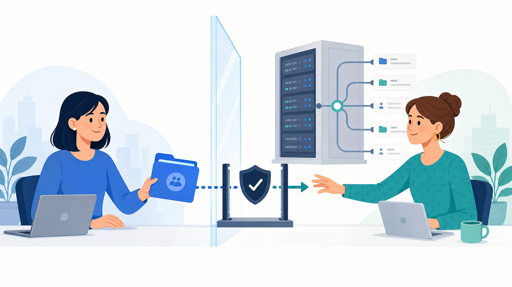
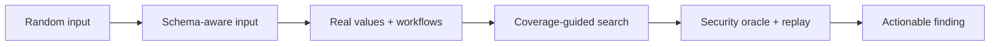
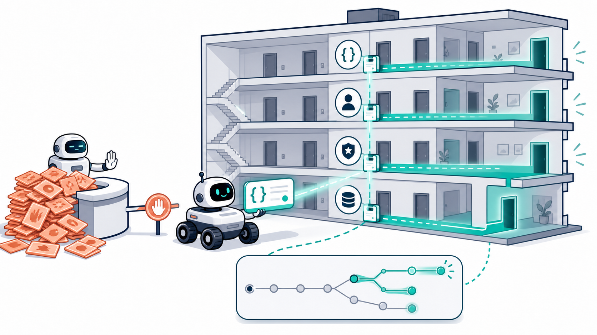
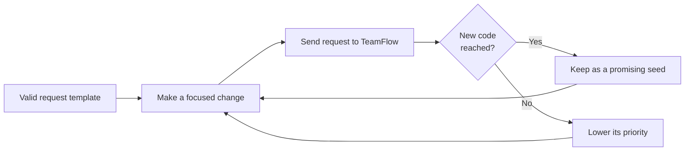
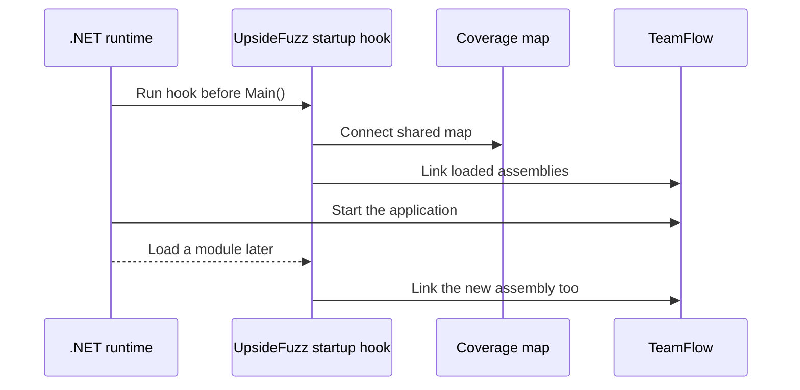
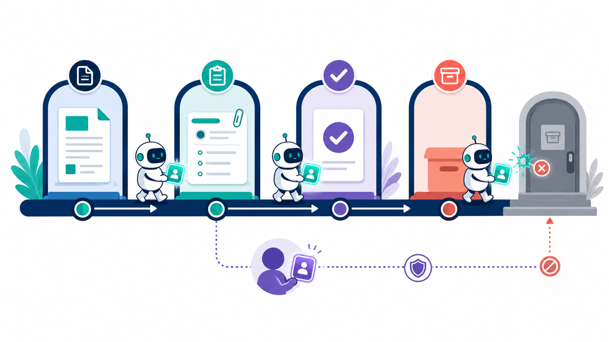
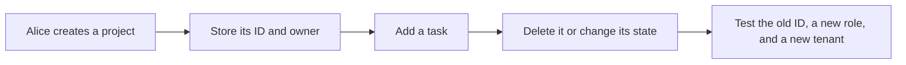
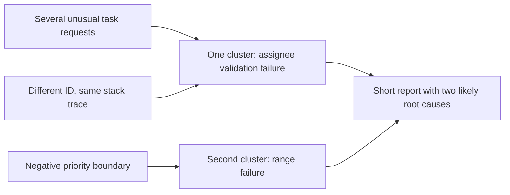
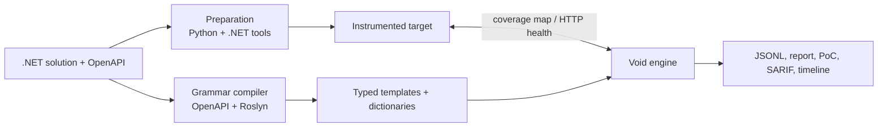
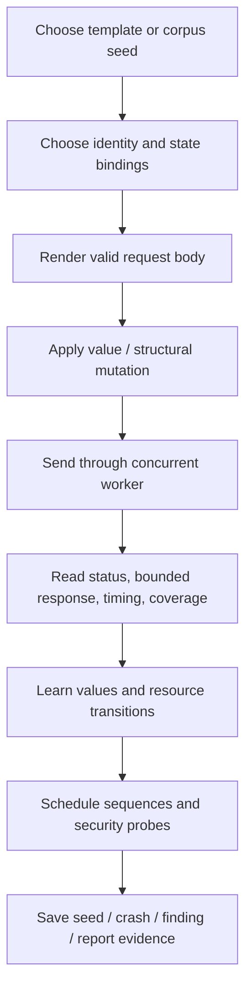

# UpsideFuzz: Finding Meaningful Security Bugs in .NET APIs

*A plain-English guide to coverage-guided REST API fuzzing: what UpsideFuzz does,
why random requests are not enough, what it can prove, and where its limits are.*



---

## Executive summary

Imagine **TeamFlow**, a normal project-management SaaS. It has organizations,
employees, projects, tasks, documents, invitations, and roles such as Member,
Manager, and Admin. Alice is an Acme administrator. Erin works for a different
company, Globex.

The security rule is easy to say: Erin must not be able to read Acme's documents,
create projects for Acme, or turn herself into an administrator. Enforcing that
rule is hard because it is distributed across hundreds of routes, authorization
checks, JSON fields, database lookups, and multi-step workflows. One missing
ownership check can break it.

**UpsideFuzz** is a testing platform for systematically looking for those gaps in
.NET REST APIs. It:

1. builds a machine-readable model of an API from OpenAPI/Swagger and, when source
   is available, extracts part of the application's real C# validation rules;
2. runs the application with code-coverage feedback, without requiring developers
   to edit `Program.cs` or add fuzzer code to the application;
3. creates structurally valid requests, then changes them just enough to reach
   deeper business logic instead of dying at the first `400 Bad Request`;
4. follows workflows such as create → read → update → delete and reuses real IDs
   returned by the server;
5. looks for evidence of security impact, not only crashes—for example, the same
   private resource successfully returned to two different accounts.

It is not a replacement for a penetration tester, and it cannot prove an API has
no vulnerabilities. Its practical job is to cover a large API surface efficiently,
prioritize code that the test actually reached, and hand a human a short,
reproducible explanation of what deserves attention.

## Who this is for

This paper is written for a U.S. engineering, product, or security audience that
does not need prior fuzzing experience. The same TeamFlow story appears throughout:
from a valid request, to a real object ID, to a second user's access attempt, to a
developer-ready report.

For readers who want the technical map first:

| Layer | Responsibility |
|---|---|
| Preparation (Python/.NET) | Finds .NET projects, prepares a Docker environment, and enables coverage with no application-code edits. |
| Grammar compiler (Python + Roslyn) | Turns OpenAPI and selected C# constraints into typed HTTP request templates. |
| Void engine (Go) | Schedules requests, reads coverage, builds workflows, runs security oracles, and writes reports. |

---

# A gentle path from basic fuzzing to UpsideFuzz

Before discussing the project, it helps to separate several ideas that are often
called “fuzzing” even though they solve different problems.

## Level 1: example-based testing

An ordinary automated test starts with a known example and a known expectation:
“when Alice creates a project, the API returns `201 Created`.” This is essential,
but it examines only cases a person thought to write down. It will not normally ask
what happens when the title is 81 characters, the project ID is from another company,
or an extra `role` field appears in a nested JSON object.

## Level 2: random fuzzing

The simplest fuzzer sends many unexpected inputs. For a command-line program that
reads a file, random bytes can be surprisingly effective: parser crashes are often
close to the input boundary. For an API, random data usually produces the same fast
rejection over and over:

```text
random bytes → invalid JSON → 400 Bad Request
random bytes → invalid JSON → 400 Bad Request
random bytes → invalid JSON → 400 Bad Request
```

The server may be behaving correctly, but the test learns almost nothing about its
authorization, billing, workflow, or database code.

## Level 3: schema-based fuzzing

A schema-aware fuzzer reads OpenAPI and sends JSON that looks plausible. It knows
that `priority` is a number, a project path needs an ID, and `members` is an array.
This reaches much more code than random bytes. However, it still has two blind spots:
the specification can be incomplete, and it cannot tell whether a request that
returned `200 OK` took a new path or simply repeated old behavior.

## Level 4: stateful fuzzing

A stateful fuzzer remembers that API calls have order. It creates a project before
trying to update it and saves the real ID returned by the server. This unlocks bugs
that cannot exist in a single request: a deleted record still being writable, a
revoked invitation still working, or a payment request being accepted twice.

## Level 5: coverage-guided fuzzing

Coverage-guided fuzzing adds a feedback loop. When one request gets beyond a new
check in the program, it is saved as a better starting point for the next request.
The tool climbs validation gates one at a time instead of needing to guess every
precondition in one lucky attempt.

## Level 6: security-oriented grey-box fuzzing

This is the level UpsideFuzz targets. It combines all five earlier ideas with:

* source-derived constraints when they are available;
* zero-edit .NET coverage instrumentation;
* multiple identities and an anonymous guest;
* a typed resource lifecycle, not only a bag of IDs;
* security **oracles** that look for evidence of access-control failure, injection,
  workflow failure, duplication, or race outcomes;
* replay, minimization, clustering, and redacted artifacts that a developer can use.

The distinction matters. “The fuzzer sent an odd request and got a 500” is a useful
lead. “Alice's private project was created, its real ID was replayed by Erin, and
Erin received the same substantive object despite belonging to a different tenant”
is a security finding with a story, evidence, and a reproduction path.



---

# 1. The problem: APIs accept more than developers anticipate

## What fuzzing means

Fuzzing is automated testing with large numbers of unusual, malformed, or
boundary-case inputs. Instead of manually inventing thousands of form fields,
files, or HTTP requests, a tool produces and sends them while watching what the
program does.

For TeamFlow, a normal request to create a task might look like this:

```json
{"title":"Prepare contract","priority":2,"assigneeId":"..."}
```

A person may try a few reasonable variations. A fuzzer can also try a missing
title, a maximum-length title, a negative priority, a wrong nested type, or an
unexpected combination of fields. The point is not to throw junk at a server for
its own sake. It is to find the difference between inputs the developers expected
and inputs that are actually possible to send over the network.

For web APIs, a crash is only one kind of signal. A `500 Internal Server Error`
may be a robustness problem. A normal-looking `200 OK` that gives Erin an Acme
document is usually much more serious. A useful API fuzzer must therefore answer
two separate questions:

* **Where did the request get inside the program?** This makes the search more
  efficient.
* **Did an important rule fail?** This turns unusual behavior into a meaningful
  finding.

## Why random data does not get far

REST APIs commonly have several gates before business logic: JSON parsing, type
checks, required fields, authentication, roles, object existence, and business
rules. Random data rarely survives the first one.

To meaningfully test an update to a project, a tool may need to log in, create or
discover a real project ID, send a body with the expected JSON shape, and only then
exercise an ownership or role check. Guessing every prerequisite independently is
not a realistic strategy.

That is why UpsideFuzz combines a model of the API, values observed in real server
responses, and a search strategy that learns which attempts made progress.

## Coverage is a compass, not a security score

When an application runs with coverage instrumentation, it records which transitions
through code executed. If a request reaches a branch the campaign has not reached
before, that is useful feedback: it may have cleared another validation gate.

UpsideFuzz retains requests with new coverage as promising **seeds**, then creates
future variations from those seeds. It is less like repeatedly trying random doors
in an office building and more like remembering which doors led to a new hallway.





This is **grey-box fuzzing**. The tool does not reason about every line of source
code as a formal verifier would, but it is not blind like a scanner that sees only
HTTP status codes. It can observe the effect of execution through coverage.

Coverage is not proof of security. New code can be perfectly safe; coverage simply
makes it far more likely that the campaign reaches the places where meaningful tests
can happen. Separate checks decide whether behavior is actually a problem.

---

# 2. Learning the API before testing it

## Swagger is a floor plan, not the building itself

OpenAPI/Swagger documents the public contract: routes, HTTP methods, parameters,
field types, and sometimes constraints. From it, UpsideFuzz learns that TeamFlow
has operations such as `POST /api/projects`, `GET /api/projects/{id}`, and
`DELETE /api/projects/{id}`.

The grammar compiler turns that contract into typed request templates. It knows
that a path `id` is an identifier, that `priority` is numeric, and that a body is
a JSON object. The fuzzer therefore starts with a request likely to pass the front
door rather than a random byte string.

An API specification is a promise, though—not always the whole truth. C# code may
contain `[StringLength(80)]`, `Range`, FluentValidation rules, or authorization
metadata that the published specification does not fully express. When source is
available, UpsideFuzz's Roslyn analyzer extracts selected DataAnnotations and
FluentValidation constraints, routes, and authorization metadata and merges them
with the OpenAPI model.

That makes boundary testing specific. If the contract says “string” but the code
accepts 3 through 80 characters, lengths 2, 3, 4, 79, 80, and 81 are much more
valuable than a million arbitrary strings.

## Valid enough to reach the logic; wrong enough to test it

The fuzzer has two complementary jobs:

* create a request valid enough to reach real project logic;
* break one meaningful condition and observe how the application handles it.

The current typed structural mutation engine keeps a request body as a tree—objects,
arrays, nested fields, `oneOf` variants, and constraints—until immediately before it
is sent as JSON. That lets the tool target the second member of an array or a nested
property without randomly destroying JSON punctuation.

| Focused change | Everyday TeamFlow example | What it can reveal |
|---|---|---|
| Omit a required field | Remove `title` from a new task | weak validation or null handling |
| Resize an array | Send no assignees or too many | boundary and loop defects |
| Substitute a type | Send a string where a number belongs | unsafe coercion or unhandled exceptions |
| Inject `null` | Clear a non-nullable field | assumptions about incoming data |
| Add an undeclared field | Add a nested role or privilege flag | mass assignment |
| Switch a `oneOf` variant | Mismatch an application type and discriminator | deserialization confusion |
| Cross a declared limit | Send one character over a limit | off-by-one validation bugs |

Some requests deliberately remain schema-correct to maximize business-logic reach.
In adversarial mode, the engine applies exactly one structural violation, making a
result easier to explain and reproduce. Operators that historically produce new
coverage receive more weight.

In a ten-minute experiment against a fresh Bitwarden deployment, typed body mutation
completed fewer requests but reached 65% more coverage and produced about 2.8× the
share of confirmed exceptions among all crashes. That is a trade-off, not a blanket
claim that typed mutation is always better: a small API dominated by path IDs may
benefit more from the faster legacy mode.

## Reuse real values instead of guessing IDs

After a successful `POST /api/projects`, the server returns a real project ID.
UpsideFuzz records it and can bind it into later requests. It extracts candidates
from more than fields literally named `id`: it can recognize locations in headers,
HAL links, JSON:API relationships, GUIDs, slugs, and opaque identifiers.

This avoids the familiar dead end of repeatedly calling a path with a made-up ID,
getting a correct `404`, and never exercising the access check for a real project.

---

# 3. Seeing execution without modifying the application

## Zero-edit coverage instrumentation

In .NET, C# compiles to an intermediate language (IL). UpsideFuzz uses
SharpFuzz/Mono.Cecil to add lightweight measurement probes to published DLLs. The
default preparation path uses a .NET startup hook, so teams do not have to add a
NuGet package or hand-edit application startup code.



The final step matters for large modular applications: an assembly loaded after
startup still contributes coverage. The instrumentor intentionally excludes a small
set of startup and compiler-generated classes that can execute before the coverage
map is ready. Without that safeguard, instrumentation itself can crash an application
before it starts; this behavior is regression-tested.

In Docker sidecar deployments, Void can read the coverage map directly from shared
memory for low overhead. It can also use an HTTP coverage channel, including with a
locally running target that already has the coverage hook installed.

## Missing coverage is an error, not a clean run

The worst outcome for a coverage-guided tool is silently running without working
coverage and then reporting nothing noteworthy. Before a campaign, Void checks hook
health, sends real warm-up requests, and verifies that the coverage map changes.
If the target responds but coverage stays flat, the campaign stops by default.

This is a basic trust rule: absence of measurement must never be presented as
absence of bugs.

## Concurrency makes attribution imperfect

APIs handle requests concurrently, and they write to one shared coverage map. It
would be misleading to credit the same new transition to every request that happened
to overlap. UpsideFuzz uses a first-observer-wins rule: after each request, the map
is merged into shared history under a short lock, and only the first request to
observe a new coverage class gets credit.

It also distinguishes approximate execution depth: one trip through a loop and many
trips through the same loop fall into different AFL-compatible hit-count buckets.
That helps surface deeper pagination, retry, and state-machine behavior.

This is not a perfect per-request trace. With parallel traffic, attribution still
depends somewhat on completion order. The limitation is explicit rather than hidden.

---

# 4. An API is a workflow, not a list of isolated endpoints

## Scheduling a campaign

The number of possible requests is too large to search evenly. Void works in stages:
it establishes a baseline and harvests real values, tests predictable boundaries,
then broadens mutations and combines promising seeds. Endpoints that are slow or
consistently stop yielding coverage are deprioritized. Concurrency adapts to target
latency so a struggling test environment is less likely to be mistaken for a bug.

The target can offer useful clues. ASP.NET often returns a `400` response identifying
a problematic field or allowed values. Void can mine those hints into its candidate
pool. Comparison operands and constants harvested from instrumented IL can reveal a
value that a black-box fuzzer would have little reason to guess.

## Stateful sequences and the resource lifecycle

API behavior depends on history. A tool cannot test “read a deleted document” until
a document has been created and deleted. UpsideFuzz maintains a bounded resource
graph: which instances were created, readable, modified, deleted, stale, or invalid;
where each value came from; and how confident the extraction is.





The scheduler prefers consumers that have not been reached or that historically
produced new coverage, while occasionally exploring less-promising branches to avoid
getting stuck. It can continue pagination, bind harvested values into paths, queries,
and nested bodies, and deliberately try a read or update after deletion.

This is how the tool can investigate business-logic failures such as duplicate
charges, use of a revoked invitation, access through an old API key, or an invalid
approval-state transition—not just malformed one-off requests.

---

# 5. When unusual behavior becomes a finding

## Security oracles: checks for meaning, not just errors

UpsideFuzz does not call every `500` a vulnerability. It uses **oracles**: explicit
tests that look for a concrete form of evidence. They work on top of coverage and
workflows rather than replacing them.

| Class | TeamFlow scenario | Strong signal |
|---|---|---|
| BOLA / IDOR | Erin replays Alice's request for a real Acme resource | a second identity receives a substantive successful response for the same resource |
| Authorization failure | A guest or request variant succeeds where a guest was previously denied | a variation changes a demonstrably protected route into a success |
| Mass assignment | A user-creation request includes a role field | the server accepts and reflects a privileged field |
| Injection | A search field receives a diagnostic marker | measurable SQL delay, evaluated template marker, or reflected XSS marker |
| Race condition | Concurrent requests confirm one business operation | the target enters a state impossible under correct atomic handling |
| Schema mismatch | `GET /users/me` returns an undeclared field | a successful response violates its OpenAPI response schema |
| Unhandled exception | A boundary input yields a stable backend stack trace | reproducible `500`, reported as a robustness/DoS concern—not automatically as an exploit |

The BOLA example is worth unpacking. The oracle does not label every response to
two users as a problem: public data and shared lists are normal. It requires a
concrete resource identifier, skips identical credentials, filters trivial and error
bodies, and compares substantive responses. That is strong evidence, but it is not
the same as a complete ownership model. Different but still unauthorized responses
may be downgraded for manual verification.

Authorization-bypass tests are evidence-gated as well. The engine first observes
that an unauthenticated request is actually rejected. Only then does it treat a
successful variation in method, path case, content type, or parameter placement as
meaningful.

## Confidence levels protect the reader from inflated counts

An invalid GUID causing a server error and one customer reading another customer's
data should never be added together as “two vulnerabilities.” Reports classify
results explicitly:

| Label | Meaning |
|---|---|
| `likely_vuln_high` / `likely_vuln` | A specific, strong oracle fired: cross-identity access, reflected privilege, or measured injection evidence. |
| `confirmed_unhandled_exception` | A reproducible backend exception. Important for reliability and possible denial-of-service impact, but not claimed as a ready-to-use exploit. |
| `needs_review` | There is a signal, but not enough evidence—for example, an unusual `500` or different successful bodies across identities. |
| `target_misconfiguration` | A dependency-injection or image-build issue caused by the test environment, not necessarily target logic. Excluded from vulnerability counts. |
| `noise` | Low-signal behavior retained in raw artifacts but not sold as a finding. |

This discipline is based on experience. An early SSRF signal turned out to be an
API simply echoing an input string, not a server-side outbound request. The oracle
was corrected to remove known payload fragments before matching, and the case became
a regression test. Correcting a false positive improves a security tool's usefulness.

## One complete TeamFlow investigation

The following fictionalized-but-representative trace shows how the subsystems work
together. It is more useful than reading their names in isolation.

1. **Model the request.** OpenAPI describes a route for reading a project, and the
   grammar compiler recognizes its `{id}` as an identifier. Source analysis adds
   route/authorization context where it is available.
2. **Reach a real object.** Baseline traffic or a stateful sequence creates a project
   while authenticated as Alice. The API returns a real project ID. The runtime store
   and resource graph record that ID, its response source, and Alice's identity.
3. **Learn useful behavior.** A valid read of that ID reaches new coverage in the
   project's service layer. The request is therefore a valuable seed—not because it
   is a bug, but because it crossed the parsing, routing, authentication, and object
   lookup gates.
4. **Ask a security question.** The BOLA oracle schedules the same resource request
   under Erin's identity. It is not random cross-tenant traffic: it uses the exact
   resource that Alice's successful request established.
5. **Collect evidence.** If Erin receives a substantive successful response matching
   the object Alice saw, the report records origin identity, shadow identity, method,
   normalized route, response fingerprints, resource provenance, and the oracle
   reason. If Erin receives `403`, the test is a useful negative result and no
   finding is emitted.
6. **Make it actionable.** The engine replays the case, minimizes unnecessary input
   where possible, clusters it with equivalent failures, redacts authentication
   secrets, and writes a PoC/workflow artifact. The developer receives a small
   statement: “a project created or read as Acme was accessible as Globex; enforce
   tenant ownership before returning the resource.”

This same pattern applies to the other classes. Coverage helps reach a deep write;
typed mutation changes one field; the resource graph supplies preconditions; a
specialized oracle asks the semantic question; replay and triage prevent an unusual
response from becoming an unsubstantiated security claim.

---

# 6. Turning thousands of requests into developer action

One underlying defect can surface through hundreds of requests. A `null` in several
fields, a different ID, and another route may all reach the same bug in the task
service. A developer should not need to read hundreds of near-duplicates.

UpsideFuzz first stores a fine-grained signature—method, route, status, exception,
and response fingerprint—then groups variants into likely root-cause clusters using
a normalized exception message and first application stack frame. When no stack is
available, it falls back cautiously to route and status.



For significant cases, the engine can replay the request, minimize it toward a
smaller reproduction, create a curl-style proof of concept, and write a workflow
artifact. Bearer tokens are replaced with environment-variable placeholders; reports
retain masked authentication context rather than live secrets. Findings can also be
exported as SARIF 2.1.0 for systems such as GitHub Code Scanning and DefectDojo.

---

# 7. What the project has demonstrated

UpsideFuzz is tested on the included TeamFlow target and on open-source projects.
TeamFlow deliberately includes 57 API operations and 42 confirmed vulnerabilities
across cross-tenant access, mass assignment, authorization mistakes, injection,
path traversal, SSRF, races, response-schema drift, and multi-step workflows. It is
a useful testbed because the expected truth is known, not inferred from a count of
HTTP 500s.

In a controlled comparison with RESTler on this class of target and the same
ten-minute budget, UpsideFuzz had a median of 3 distinct bugs versus 1 and reached
357 versus 155 coverage edges. This is not a claim that one tool universally wins:
the result belongs to a particular configuration and set of repetitions. The relevant
architectural difference is the feedback loop plus the evidence-driven oracles—not
request generation alone.

In one historical 20-minute Bitwarden campaign, the project instrumented 754 API
endpoints and 3,293 types, completed 328,396 requests, reached 221,847 edges, and
recorded 125 unique crash signatures. That does **not** mean “125 vulnerabilities.”
Crash signatures still require clustering and human assessment. Earlier Bitwarden
campaigns also showed that multi-identity testing, workflows, races, minimization,
and proof-of-concept generation can operate together; most results were validation
and resilience issues, not demonstrated critical compromise.

Numbers depend on the target version, data, credentials, time budget, and campaign
configuration. They should be read as experiment artifacts, not a universal security
ranking of any product.

---

# 8. What a practical campaign looks like

1. **Get authorization and use an isolated environment.** Fuzzing can create data,
   generate load, and leave unwanted state. It should never be aimed at someone
   else's production environment without explicit permission.
2. **Prepare the target.** `fuzz-prep-multi.py` analyzes the .NET solution,
   adapts or creates Docker configuration, and enables the coverage hook.
3. **Verify measurement.** A run must demonstrate that real warm-up traffic moves
   coverage before it is trusted.
4. **Compile the grammar.** `compile-grammar.sh` consumes Swagger and optionally
   source code to write templates and a dictionary.
5. **Configure roles.** BOLA and authorization testing need at least two genuine
   accounts with different permissions; guest checks need an unauthenticated identity.
   Tokens should stay outside the repository.
6. **Choose a profile.** `fast` suits CI smoke tests, `deep` emphasizes exploration,
   and `security` enables multi-identity and adversarial checks. The effective flags
   are recorded in the run manifest.
7. **Review clusters, not just totals.** Reproduce high-signal oracle hits and stable
   exceptions first, then give developers the minimal case, conditions, and expected
   safe behavior.

For TeamFlow, that means more than sending a million requests as Alice. It means
creating a project as Alice, preserving its real ID, replaying access as Erin,
confirming the result, and giving the team a small test case to fix the missing
tenant check.

Rather than reassembling that seven-step recipe as a drifting bag of CLI flags each
time, a campaign can be declared once as a single `campaign.yaml` file: the target, how
to reset it to a known state, the identities to fuzz with, coarse safety policy, and
which security-scenario families to enable. `campaign.py` reads it and *prints* the
exact environment variables and `void` flags it composes to — it invents no engine
behavior, so `plan` shows precisely what `run` will execute (reset → wait for readiness
→ seed → invoke the engine → clean up). This is what makes a run reproducible and
reviewable instead of remembered. See
[docs/guides/campaigns.md](../guides/campaigns.md).

---

# 9. Current limits

The capabilities above do not provide complete security coverage. Important current
limits include:

* **No out-of-band interaction server (OAST).** Blind SSRF, XXE, RCE, and blind SQLi
  that appear only through an external DNS or HTTP callback cannot be confirmed.
* **BOLA is still heuristic.** Identical substantive responses for two identities are
  strong evidence; a complete “this ID belongs to B but A read it” ownership matrix
  is not yet automated for every scenario.
* **Coverage is not perfectly isolated per request.** A shared map and concurrency
  retain some completion-order dependence.
* **Producer/consumer links are inferred heuristically.** Composite IDs and unusual
  naming can be missed or paired incorrectly.
* **Structural mutation does not synthesize strings from arbitrary regex patterns.**
  It understands numeric, length, and enum boundaries, but not every `pattern` rule.
* **Warm-start support is opt-in and incomplete.** A campaign can periodically
  checkpoint and resume its corpus and resource graph, but there is not yet a
  durable, target-keyed corpus-management system comparable to a mature AFL-style
  shared queue.
* **Results are not automatically bit-for-bit reproducible without a fixed seed and
  stable environment.** Network timing, parallelism, databases, and token expiry
  matter.
* **The model is REST/OpenAPI-focused.** GraphQL, gRPC, and WebSockets are outside
  the current grammar model.

These boundaries matter as much as the feature list: they identify where human
validation remains necessary and where future investment is most valuable.

---

# Part I conclusion

UpsideFuzz turns a large, hard-to-see .NET REST API surface into a structured
investigation. It does not try to guess every attack. It first learns how to speak
the API's language, uses coverage to move beyond the front-door checks, retains real
objects for multi-step workflows, and applies security oracles only when it can
produce a meaningful form of evidence.

The TeamFlow question stays the same at every layer: can Erin do something with
Acme's data that she should not be able to do? The grammar builds a plausible request;
coverage shows that the test reached deeper checks; the resource graph supplies a
real ID; the multi-identity oracle compares outcomes; and triage produces a small,
reproducible report. That combination—not any single technique—is what makes fuzzing
useful to a real engineering team.

For implementation details, see the [documentation index](../index.md) and the
[Void engine architecture](../architecture/engine.md).

---

# Part II — Full Technical Reference

Part I intentionally explains the idea without assuming a fuzzing background. This
part documents the full UpsideFuzz pipeline for readers who need to evaluate it,
operate it, extend it, or compare it with another fuzzer. It uses the same TeamFlow
example, but names the implementation choices and their trade-offs directly.

## 10. End-to-end pipeline

The pipeline has three independently replaceable stages. They exchange files, HTTP,
and a coverage map rather than relying on one large process or a private binary
protocol.



| Stage | Inputs | Outputs | Why it exists |
|---|---|---|---|
| Project preparation | .NET source tree and optional Docker files | prepared image/compose setup, hook, instrumented assemblies | makes grey-box measurement repeatable without application-code changes |
| Grammar compilation | OpenAPI 3.x or Swagger 2.0, optional C# source | `templates.export.json`, dictionaries, constraint metadata | creates requests that are plausible enough to pass early validation |
| Void runtime | target URL, grammar, optional auth identities and source path | coverage-guided traffic, findings, reproductions, machine-readable reports | searches, confirms, ranks, and explains behavior |

The public launcher and compatibility wrappers can orchestrate these steps, but each
underlying tool remains usable on its own. That makes a failing stage diagnosable
without treating the whole system as a black box.

## 11. Preparing a real .NET target

`bin/fuzz-prep-multi.py` scans a solution rather than assuming a single flat web
project. It enumerates projects, identifies likely web/application projects and
business-logic dependencies, aggregates namespaces, detects Docker and Compose
configuration, and can adapt an existing container build or generate a fallback
configuration. This matters because a normal production solution may have an API
project, domain library, infrastructure library, plug-ins, and test projects.

For TeamFlow, the useful target is not the test project or a DTO-only assembly. It
is the API plus the service and persistence assemblies where authorization and
business rules execute. Preparation therefore instruments the published application
set while deliberately avoiding framework and tool assemblies.

Two injection modes exist:

| Mode | Use | Trade-off |
|---|---|---|
| `hook` (default) | .NET startup hook plus ASP.NET hosting startup middleware | no application-source edits; outer middleware can have reduced exception detail if the app swallows an exception first |
| `source` | legacy source injection into the app pipeline | better exception visibility in some configurations; requires changing generated target source |

The default is intentionally zero-edit. A security team can instrument a normal
publish output while keeping its source tree and application startup logic untouched.
The source mode remains an escape hatch when diagnostic fidelity matters more than
that property.

## 12. IL rewriting and runtime linking

SharpFuzz injects AFL-style probes into basic blocks in selected .NET assemblies.
Each probe maps a control-flow transition into a shared bitmap. The startup hook then
maps that bitmap and links every relevant loaded assembly to it. It also subscribes
to `AssemblyLoad`, closing the gap for lazily loaded modules and plug-ins.

The project learned an important .NET-specific lesson here. Excluding every
compiler-generated type would miss much of modern `async` business logic, because
the actual code often lives in generated state machines. Instrumenting every
generated type would allow startup closures to execute before the coverage pointer
exists. The filter is deliberately narrow: it excludes startup-sensitive entry-point
and lambda-cache shapes while retaining async state machines. Regression tests guard
that boundary.

The coverage runtime exposes operational endpoints including initialization, global
coverage, reset, health, CmpLog values, and extracted constants. Health reports facts
such as whether shared memory is bound and which application assemblies are visible.
It is an introspection surface for the campaign, not an application API to expose on
an untrusted production network.

## 13. Coverage feedback in detail

### Edge coverage, buckets, and map sizing

The bitmap is not merely a set of “visited/unvisited” bits. Each byte's raw execution
count is classified into AFL-style logarithmic buckets: 1, 2, 3, 4–7, 8–15, 16–31,
32–127, and 128+. Reaching a new bucket for a previously visited edge still counts
as new coverage. This gives the engine a reason to keep exploring a deeper loop,
retry path, or paginated collection after surface branches have already been seen.

Map size is derived from the number of types actually instrumented, rounded to a
bounded power-of-two range, instead of using one fixed map for every application.
It is a practical proxy—not a literal count of all possible edges—because the
underlying instrumentor does not expose an exact branch-count API. A too-small map
creates hash collisions and weakens the search signal; a too-large map wastes memory.

### Per-request novelty under concurrency

At the end of a request, middleware merges the live map into a persistent virgin map
and returns the number of coverage classes that request first observed. This is a
single scan with a fast path for empty words, rather than an expensive before/after
full-map diff. It avoids double-crediting two concurrent requests for the same newly
seen transition.

The remaining limitation is fundamental to the present probe design: requests share
one underlying trace map. “First observer” is useful and bounded, but it is not true
per-thread trace isolation or full per-input path novelty. Achieving that would require
changing the probe implementation itself.

### Read modes and reset policy

Void can obtain coverage through HTTP or directly from a shared-memory bitmap. The
Docker-sidecar pattern with a Linux `mmap` reader is the lowest-overhead option;
plain file rereads can be slower than HTTP because they repeatedly scan the whole
map. A reset is not triggered merely because a map is busy: the engine requires both
high saturation and a period of stagnation, reducing the chance of discarding useful
progress mid-campaign.

## 14. Grammar compilation and constraint recovery

The first-party compiler replaces the retired RESTler grammar path. It parses
Swagger 2.0 and OpenAPI 3.x directly into typed templates: path/query/header/body
segments, request and response schemas, required fields, arrays, formats, enums,
multipart forms, and producer/consumer relationships.

The Roslyn analyzer is deliberately syntax-tree based rather than a full MSBuild
semantic build. That makes it more portable across arbitrary target repositories:
it avoids needing a successful dependency restore just to learn constraints. In
return, it cannot resolve every dynamic or semantic validation pattern. Its extracted
DataAnnotations, FluentValidation rules, routes, and authorization facts are scoped
by type and property so two unrelated fields with the same name do not contaminate
each other.

The compiler generates boundary candidates from OpenAPI and source constraints and
can merge a target-specific `dict.custom.json` with its standard dictionary. It also
records a schema AST for modern request bodies. The remaining constraint gap is regex
generation: the engine can test length, numeric, and enum edges but does not yet
synthesize a string guaranteed to satisfy an arbitrary declared pattern.

## 15. Mutation: how requests change

The engine combines generated baseline inputs with mutation. The following groups
are selected adaptively rather than with one fixed probability forever:

| Category | Examples | Purpose |
|---|---|---|
| Value and boundary mutation | empty/long strings, numeric edges, enum values, dates, UUIDs | exercise validation and assumptions |
| Dictionary mutation | API-specific terms and security-oriented candidates | reach values a generic generator is unlikely to invent |
| Structural body mutation | add/remove fields, array changes, duplicate keys, variant switches | probe JSON shape and deserialization behavior |
| Resource-aware binding | values from the runtime store and tenant-scoped graph | reach operations requiring a real object |
| Content-type adaptation | JSON/form-style alternatives after endpoint feedback | avoid repeatedly failing the same MVC binding gate |
| CmpLog and constant guidance | operands and string constants harvested from IL | move toward hard-coded comparisons and “magic” values |

MOpt-style weights favor mutation categories whose recent requests produced useful
coverage. The engine also maintains a bounded seed corpus and uses energy scheduling
to concentrate effort around seeds with novelty, while still sampling enough variety
to avoid a local plateau.

Structured bodies are a separate path from legacy flat JSON mutation. Templates with
a current `body_schema` use a `BodyNode`/`BodyValue` tree from rendering through
mutation, binding, and minimization. Templates without it keep their existing legacy
behavior, which makes the migration additive and keeps older grammars usable.

## 16. Learning from rejection: 400-body mining, CmpLog, and constants

Modern APIs often explain a rejection. An ASP.NET `ValidationProblemDetails` body
may identify a field and an acceptable enum-like value. The runtime mines selected
400-body information into its value store. This closes a feedback loop: a human-
readable validation error becomes a future candidate instead of a dead end.

Two instrumentation-assisted signals go further:

* **CmpLog/RedQueen-style comparison harvesting** collects operands from supported
  string and integer comparison shapes in the target's IL, then blends them into
  mutations.
* **Constant extraction** performs a read-only pass for useful target strings and
  numeric values and imports them into the dictionary.

Neither feature means the engine symbolically executes the program or can solve all
branches. They are practical hints that improve the odds of crossing literal checks
without pretending to be white-box symbolic execution.

### External dictionary enrichment (MCP)

Some of the most useful values are ones the API never volunteers in an error and no
comparison exposes: a real customer GUID, a valid coupon code, an existing order
number. Those live in the target's database. The dictionary
(`store.go::loadDict`/`candidatesForKey`) is a flat `{fieldName: [values…]}` map, so it
is easy to enrich from real data. UpsideFuzz supports doing this through the Model
Context Protocol: an MCP server exposing the target's database, an internal admin API,
or logs lets an agent pull genuine identifiers and business values and write them into
`dict.custom.json`. That file is deliberately separate from the generated `dict.json`
— `bin/compile-grammar.sh` overwrites `dict.json` on every run but only ever *merges*
`dict.custom.json` — so enrichment is not silently lost on the next grammar recompile.
For TeamFlow, this is the difference between fuzzing `GET /api/projects/{id}` with
invented IDs that all return `404` and fuzzing it with real project IDs that actually
exercise the authorization and lookup path. See
[docs/guides/mcp-integration.md](../guides/mcp-integration.md).

## 17. Scheduling, epochs, and campaign control

The campaign moves through baseline, harvest, deterministic, havoc, and splicing
work. The exact share can adapt based on observed payoff. Baseline traffic establishes
the initial surface; harvest collects values; deterministic cases exercise known
boundaries; havoc stacks broader mutations; and splicing combines useful material.

Selection uses a Fenwick-tree-style weighted sampler, seed energy, novelty, and
endpoint feedback. Endpoint stall controls protect a campaign from spending most of
its budget on a route that is noisy, has produced no edges for many requests, or
returns 5xx responses at a very high rate. Crash replay and bounded crash boosts are
the counterweight: a genuinely interesting crash area may receive a limited local
follow-up to discover variants.

This behavior is configurable rather than forced. For a breadth-first scan of a
noisy API, an operator can skip one crashing template or an entire endpoint and
disable replay/boost. For a research run, they can leave the defaults on to explore
root-cause variants.

## 18. Stateful exploration beyond create/read/update/delete

The sequence engine builds a chain after successful writes, clones state per branch,
and retains producer-to-consumer provenance. It rewards a new **workflow shape**—a
method/normalized-path/status sequence—even when ordinary coverage stops changing.
That creates an incentive to explore a new business state rather than only a new
branch in code.

The resource graph adds typed lifecycle state, aliases, confidence, bounded instance
retention, and transition history. Consumer ranking blends resource availability,
historical coverage yield, an unreached-endpoint bonus, repeated-failure penalties,
and a small exploration probability. It can intentionally bind stale or deleted
resources for adversarial checks.

Specialized stateful models complement that general graph:

| Model | What it recognizes | Example |
|---|---|---|
| Pagination chaining | cursors, next-page fields, or `Link: rel="next"` | follow a large list beyond page one |
| Async operations | `202 Accepted`, `Retry-After`, and terminal status | submit an export, then poll until completion |
| Multipart chaining | upload → process → retrieve | upload a document, then test its download endpoint |
| Webhook lifecycle | disabled subscription still firing after a trigger | turn off a notification, then trigger the event |
| Idempotency replay | repeated successful create-shaped POST | verify the same payment request does not create two charges |

The graph is a real typed model, but not yet a learned full state-space search. It
does not infer every composite identity or retroactively merge all aliases discovered
at different times.

## 19. Authentication, identities, and anti-forgery

Access-control testing only has meaning when requests represent different principals.
An identity file can describe JWT, API-key, cookie, or custom-header identities.
Void schedules them weighted, round-robin, or randomly and can add an anonymous
guest. It masks secrets in reports and reads the unsigned `exp` field from JWT-shaped
tokens only to warn about expiry; it does not claim to validate the signature.

For cookie/MVC applications, the engine can harvest anti-forgery tokens from HTML
and rotate them through a bounded pool. It also supports login-related configuration
for a single identity, but full multi-identity OAuth/OIDC discovery, credential minting,
and automatic refresh are not yet a solved first-class workflow. Long unattended
campaigns against short-lived tokens still need operational care.

Identity scheduling is intentionally connected to the resource graph. A resource
discovered while acting as Alice should preferentially be reused in Alice's tenant
for normal valid workflows; cross-identity replay is introduced deliberately by an
authorization oracle, not by accidental value mixing.

## 20. Complete oracle catalog

The table in Part I introduced the major categories. This table covers the full
implemented set and the proof standard each uses.

| Oracle | Trigger/evidence | What it does **not** prove |
|---|---|---|
| BOLA / IDOR | replay a successful resource request as other identities; identical substantive cross-identity success is strongest | complete object ownership for different-looking bodies |
| Plain auth bypass | unauthenticated replay succeeds after the endpoint was observed returning 401/403 | that a route was intended to be private without that prior evidence |
| Differential auth bypass | method, content type, route-case, or parameter-location variation bypasses an observed auth check | every alternate representation of a route |
| Mass assignment | privileged over-posted property is accepted and reflected | silent privilege writes that need a later behavioral read-back |
| Time-based SQL injection | payload delay exceeds an absolute threshold and a multiple of baseline | boolean/error-based SQLi or every database injection class |
| SSTI / reflected XSS | evaluated arithmetic marker or reflected marker | blind template execution or stored execution without observed evidence |
| Response-schema conformance | successful body contains undeclared/sensitive fields or declared type drift | correctness for endpoints with no declared response schema |
| Stale object | a mutation succeeds after a resource was observed deleted | every use-after-free pattern without a modeled resource |
| Stale ETag | a known wrong `If-Match` write is accepted | all forms of lost update without ETags |
| Workflow bypass | declared `x-state-transition` predecessor is violated by a successful action | workflows not described by that extension |
| Idempotency | an identical successful create request creates a second different resource | all duplicate-effect bugs, especially opaque side effects |
| Race outcome | more than one concurrent conflicting request succeeds | general performance under load |
| Webhook disabled-but-active | disabled subscription still fires after a triggering action | delivery correctness under every retry/provider condition |

The positive-oracle design is intentional. A status code is weak evidence; a
cross-identity resource response, an accepted stale ETag write, or two successful
conflicting payment-like requests is materially more actionable. Blind classes still
need an out-of-band interaction service, which is not present today.

### 20.1 Broken object-level authorization (BOLA / IDOR)

**What it is.** An API accepts an object identifier from the caller but does not
verify that the caller is allowed to access that specific object. This is one of the
most common API failures. In TeamFlow, Alice can read
`GET /api/projects/41`. If Erin can send the same request for project 41 and receive
Acme's project data, the route authenticated Erin but failed to authorize the object.

**How UpsideFuzz gets there.** The grammar identifies identifier-shaped path and
body fields. A successful response supplies a real ID; the resource graph records
its origin, type, lifecycle, and identity context. After a successful resource-scoped
request, the BOLA oracle may replay it under other configured identities. It does
not need to enumerate arbitrary numbers blindly.

**What counts as evidence.** A cross-identity `2xx` response with an identical,
substantive response body is `likely_vuln_high`. If the second response is successful
but different, the result is still useful but may require manual ownership review.
The oracle avoids obvious noise by requiring a concrete ID, skipping the same
credential, and filtering tiny/common error bodies.

**What remains hard.** The strongest future version is an ownership matrix: create
or identify an object known to belong to Erin, then prove Alice can read it. Today,
body similarity is strong evidence for one part of the BOLA problem, not a universal
ownership proof.

### 20.2 Authentication bypass and differential authorization bypass

**What it is.** Authentication bypass means a request succeeds without credentials
where the same route should require them. Differential bypass is subtler: an ordinary
`GET` may be blocked, while `HEAD`, a different path case, a different content type,
or a parameter moved from query to body accidentally follows another middleware or
route path and succeeds.

**How UpsideFuzz tests it.** The tool first earns the premise: it sends an ordinary
guest request and records that the endpoint returned `401` or `403`. Only then does
it queue credential-free replays and controlled variants in method, content type,
route case, and parameter placement.

**Why that premise matters.** An endpoint that is public by design should not be
reported because a guest can use it. A successful variant of an endpoint that the
same campaign directly observed rejecting a guest is much stronger evidence that the
variant changed the authorization decision.

### 20.3 Mass assignment / over-posting

**What it is.** Many frameworks bind JSON fields to server objects automatically.
If an endpoint accepts fields that the caller was never meant to control, a regular
user may be able to set a role, permission, account state, tenant ID, price, or
approval flag. In TeamFlow, a harmless profile update should not become a way to send
`"role": "Admin"`.

**How UpsideFuzz tests it.** After observing a successful write, the engine replays
the write with candidate privileged fields over-posted. Typed structural mutation can
also insert an undeclared property at a precise nested location, where a flat JSON
mutator could not reliably target it.

**What counts as evidence.** The current positive check looks for a privileged field
accepted and reflected in the successful response. That is intentionally conservative:
a field merely being accepted by the parser is not enough to call it a privilege
escalation.

**Known limit.** A server can silently store a dangerous change but not echo it. A
future read-back or behavioral follow-up—for example, proving the newly created user
can access an admin-only action—would provide stronger coverage of that case.

### 20.4 SQL injection and other input-driven code execution signals

**What it is.** Injection occurs when input intended as data changes the meaning of a
query, command, template, or downstream interpreter. A search box, report filter,
sort field, import parameter, or webhook configuration can all be boundary points.

**How UpsideFuzz searches.** Dictionaries and mutation categories deliver targeted
test values only after the grammar has created a plausible request. The injection
oracle measures time-based SQL signals against a baseline: a response must exceed an
absolute delay and be at least a multiple of normal latency. It separately looks for
an arithmetic result that indicates a server-side template evaluated a marker and for
controlled reflection that indicates an XSS marker returned in a response.

**Why this is better than treating an error as SQLi.** Database errors can be caused
by malformed input, an unavailable database, or test-environment instability. A
repeated, calibrated timing effect or an evaluated marker is a stronger signal than
a generic `500` containing the word “SQL.”

**Known limit.** The engine does not presently confirm blind SQLi, blind SSRF, XXE,
or RCE via an external callback. It has no OAST server yet. It also does not claim
boolean- or error-based SQLi confirmation from every unusual response.

### 20.5 SSRF, XXE, path traversal, and deserialization surfaces

**What they are.** SSRF causes the server to make an outbound request chosen by a
caller. XXE and unsafe deserialization can cause a parser to resolve or instantiate
something unintended. Path traversal lets an attacker escape an intended file area.
These classes often occur around imports, attachments, document previews, URL
validators, webhooks, archive extraction, and file-download endpoints.

**What the current project contributes.** Grammar-aware and structural mutation can
reach nested URLs, paths, variant/discriminator fields, duplicate keys, and depth
stress that a flat mutator misses. Dictionaries include relevant candidate shapes;
coverage tells the engine when one passed farther into parsing or service code; crash
triage captures reproducible parser and backend failures. The included TeamFlow
fixture contains examples across these surfaces, including a real server-side webhook
fetch and file-storage boundary cases.

**What it can honestly confirm today.** In-band effects—such as an observed response
change, safe local fixture behavior, or a reproducible backend error—can be reported
with their actual confidence level. A silent server-side callback to a remote host
cannot be proven without OAST. Therefore the tool must not turn a URL-looking payload
or a reflected input into a confirmed SSRF report.

### 20.6 Response-schema drift and accidental data exposure

**What it is.** An API can return data that its OpenAPI contract never promised:
password hashes, tokens, internal flags, raw database properties, or a field with the
wrong type. Even when it is not immediately exploitable, undocumented exposure often
breaks a boundary teams expected to have.

**How UpsideFuzz tests it.** The grammar compiler retains declared response schemas.
For a `2xx` response with a schema, the response oracle validates the live body. An
undeclared field is recorded; a field with a sensitive-looking name such as `secret`,
`token`, `password`, or `hash` is ranked higher. Declared-versus-observed type drift
is lower-confidence because specifications can lag legitimate implementations.

**Scope boundary.** If an endpoint has no declared response schema, the tool has no
contract against which to judge it and intentionally emits no schema finding.

### 20.7 Stale objects, optimistic locking, and workflow bypass

**What they are.** Stateful APIs can enforce rules that are invisible in a single
request: a deleted project should not accept a new task; a stale editor should not
overwrite a newer version; an invoice should not be paid before it is issued.

**How UpsideFuzz tests them.** The resource graph observes that a specific object was
deleted, records real ETags where available, and tracks declared lifecycle transitions.
It can then attempt a mutation against a deleted object, replay a write with a wrong
`If-Match`, or invoke an action when a declared predecessor state was never reached.

**Evidence.** A write that succeeds after deletion is more serious than a stale read
and is classified accordingly. A successful wrong-ETag write indicates missing
optimistic locking. Workflow-bypass checks are deliberately narrow: they require an
`x-state-transition` declaration in the grammar, so undocumented workflows are not
misrepresented as verified rules.

### 20.8 Idempotency failures and duplicate side effects

**What it is.** A client or network may retry a successful request. A correctly
designed create/payment/redeem endpoint often needs an idempotency guarantee: sending
the same request twice should not create two payments, two refunds, two redemptions,
or two accounts.

**How UpsideFuzz tests it.** Immediately after a create-shaped POST succeeds, the
engine replays the same body and headers—including a client idempotency key when one
exists. If the server returns a second, different created resource ID, the oracle
records a non-idempotent result. Payment-, refund-, withdrawal-, transfer-, and
redeem-shaped routes receive special security relevance in triage.

**Scope boundary.** The oracle sees created IDs and HTTP-visible effects. It cannot
prove every hidden financial side effect when the API does not expose a distinct
resource or outcome.

### 20.9 Race conditions and double-spend-style outcomes

**What it is.** A correct sequential check can fail under concurrency. For example,
two simultaneous “approve” actions may both see a pending task and both succeed;
two withdrawals may both see the same balance.

**How UpsideFuzz tests it.** After a successful write, race mode can send a bounded
burst of identical conflicting requests concurrently. The race oracle asks a sharper
question than “did the server crash under load?”: did more than one request in the
same conflict burst actually succeed?

**Evidence and caution.** Multiple successes are a high-value lead for double-spend,
over-redemption, or concurrent-approval problems. The final assessment still needs
the application’s business invariant: some operations are legitimately repeatable,
while others must be atomic.

### 20.10 Webhooks, asynchronous work, pagination, and uploads

These are not a single vulnerability class; they are API shapes that frequently hide
security and state bugs. UpsideFuzz models them because a single request rarely
reaches their important behavior:

* **Webhooks:** it can disable a subscription with `active:false` or `enabled:false`,
  trigger a matching action, and detect a subscription that still fires.
* **Asynchronous jobs:** it recognizes `202 Accepted` and `Retry-After`, then biases
  the scheduler to poll until a terminal state instead of abandoning the operation.
* **Pagination:** it follows a server-provided cursor, next-page field, or standard
  `Link` header, exercising logic hidden beyond page one.
* **Multipart uploads:** it connects upload, processing, and retrieval steps so file
  parsing, access control, and download behavior can be reached with a real file
  resource rather than a guessed URL.

### 20.11 Unhandled exceptions, robustness, and denial-of-service clues

**What it is.** An unhandled `NullReferenceException`, parsing exception, recursion
failure, or out-of-range error can expose stack details, consume resources, or make a
route unreliable. It is not automatically remote code execution or a critical breach.

**How UpsideFuzz finds it.** Boundary, structural, dictionary, resource-state, and
race mutations all feed the same crash collector. Reproduction probes establish
whether the response is stable; clustering identifies likely shared root causes;
minimization removes unnecessary fields and sequence steps.

**How it is reported.** A reproducible backend stack trace is
`confirmed_unhandled_exception`, not `likely_vuln`. Malformed GUID/base64 model-
binding failures are down-ranked. Image/dependency-injection failures caused by the
test build are classified as `target_misconfiguration`, keeping them out of security
counts.

## 21. Crashes, reproduction, minimization, and reports

Every 5xx can be recorded, but reporting is not a raw log dump. Fine-grained crash
signatures deduplicate nearly identical request/response variants. Root-cause
clusters then group signatures by a normalized exception and first application frame,
or conservatively by method/status/route when a stack is unavailable.

Unique findings are replayed by default and need to meet a configurable stability
target. Delta reduction tries to remove unnecessary body, query, path, and—when the
finding came from a sequence—earlier workflow steps. Present minimization is strongest
at field and chain removal; value-level shrinking, such as finding the shortest
triggering 10,000-character string, remains a future improvement.

Output artifacts can include:

* all crashes and deduplicated crashes as JSONL;
* summary and structured report JSON;
* minimized shell PoCs with secrets redacted;
* Mermaid workflow/exploit timelines;
* SARIF 2.1.0, whose rule identifiers are reserved for strong, specific oracle
  reasons rather than generic server-error labels;
* optional terminal or web dashboard views.

Triage severity is a hand-tuned ranking heuristic, not CVSS. It helps sort work; it
must not be presented as a standardized severity score.

## 22. Reliability, reproducibility, and CI

A run can record a manifest containing the target, seed, loaded template hash, and
optionally a target-image digest, OpenAPI hash, and campaign configuration path.
An opt-in event log records per-request epoch, mutation category, coverage delta,
sequence/corpus ancestry, identity, and state-change facts. Supplying a seed removes
the dominant random source, although concurrency and a live target prevent a promise
of byte-for-byte determinism.

Long campaigns can save a periodic checkpoint containing the corpus and resource
graph, then resume it explicitly. This avoids losing valid chains after a planned
pause or interruption. It is not yet a durable shared corpus ecosystem with automatic
target-version management, so operators should still treat it as campaign state,
not an evergreen global knowledge base.

The repository has both unit and end-to-end protection. The E2E fixture is
instrumented, started, checked for actual coverage growth, and required to expose a
deliberately planted bug. That tests the valuable promise—“the loop finds something
under real instrumentation”—rather than only checking that binaries compile.

## 23. Operating profiles and deployment choices

The engine exposes many switches because targets vary substantially, but normal use
starts with three profiles:

| Profile | Best for | Main trade-off |
|---|---|---|
| `fast` | CI smoke tests and throughput | turns off expensive reproduction/oracles and typed bodies for speed |
| `deep` | broad, longer exploration | balances valid typed bodies, structural variation, reproduction, sequences, and races |
| `security` | access-control and vulnerability hunting | emphasizes multi-identity probes, source-aware priority, races, and adversarial bodies |

Direct shared-memory `mmap` mode in a Docker sidecar is generally the fastest
deployment. Host mode can use the HTTP coverage channel. The tool can be built
natively or through Docker, but its instrumentation assumptions still favor
containerized, non-AOT .NET services. A trimmed or AOT target is outside the current
supported instrumentation story.

## 24. Comparison with adjacent approaches

UpsideFuzz borrows established ideas rather than claiming to invent fuzzing: AFL-style
coverage buckets and mutation economics, RESTler-style producer/consumer thinking,
SharpFuzz IL instrumentation, and stateful API testing patterns. Its distinction is
the assembly of those ideas for .NET REST APIs with zero-edit coverage and security
oracles.

| Tool family | Where UpsideFuzz is strong | Where it still trails |
|---|---|---|
| RESTler | first-party grammar compiler, .NET coverage loop, positive access-control and security oracles | RESTler's mature resource-lifecycle ecosystem in some areas |
| EvoMaster | zero-edit .NET deployment and access-control-focused evidence | no white-box branch-distance fitness, SQL state model, or generated JUnit/JS regression tests |
| Schemathesis | coverage-guided search, source constraints, multi-identity security checks | no Hypothesis-style property engine or mature pytest ecosystem |
| DeepREST | concrete resource graph and coverage-guided consumer ranking | no learned reinforcement-based full state-space exploration |
| AFL++ / libFuzzer | HTTP/API-aware state and authorization testing | cannot match in-process per-input throughput, persistent queue maturity, or true per-input trace isolation |

## 25. Roadmap and the most valuable open work

Three investments would change the practical ceiling most sharply:

1. **OAST support** would let the engine confirm blind SSRF, XXE, RCE, and blind
   injection through controlled DNS/HTTP callbacks.
2. **Ownership-matrix BOLA** would seed resources known to belong to identity B and
   deliberately test them under identity A, replacing body similarity with stronger
   ground truth.
3. **Full per-input coverage isolation** would remove the residual concurrency
   attribution problem and improve seed quality.

Other high-value work includes regex-aware input synthesis, automatic multi-identity
OAuth/OIDC login and refresh, composite-key/resource aliasing, persistent corpus
management, value-level minimization, richer human-readable reporting, non-Docker
coverage transports, and support for GraphQL, gRPC, and WebSockets.

## Final perspective

The accessible story and the technical details lead to the same conclusion. A useful
API fuzzer is not a machine that merely creates bad JSON. It is a feedback system:
it builds a model, earns deeper execution, remembers real state, changes one variable
at a time when possible, and reports only what it can support with evidence.

For TeamFlow, every subsystem answers one part of a single question: can Erin cross
the boundary around Acme's data? Instrumentation shows whether the server took a new
path; the grammar makes the request realistic; mutation tests the edge; the resource
graph supplies a real object; identities make the comparison meaningful; and the
oracle, replay, minimizer, and report make the result useful to the team that has to
fix it.

---

# Part III — Engineering Design and Runtime Mechanics

This part describes how the system is built, not only what it promises. It is meant
for engineers reviewing the implementation, debugging a target, or deciding where to
contribute. File names are included so a reader can move from the model in this paper
to the codebase without guesswork.

## 26. Why the implementation is split across Python, C#, and Go

The language split is purposeful rather than accidental:

| Component | Language | Reason for the choice | Main boundary |
|---|---|---|---|
| Project preparation | Python | filesystem, Dockerfile, Compose, and solution discovery are easier to orchestrate | prepared directory and build artifacts |
| Source analysis and IL instrumentation | C# | Roslyn and .NET assembly/IL ecosystem are native here | JSON constraint facts and rewritten assemblies |
| Grammar compiler | Python | portable parser and serializer with no external runtime in the hot compile path | `templates.export.json`, dictionaries |
| Fuzzing engine | Go | high-concurrency HTTP, compact deployable binary, explicit synchronization | HTTP, coverage map, JSONL/SARIF artifacts |

The result is deliberately file- and protocol-oriented. The grammar compiler does
not need to import the Go engine; Void does not need to understand Roslyn internals;
the startup hook does not need the original source tree at runtime. This makes each
stage testable and replaceable, but it also creates contracts that need careful
versioning and validation.

## 27. Core runtime data model

`src/void/internal/engine/types.go` defines the shared runtime concepts. The exact
struct fields evolve, but the relationship is stable:

```text
Template
  ├─ HTTP method, normalized route, headers and segments
  ├─ request/response schema metadata
  ├─ producer/consumer and source-aware hints
  └─ optional typed BodyNode schema

WorkItem
  ├─ template + rendered/mutated request
  ├─ identity and auth context
  ├─ parent seed / mutation provenance
  └─ optional SequenceState / resource binding

SendResult
  ├─ HTTP status, headers, bounded response body, timing
  ├─ coverage delta and client/server-error facts
  └─ extracted values, resource observations, oracle candidates

Seed / Corpus entry
  ├─ the useful request and its ancestry
  ├─ coverage-derived energy and recency
  └─ mutation and sequence provenance
```

Keeping the request, its identity, mutation label, parent seed, and sequence context
together is central to report quality. A result without its lineage can say “a 500
occurred”; a result with lineage can say “the third step of a chain used the project
ID returned by Alice's create request, then Erin replayed the read.”

## 28. Request lifecycle: one work item from template to report



1. **Selection.** `fuzzer.go` chooses baseline work, a corpus seed, a sequence
   follow-up, a queued access probe, a crash replay, or a race burst according to
   epoch, weights, and bounded queues.
2. **Binding.** `template.go`, `store.go`, `sequence.go`, and `body_bind.go` resolve
   values. The priority is a path-qualified runtime value, then a tenant-compatible
   resource-graph value, then a generic dictionary candidate. This order prevents
   ordinary valid chains from accidentally borrowing another tenant's value.
3. **Rendering and mutation.** A template renders a baseline body. Legacy templates
   use their original flat-segment path; templates with `body_schema` build a
   disposable typed `BodyValue` tree. Mutation then changes values or one structural
   property according to the active epoch.
4. **Execution.** `worker.go` sends the request with timeouts, response-size limits,
   adaptive content type, and the selected authentication identity.
5. **Observation.** The worker records status, timing, headers, a bounded body,
   coverage delta, 4xx validation clues, extracted resources, and crash facts.
6. **Feedback.** New coverage can add/boost a seed. A successful write can schedule
   consumers. A result can feed an oracle, race burst, crash replay, or report.

This pipeline is why the engine can preserve enough context to explain a finding
without rerunning an uncontrolled random campaign.

## 29. Preparation and image-build engineering

The preparation stage must deal with application diversity before fuzzing begins.
It inspects project and solution files, distinguishes likely app logic from tests,
detects existing Docker/Compose inputs, and copies/adapts them into a prepared output
directory. This avoids modifying the original checkout in place.

The generated build pipeline generally performs these operations:

1. publish the target application;
2. select target assemblies and rewrite their IL with SharpFuzz probes;
3. place the independent coverage hook and required libraries in a coverage directory;
4. configure `DOTNET_STARTUP_HOOKS` and ASP.NET hosting startup behavior;
5. create or wire a shared coverage volume for a container deployment;
6. preserve the target's ports, environment, and service topology where possible.

This is engineering with failure modes. Minimal API top-level statements, entry-point
closures, multi-project copy patterns, and test assemblies can all make a naive
Dockerfile rewriter produce an image that builds but measures nothing—or an image
that fails at startup. The project has targeted regression tests for the discovery
and filtering cases that have failed in real targets.

## 30. The .NET hook and coverage ABI

The hook is a separate managed assembly. Its startup entry point runs before the
application's `Main`, locates the coverage directory, resolves its own dependencies
outside the app's normal probing path, maps the shared bitmap, and connects loaded
assemblies to SharpFuzz's trace storage. It then subscribes to later assembly loads.

The map is the primary cross-language ABI:

| Producer | Consumer | Contract |
|---|---|---|
| instrumented IL probes | coverage runtime | increment hashed edge counters in the shared bitmap |
| coverage runtime middleware | Void | merge novelty and expose health/coverage facts over headers/endpoints |
| coverage file/volume | direct-SHM Void reader | byte bitmap whose real file size is authoritative |
| CmpLog/constant hook | Void poller | extracted operands and constants via dedicated runtime endpoints |

The implementation uses reflection-based linking because separate instrumented
assemblies have their own reference path to SharpFuzz's static trace state. The hook
must point each relevant loaded assembly at the one shared map. Missing that step
creates the worst kind of failure: requests work, but coverage is silently blind.

The fail-closed health check is therefore part of the architecture, not a cosmetic
preflight. `coverage.go` verifies hook facts, sends real warm-up templates, and
requires observed movement. `-allow-degraded-coverage` is for debugging this layer,
not for normal campaigns.

## 31. Concurrency and backpressure

Void is an out-of-process HTTP fuzzer. Its useful throughput comes from concurrent
workers, but uncontrolled parallelism can make the target slow, hide causality, and
turn a fuzz run into a load test. `worker.go` coordinates workers while adaptive
concurrency maintains a bounded range between configured minimum and maximum based
on observed latency.

Several details prevent one pathological route from owning the entire campaign:

* endpoint stall counters lower the weight of requests with no coverage yield;
* a soft request-share cap restrains endpoints that are repeatedly selected without
  adding value;
* high 5xx-rate routes can be down-weighted after a minimum evidence threshold;
* `skip-on-crash` removes only the crashing template, while
  `skip-endpoint-on-500` removes the entire endpoint—a deliberately stronger choice;
* replay and crash boost queues are bounded by global and per-endpoint limits.

The engine also bounds response bytes. This protects the fuzzer process from treating
an unexpectedly huge response as a finding while exhausting its own memory.

Concurrent coverage attribution uses a short critical section only for novelty merge,
not for HTTP handling. The map remains global; this minimizes double counting but is
not a substitute for isolated per-request trace buffers.

## 32. Scheduler mechanics and feedback economics

### Epochs

The default time budget is partitioned across five epochs, defined literally in
`worker.go::mainLoop`:

```go
epochs := []Epoch{
    {Name: "Baseline",      Fraction: 0.05, Mode: "none"},
    {Name: "Harvest",       Fraction: 0.25, Mode: "harvest"},
    {Name: "Deterministic", Fraction: 0.25, Mode: "mutate"},
    {Name: "Havoc",         Fraction: 0.35, Mode: "havoc"},
    {Name: "Splicing",      Fraction: 0.10, Mode: "havoc"},
}
```

| Epoch | Share | Engineering purpose |
|---|---:|---|
| Baseline | 5% | send unmutated templates, validate connectivity, seed corpus, establish coverage ceiling |
| Harvest | 25% | drive writes to collect real IDs/values into the runtime store and resource graph before heavy mutation begins |
| Deterministic | 25% | apply controlled single changes to fields and values |
| Havoc | 35% | stack broader mutations; increase depth after stalls |
| Splicing | 10% | combine seed/template material and apply havoc variation |

The shares are not frozen: an adaptive rebalancing step (also in `mainLoop`) measures
edges-per-request for each finished epoch and, if a phase proved unproductive
(`prevReqs > 200 && edgeRate < 0.001`), transfers part of its remaining budget into
Havoc. The schedule prevents a common failure of API fuzzers: going “fully random”
before they possess one trustworthy valid request and one usable real resource value.

> **Note on epoch labels.** Baseline/Harvest/Deterministic/Havoc/Splicing are the
> *time-partitioned* epochs. Out-of-band work — sequence follow-ups, access-control
> probes, crash replay, and race bursts — is drained from bounded queues under
> pseudo-epoch labels (`Sequence`, `Replay`, …) so a finding's provenance still names
> the phase that produced it. See Part IV §41.3 for the selection code.

### Corpus energy and adaptive mutation weights

A seed has energy, which controls how often it is selected. New coverage increases
its value; repeated selection decays energy slightly; a bounded corpus prunes stale,
exhausted entries. Selection is weighted with a Fenwick tree, making updates and
random weighted sampling efficient as seed values change.

Mutation categories maintain independent hit rates. The current MOpt-style update is:

```text
weight = 1.0 + 4.0 × hitRate     (capped at a 5× multiplier)
```

If structured JSON changes repeatedly open new paths on TeamFlow, their probability
rises. If a SQL-oriented category produces no new coverage, it does not disappear,
but it consumes less of the budget. Typed structural operators use a sibling registry
so a structural operation is never accidentally sampled in a context that only accepts
a flat string mutation.

### Signal versus outcome

Coverage is a **search reward**, not a vulnerability reward. A SQL-shaped payload
may be sampled less often because it opens no new code and still be important when it
triggers a calibrated injection oracle. Conversely, an input can receive high corpus
energy because it reaches new code and later prove harmless. The implementation keeps
these signals separate to avoid optimizing solely for crash count or solely for
security labels.

## 33. Typed body engineering

The old flat approach was necessarily lossy: render JSON into bytes, parse it to a
generic map if possible, modify a top-level value, serialize it again. It does not
faithfully represent field order, duplicate keys, nested schema semantics, or
discriminator variants.

The current typed path has five explicit stages:

```text
OpenAPI schema AST (Python) → body_schema JSON in template
  → BodyNode (Go schema) → BodyValue (one concrete request)
  → body mutation / tenant-aware binding → serializer immediately before send
```

`BodyNode` is immutable template metadata; `BodyValue` is disposable per-render
state. This separation prevents one worker's mutation from leaking into another
request. Ordered body fields are used where necessary so a duplicate JSON key can be
represented and tested—something a normal Go map cannot preserve.

The ten structural operators are intentionally mostly single-violation operations:
add/remove optional field, omit required field, resize array, switch variant,
substitute type, inject null, insert undeclared property, duplicate key, stress
nesting, and cross a constraint boundary. Valid-body construction and adversarial
body mutation are separate paths. That makes it possible to run a “reach deeper
business logic” campaign, an “attack one structural invariant at a time” campaign,
or a measured blend.

## 34. Resource graph engineering

The resource graph is not merely a cache from the string `id` to a value. Each
candidate has a normalized resource type, canonical value, optional parent and tenant
keys, owner identity, source operation, lifecycle state, version/ETag, limited
attributes, extraction strategy, confidence, and logical observation order.

Extraction is layered. `resource_extraction.go` examines structural value shapes in
response JSON, header fields such as `Location` and `Link`, HAL links, JSON:API
relationships, cookies, query parameters, and the request's own path. It then matches
URIs against normalized route templates so a nested route such as
`/organizations/{orgId}/projects/{projectSlug}` produces typed organization and
project candidates rather than one untyped final segment.

`resource_scheduling.go` derives lifecycle transitions from method, status, and prior
state. A read after deletion returning `404` confirms a deleted state; the same read
returning `200` is a stale observation. Consumer ranking combines static REST verb
affinity, resource availability, coverage yield, unreached consumer bonus, failure
penalty, and seeded epsilon exploration. The graph is bounded per type, aliases, and
transition history so a long campaign cannot grow without limit.

Most importantly, valid-chain planning and adversarial branches are separate. A valid
TeamFlow chain first uses a tenant-compatible project ID. Only after that evidence
exists does an access oracle replay the resource for another identity or deliberately
bind a deleted/stale object. This keeps `404` noise from being confused with a
meaningful authorization or lifecycle test.

## 35. Authentication and secret handling engineering

An identity is more than an `Authorization` string. `identity.go` tracks identity
names, weights, safe metadata, and scheduling; `auth.go` applies JWT/header/cookie
credentials, supports a login fallback, and harvests anti-forgery tokens from sampled
HTML forms. A guest identity is explicit rather than a special missing-header case,
which makes guest-only evidence auditable in reports.

Secrets are redacted at the artifact boundary. Generated PoCs contain placeholders
such as an environment variable rather than a live bearer token. Structured records
retain non-secret context—identity name, header kind, token length, and short
fingerprint—so a reviewer can distinguish “this only happens as admin” from “this
happens as guest” without exposing reusable credentials.

JWT expiry parsing deliberately reads only an unsigned expiry claim. It is an
operational warning system, not token validation; the target remains the authority on
whether a token is valid.

## 36. Oracle execution architecture

Oracles are not called in one indiscriminate loop after every response. They are
gated and queued around evidence:

| Event | Candidate work queued | Gate |
|---|---|---|
| successful resource-scoped request | BOLA and access probes | real concrete resource; queue/endpoint limits |
| previously observed guest rejection | plain and differential auth variants | actual 401/403 history for that endpoint |
| successful write | mass-assignment replay, idempotency replay, optional race burst | write shape and bounded probabilities |
| deleted resource or known ETag | stale-object or stale-ETag branch | resource graph evidence |
| `x-state-transition` metadata | workflow-bypass action | declared predecessor state |
| successful response with response schema | schema-conformance validation | declared schema exists |

This event-driven arrangement protects throughput and reduces false positives. It
also makes each result explainable: the report can point to the earlier success that
earned a later probe rather than implying the fuzzer guessed a valid exploit path.

## 37. Crash pipeline and report construction

The crash path is deliberately layered:

```text
5xx/exception-like result
  → fine-grained signature and JSONL record
  → reproducibility probes
  → payload and optional chain minimization
  → root-cause cluster
  → triage classification
  → PoC / timeline / JSON report / optional SARIF
```

`crash.go` handles detailed deduplication; `cluster.go` groups likely root causes;
`triage.go` uses endpoint and response signals to rank; `minimize.go` removes fields,
parameters, and sequence steps within a probe budget; `poc.go`, `report.go`, and
`sarif.go` construct human and machine artifacts.

The distinction between signature and cluster is engineering-critical. A strict
signature preserves forensic variations. A cluster answers the developer's question:
“How many underlying defects do I need to fix?” In production mode, generic error
handling can hide application stack frames, so fallback clustering is intentionally
conservative and may under-cluster rather than incorrectly merge unrelated defects.

## 38. Test strategy and what is verified

The system needs more than unit tests because its critical path crosses languages,
container layers, runtime hooks, and network traffic.

| Test layer | What it protects |
|---|---|
| Go unit tests | coverage parsing, mutation, triage, reports, auth, resource graph, scheduling, minimization |
| Python grammar tests | OAS parsing, body serialization, boundaries, dependencies, multipart, Roslyn merge, response schemas |
| C# xUnit tests | instrumentation filter/namespace behavior, analyzer extraction, comparison instrumentation helpers |
| integration tests | resource extraction and scheduling against a real `httptest` server |
| Docker E2E gate | instrument minimal planted-bug target → validate hook/coverage → compile grammar → fuzz → assert positive coverage and known crash |

The E2E gate is particularly important. A successful `go test` cannot prove that a
startup hook mapped the same bitmap as a rewritten assembly in a running container.
The gate asserts real edge growth and discovery of a deliberately planted
`ArgumentOutOfRangeException`, which catches failures in the entire pipeline rather
than only a single function.

## 39. Performance and operational observability

At startup, Void prints its effective configuration: loaded grammar/dictionary,
coverage mode and bitmap size, worker/adaptive concurrency bounds, identity count,
resource-graph facts, health-check results, output locations, and enabled advanced
features. This is intentional observability: the most common campaign mistakes are
using the wrong grammar, expired identities, degraded coverage, or a slow coverage
read mode.

During and after a run, the terminal UI or optional web UI surfaces throughput,
coverage, latency, errors, endpoint activity, crashes, clusters, and triaged results.
For rigorous analysis, an opt-in event log includes per-request lineage and reward
facts. It costs a JSON write per completed request, so it is disabled by default in
throughput-sensitive campaigns.

Performance choices are explicit trade-offs. Typed bodies cost more because valid
structures reach database and business code rather than failing immediately in model
binding. Direct mmap coverage saves overhead in a Linux sidecar. Crash replay spends
requests near interesting failures rather than maximizing breadth. Profiles encode
these choices, but any individual flag can override a profile.

## 40. Engineering limits and design debts

The remaining gaps are mostly consequences of clear architectural boundaries:

* per-input coverage requires a different SharpFuzz probe design, not another Go-side
  counter;
* robust OAST requires a secure callback service and correlation protocol, not merely
  more URL strings in a dictionary;
* ownership-matrix BOLA needs persistent relationship knowledge and controlled data
  setup, not just response fingerprinting;
* auto-login/refresh needs explicit credential and OAuth/OIDC lifecycle design;
* a durable corpus needs target/version identity and safe invalidation rules;
* non-REST protocols need a new grammar, transport, and state model;
* true branch-distance guidance would require deeper instrumentation and a different
  search signal than the current edge bitmap.

These are useful design constraints to state plainly: they identify the layer that
must change, so future work does not paper over a fundamental limitation with a flag.

---

# Part IV — Core Algorithms in Code, with Everyday Analogies

Parts I–III describe *what* each subsystem does. This part shows *how the important
algorithms are actually written*, using short, faithful excerpts from the codebase.
Each begins with a plain analogy — so a newcomer can follow — and then shows the real
code, so an engineer can trust the description and find it in the tree. The TeamFlow
story continues throughout: Alice, Erin, and a project ID.

Snippets are lightly trimmed for readability (comments and error paths removed where
noted); the file is named so you can read the full version.

## 41. How coverage becomes a compass (the SHM subsystem)

### 41.1 The bitmap and hit-count buckets

**Analogy.** Imagine the API is an office building and every doorway between rooms is
an *edge*. As a request walks the building, it leaves a footprint on each doorway it
uses. A naive tool only asks “was this doorway ever used?” — one bit. But there is a
difference between walking through the mailroom door *once* and walking through it
*5,000 times* (a loop over 5,000 records). AFL solved this decades ago by bucketing
the footprint count into log-scale classes; UpsideFuzz does the same. A doorway
reaching a *new bucket* counts as new coverage, which is why the fuzzer keeps making
progress inside pagination and retry loops instead of stalling once every door has
been touched once.

The classification is a 256-entry lookup, in `coverage.go` (`src/void/internal/engine/`):

```go
// countClass maps a raw hit count (0..255) to its AFL-style bucket bit.
func buildCountClass() [256]byte {
    var t [256]byte
    for i := range t {
        switch c := byte(i); {
        case c == 0:   t[i] = 0
        case c == 1:   t[i] = 1
        case c == 2:   t[i] = 2
        case c == 3:   t[i] = 4
        case c <= 7:   t[i] = 8
        case c <= 15:  t[i] = 16
        case c <= 31:  t[i] = 32
        case c <= 127: t[i] = 64
        default:       t[i] = 128
        }
    }
    return t
}
```

The reader keeps a **virgin map** (`s.seen`) where each byte is the OR of every bucket
*bit* seen for that edge. Novelty = a bucket bit not yet recorded. The scan skips
all-zero 8-byte words — most of the 256 KB map is empty, so this is the standard
sparse-bitmap fast path (`coverage.go::GetEdges`, trimmed):

```go
for ; i+8 <= n; i += 8 {
    if binary.LittleEndian.Uint64(buf[i:]) == 0 {
        continue // empty word: no footprints, nothing new
    }
    for j := 0; j < 8; j++ {
        c := buf[i+j]
        if c == 0 { continue }
        bucket := countClass[c]
        if s.seen[i+j]&bucket == 0 { // first time this edge hits this bucket
            s.seen[i+j] |= bucket
            s.edges++                // a new (edge, bucket) coverage class
        }
    }
}
```

For TeamFlow: the first time a request's model binding, auth filter, and project
lookup all execute, dozens of new edges light up and the request is kept as a seed.
The thousandth similar request lights up nothing new — unless it drove a loop deeper,
which the buckets can still detect.

### 41.2 First-observer-wins: honest credit under concurrency

**Analogy.** Several explorers are mapping the building at once. If two of them walk
into the same newly-found room at the same moment, you must not write “new room
discovered” twice — that would double-count the discovery and mislead everyone about
which explorer is productive. The rule is simple: **whoever plants the flag first owns
the discovery; anyone arriving after sees the flag already there and gets no credit.**

This is exactly the merge the .NET coverage middleware performs after each request
(generated by `tools/prep/fuzzprep/coverage_helper_gen.py`, C# trimmed):

```csharp
private static int MergeAndCountNovel() {
    int novel = 0;
    lock (covLock) {                       // the flag-planting is serialized...
        unsafe {
            byte* b = (byte*)globalShmAddr;
            for (int i = 0; i < SHM_SIZE; i += 8) {
                if (*(ulong*)(b + i) == 0UL) continue;     // empty word fast path
                for (int j = 0; j < 8; j++) {
                    byte c = b[i + j];
                    if (c == 0) continue;
                    byte bucket = CountClass[c];
                    if ((seenBuckets[i + j] & bucket) == 0) {   // I am the first observer
                        seenBuckets[i + j] |= bucket;
                        novel++;
                    }
                }
            }
        }
        totalClasses += novel;
    }
    return novel;                          // ...but this count is THIS request's alone
}
```

The returned number is sent back inline on the response header `X-Coverage-Delta`, so
Void gets per-request attribution without a second round trip. The honest caveat,
stated in Part III §31: the underlying trace map is still shared, so “first observer”
depends on completion order — it removes the *double-counting* pathology but is not
true per-thread trace isolation.

### 41.3 Why this matters: coverage is a search reward, not a security score

A request that reaches new code becomes a **seed**; a seed with more novelty is
selected more often. But new code is not a bug — it is only a better *place to test*.
TeamFlow's project-read endpoint is a valuable seed not because reading a project is a
vulnerability, but because getting there means the request already cleared parsing,
routing, authentication, and object lookup — the exact place a BOLA test becomes
meaningful (§41.6).

## 42. How the campaign spends its time (the scheduler)

### 42.1 Epochs as phases of a search party

**Analogy.** A competent search party does not sprint into a building throwing
confetti. It (1) walks the floor plan to confirm the doors open — *Baseline*; (2)
collects the keys and badges lying around — *Harvest*; (3) tries each door methodically
with one deliberate variation at a time — *Deterministic*; (4) improvises, combining
tools and forcing several things at once — *Havoc*; and (5) recombines the most useful
clues from earlier — *Splicing*. UpsideFuzz encodes exactly these five phases (see the
literal `[]Epoch{...}` in §32). Harvest is the one API-specific addition: you cannot
test “update Alice's project” until a create request has *harvested* a real project ID.

### 42.2 Energy and the “surprise” bonus

**Analogy.** A detective spends more time on the lead that just cracked open — and
*even more* if it is the first break after a long dry spell. UpsideFuzz gives each seed
*energy* that decays as it is reused, and boosts it when its mutations find new edges,
scaled by a **surprise factor** (`worker.go::addOrBoostSeed`, trimmed):

```go
surprise := 1.0
if ep := f.endpointStats[epKey]; ep != nil && ep.Reqs > 1 {
    surprise = 1.0 + math.Log2(float64(ep.Reqs)) // deeper on a heavily-fuzzed endpoint
    if ep.NewEdges == 0 {
        surprise *= 3.0                          // first break after a dry spell
    }
}
// reward the parent seed and register a fresh one
f.corpus[item.SeedIdx].Energy += float64(newEdges) * 5.0 * surprise
```

A new edge discovered on an endpoint that has already been hammered 10,000 times is
far more interesting than one on a fresh endpoint — it usually means a rare, deep
branch (an unusual project state, a specific role path) finally opened. Selection over
these energies uses a Fenwick tree so weighted-random sampling stays cheap as energies
change every request.

### 42.3 MOpt: cook more of what sells

**Analogy.** A food-truck owner watches which dishes sell and cooks more of those,
without ever removing the slow sellers entirely. Each mutation category (boundary,
dictionary, structural, SQLi, …) tracks its own hit rate and reweights itself
(`mutations.go::updateMutationCategoryWeights`):

```go
hitRate := float64(c.Hits) / float64(c.Attempts)
c.Weight = 1.0 + hitRate*4.0   // productive categories earn up to ~5x selection
```

If structural JSON edits keep opening new paths in TeamFlow's binder, they get more of
the budget; if the SQL category opens no new code, it shrinks — but never to zero,
because it may still be the category that trips a calibrated injection oracle later
(§41.3's signal-vs-outcome separation).

## 43. How “weird response” becomes “security finding” (an oracle in code)

### 43.1 The BOLA oracle only fires when it has earned the right to

**Analogy.** You do not accuse someone of trespassing unless two things are true:
there was actually a *locked door*, and there was actually a *real room* behind it.
Accusing every passer-by of trespassing produces nothing but noise. The BOLA oracle
applies the same discipline before it ever replays Alice's request as Erin
(`oracle.go::maybeEnqueueAccessProbes`, trimmed to its gates):

```go
func (f *Fuzzer) maybeEnqueueAccessProbes(res SendResult) {
    if res.Status < 200 || res.Status >= 300 { return } // must be a real success
    if !pathHasConcreteResourceID(res.Item.Path) { return } // a real object id, not /is-country-supported
    if !f.identityIsAuthed(res.Item.Identity) { return }    // origin caller was authenticated
    if isTrivialBody(res.Body) { return }                   // empty/[]/{} — nothing to steal
    // ... only now schedule a replay of THIS exact request under Erin / no-auth
}
```

`pathHasConcreteResourceID` accepts a UUID, a numeric id, or a dashed token *containing
a digit* (`usr-1234`) but rejects hyphenated route words (`is-country-supported`) — a
rule added after those static segments produced false BOLA hits. The no-credential
variant is gated even harder: it only fires on endpoints the campaign has *already
observed* rejecting a guest with 401/403 (`authRequiredEndpoints[epKey] >= 1`). So a
genuinely public endpoint never accumulates the evidence and is never flagged. That is
the difference between “Erin got a 200” and a defensible finding: the tool first proved
the room was locked and that Alice's request opened a real object behind it.

### 43.2 CmpLog: reading the lock's own hint

**Analogy.** A good lockpick reads the label the lock prints when you get it wrong —
“must be one of: USD, EUR, GBP” — instead of guessing three-letter strings forever.
Two mechanisms give UpsideFuzz that hint: mining ASP.NET `ValidationProblemDetails`
bodies (`worker.go::mineClientErrorFields`), and CmpLog — the instrumentor rewrites the
target's IL to record the operands of string/int comparisons
(`tools/dotnet/instrumentor`, `InstrumentStringComparisons`/`InstrumentIntComparisons`)
and feeds them back as dictionary candidates. Neither is symbolic execution; both are
cheap ways to cross a literal check the way a black-box fuzzer never could.

## 44. Putting it together: one TeamFlow finding, traced through the code

1. **Baseline/Harvest** send `POST /api/projects` as Alice; the response carries a real
   ID; `resource_extraction.go` records `{type: project, owner: Alice, state: readable}`.
2. A valid `GET /api/projects/41` as Alice reaches new service-layer edges; `GetEdges`
   returns a positive delta; `addOrBoostSeed` keeps it as a high-energy seed.
3. That success satisfies every gate in `maybeEnqueueAccessProbes`, so a replay of the
   *exact* request is queued under Erin's identity.
4. Erin's replay returns a substantive `2xx` whose fingerprint matches Alice's body;
   `oracle.go` records `likely_vuln_high`, with `origin_identity=Alice`,
   `shadow_identity=Erin`, and the resource provenance.
5. `crash.go`/`cluster.go` deduplicate, `minimize.go` trims the request, `poc.go`
   redacts the bearer token to an env var, and `sarif.go` emits a rule whose id is
   reserved for a strong oracle — not a generic 500.

The report a developer reads is one sentence: *a project created as Acme was readable
as Globex; enforce tenant ownership before returning the resource.* Every subsystem in
this paper contributed one link in that chain — and now you have seen the actual code
for the load-bearing ones.

## 45. What gets instrumented, and why (the preparation decisions)

Before a single request is sent, the preparation stage (`bin/fuzz-prep-multi.py` →
`tools/prep/fuzzprep/`) makes four decisions that determine whether the whole campaign
measures anything useful. They are easy to get wrong silently, so they are worth
seeing in detail.

### 45.1 Why you point at a `--main` project

**Analogy.** A real .NET solution is not one building; it is a *complex*: a web API, a
domain library, an infrastructure library, a DTO assembly, and several test projects.
Before a surveyor can wire up the building, someone has to say *which* building is the
lobby with the front door. `--main` names that lobby.

Concretely, the main project is the one that (a) receives the coverage hook and the
`/shm/*` control endpoints, and (b) anchors the grammar's base URL and route set. Pick
the wrong project — a class library, or a test host — and you get an image that builds
but exposes no coverage endpoints, or a grammar for the wrong surface. The analyzer
auto-detects it, and `--main` overrides when auto-detection is ambiguous
(`analysis.py::analyze_solution`):

```python
is_web = ('Sdk="Microsoft.NET.Sdk.Web"' in content
          or (project_dir / 'Startup.cs').exists()
          or (project_dir / 'Program.cs').exists())

# --main accepts a bare stem ('Api') OR a path suffix ('src/Api'), so both
# `--main Api` and `--main src/Api` select the same project.
if manual_main and (csproj.stem.lower() == manual_main.lower()
                    or (manual_main_stem and csproj.stem.lower() == manual_main_stem.lower())):
    main_project_name = csproj.stem
    is_web = True
elif not manual_main and is_web and not main_project_name:
    main_project_name = csproj.stem
```

For TeamFlow the auto-detection finds `TeamFlow.Api`. For a solution with two web-ish
projects (an API *and* an MVC front-end, like SimplCommerce), you pass `--main` so the
API — not the MVC host — becomes the target.

### 45.2 What counts as “business logic worth instrumenting”

**Analogy.** You do not wire sensors into the janitor's closet or the model showroom;
you wire them into the offices where work actually happens. The analyzer classifies
`.cs` files by naming and directory conventions — controllers, services, repositories,
handlers, validators, CQRS commands/queries, endpoints, domain aggregates — and
**skips test projects entirely** (`analysis.py`):

```python
BUSINESS_PATTERNS = [r'.*Controller\.cs$', r'.*Service\.cs$', r'.*Repository\.cs$',
                     r'.*Handler\.cs$', r'.*Validator\.cs$', r'.*Command\.cs$',
                     r'.*Query\.cs$', r'.*Endpoint\.cs$', r'.*Aggregate\.cs$', ...]
BUSINESS_DIRECTORIES = {'Controllers', 'Services', 'Handlers', 'Repositories',
                        'Commands', 'Queries', 'Endpoints', 'Features', 'Domain', ...}
# test projects are skipped before any of this runs:
if 'test' in csproj_lower or '/test/' in str(csproj).lower():
    continue
```

This classification produces the per-project namespace set. Note the honest caveat: a
project that follows *none* of these conventions (an unusual vertical-slice layout,
say) would be under-detected — which is exactly why the namespace set is only used in
the *fallback* mode, and the default mode below does not depend on it at all.

### 45.3 The mode decision: instrument everything, unless you can't

This is the subtle, automatic part. There are two ways to tell the IL rewriter what to
touch, and the analyzer chooses between them **per solution**:

* **`--instrument-all-user-code` (default):** rewrite *every* type that is not
  framework code or compiler-generated. Complete by construction — it has no
  naming-convention blind spots.
* **Namespace allowlist (fallback):** rewrite only types under the discovered business
  namespaces.

**Analogy.** Normally you paint every room that is not a utility closet. But if the
building's *own* rooms happen to be numbered like the utility closets, “paint
everything that isn't a utility closet” would skip real rooms — so there you fall back
to an explicit room list.

That “numbered like the utility closets” case is real: the IL rewriter skips a
hardcoded set of *framework* namespace prefixes (`System.`, `Microsoft.`, `Newtonsoft.`,
`Serilog.`, …). eShopOnWeb's own code lives under `Microsoft.eShopWeb.*` — which
*collides* with the `Microsoft.` framework prefix. Blindly instrumenting-all would
silently drop the entire target. So the analyzer detects the collision and switches
modes (`analysis.py`):

```python
instrument_all_safe = bool(projects) and not exclude_namespaces and not any(
    _collides_with_framework_denylist(p.root_namespace) for p in projects
)
```

`--exclude-namespaces` also forces allowlist mode, because instrument-all has no
per-namespace exclusion mechanism of its own. The decision is logged at prep time, so
an operator can see which mode was chosen and why.

### 45.4 The type filter: the two rules that are not obvious

Inside the chosen mode, `InstrumentationFilter.Decide`
(`tools/dotnet/instrumentor/Program.cs`) makes the per-type call. Two of its rules are
counter-intuitive and were both learned from real crashes:

**Async state machines are instrumented; entry-point closures are not.** In modern C#,
an `async Task` method's real body is compiled into a generated state-machine type like
`CouponService/<RedeemAsync>d__3`. If you skipped every generated type, you would skip
most business logic. So `d__` state machines are *kept*. But a lambda-cache class
nested under the entry point (`Program+<>c`) can execute during *type initialization* —
before the startup hook has bound the SHM bitmap — and a coverage probe firing then
dereferences a null map and crashes the app with `AccessViolationException` at startup.
So those are excluded on *timing* grounds, not because they are generated:

```csharp
// kept: async/iterator state machines carry the async business logic
// skipped: entry point + its closures (static-init timing, pre-SHM-bind)
if (fullName == "Program"                 // top-level-statements entry point (global ns)
    || fullName.EndsWith(".Program")
    || fullName.Contains("+<>c") || fullName.Contains("/<>c")   // lambda-cache classes
    || fullName.Contains("<Main>")        // top-level Main state machine
    || fullName.Contains("Migration"))    // EF migrations: not request logic
    return InstrumentDecision.SkipInfra;
```

For TeamFlow: `CouponService/<RedeemAsync>d__3` is instrumented (that is where the
double-redeem race lives), while `Program/<Main>d__0` is not.

**Namespace matching is exact-or-prefix, never substring.** The allowlist compares a
type's full name against each allowed namespace with `name == ns || name.StartsWith(ns
+ ".")`. This looks pedantic until you see the bug it fixes: a naive `Contains(ns)`
check with the allowed namespace `Bit.Core` would match `Bit.Core` but *not*
`Bit.Commercial.Core` — silently dropping Bitwarden's entire Secrets Manager assembly
from coverage. Exact/prefix matching makes the boundary explicit.

Together, §45.1–45.4 are why a prepared image measures the *right* code: the main
project hosts the coverage surface, business assemblies are the ones rewritten, the
mode is chosen so the target's own namespaces are never mistaken for framework code,
and the type filter keeps async logic while excluding exactly the handful of types that
would otherwise crash the process before coverage is even alive.
